# Phân tích luồng đồng bộ và xử lý validator chậm

## Tổng quan hệ thống

Hệ thống Mysticeti sử dụng kiến trúc hybrid với:
- **Rust layer**: Consensus engine, block production, validation
- **Go layer**: State management, transaction execution, storage
- **Multiple nodes**: Validators (tham gia consensus) và Full nodes (chỉ đồng bộ)

---

# 🎯 **PHÂN TÍCH RIÊNG: ĐỒNG BỘ GIỮA VALIDATOR VÀ VALIDATOR**

## Tổng quan Validator-to-Validator Sync

**Tất cả communication trong consensus đều là Rust ↔ Rust (P2P):**

### 1. **Consensus Protocol Communication**
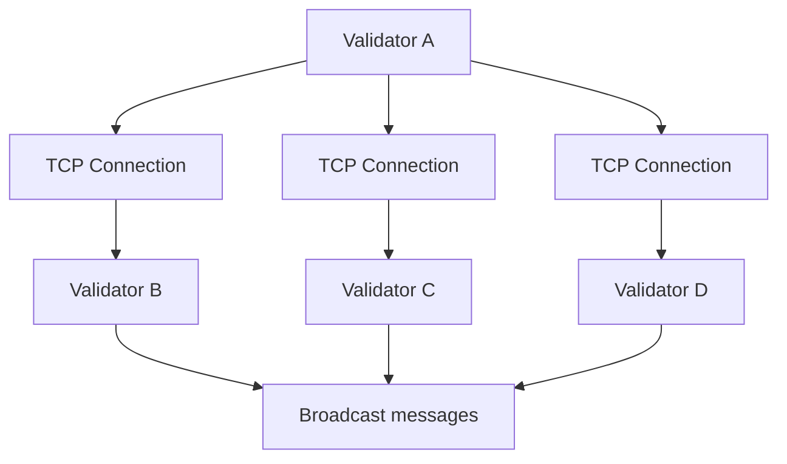

### 2. **Message Types trong Consensus**
- **Proposals**: Leader đề xuất blocks
- **Votes**: Validators vote cho/đứng lại proposals
- **Commits**: Thông báo block đã committed
- **Timeouts**: Timeout messages khi validator chậm
- **Heartbeats**: Keep-alive messages

### 3. **State Synchronization**
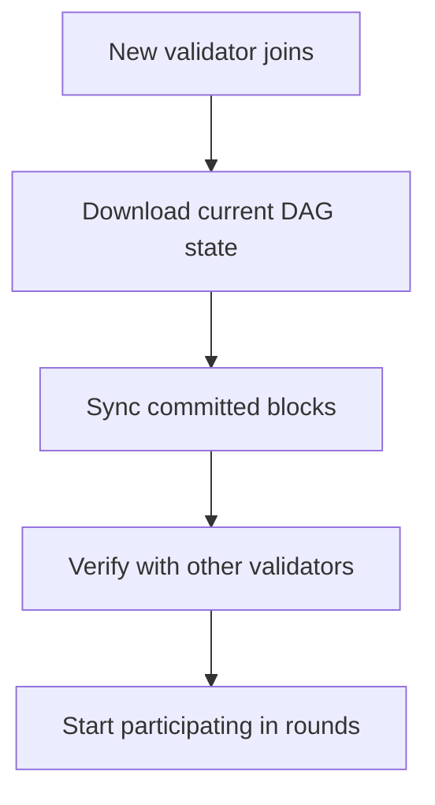

---

## 🔄 **Chi tiết Validator-to-Validator Sync Process**

### **1. Block Proposal & Voting (Round-based)**


#### **Network Requirements:**
- **Latency**: < 500ms typical, < 2s max
- **Bandwidth**: Block size (KB) × validator count
- **Reliability**: TCP ensures message delivery

### **2. Leader Election & Rotation**
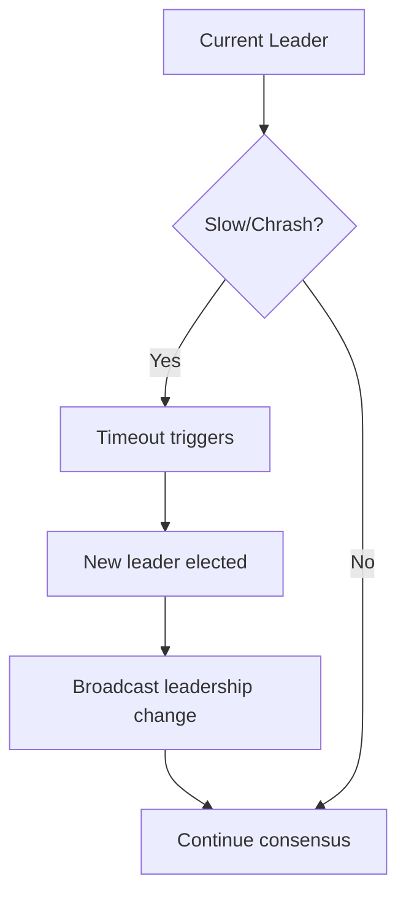

#### **Leader Selection Criteria:**
- **Round-robin**: Deterministic rotation
- **Performance-based**: Fastest validators prioritized
- **Stake-weighted**: Higher stake = higher priority

### **3. Validator Failure Detection**
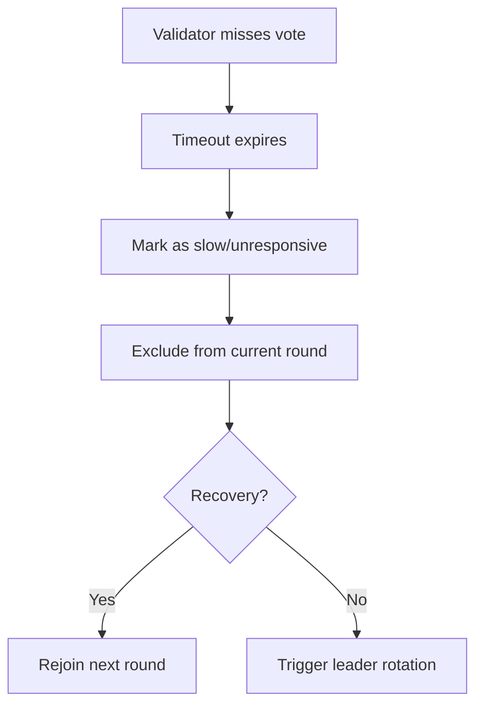

#### **Failure Types:**
- **Network partition**: Temporary isolation
- **Process crash**: Complete failure
- **Performance degradation**: Slow responses
- **Byzantine behavior**: Malicious actions

### **4. State Consistency Verification**
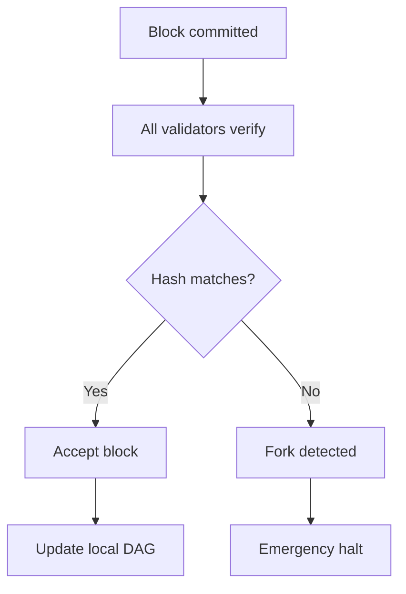

#### **Consistency Checks:**
- **Block hash verification**
- **Transaction merkle root**
- **DAG parent relationships**
- **Round number sequencing**

---

## 📊 **Performance Metrics cho Validator Sync**

### **Key Metrics:**
- **Round completion time**: Time from proposal to commit
- **Vote latency**: Time for validator to respond
- **Message propagation delay**: Time for message to reach all validators
- **Throughput**: Blocks/second under load

### **Typical Values:**
```
Round time: 500ms - 2s
Vote latency: < 100ms
Block size: 1KB - 100KB
Network overhead: 2-5x block size (metadata + signatures)
```

### **Bottlenecks:**
1. **Network latency** giữa validators
2. **Cryptographic operations** (signing/verification)
3. **Storage I/O** for state updates
4. **Consensus algorithm complexity**

---

## 🚨 **Scenarios: Validator-to-Validator Sync Issues**

### **Scenario 1: Single Validator Slow**
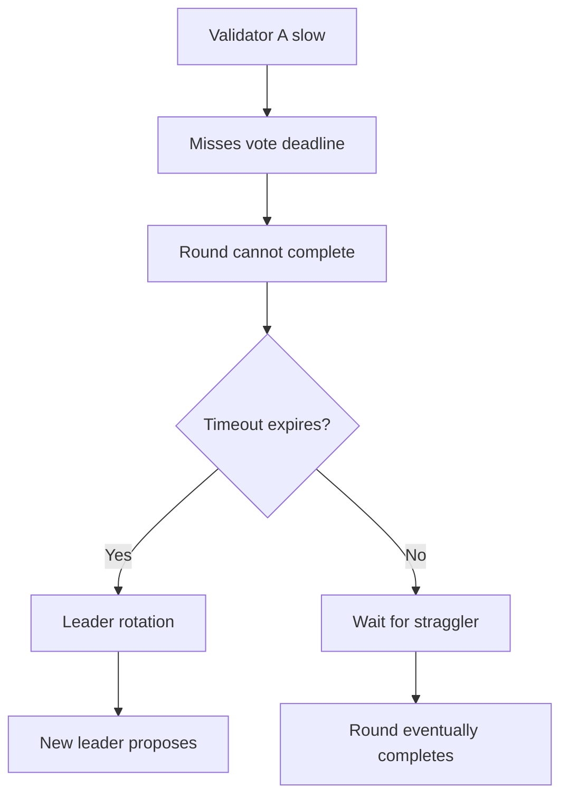

**Impact:** Temporary slowdown, potential leader churn

### **Scenario 2: Network Partition**
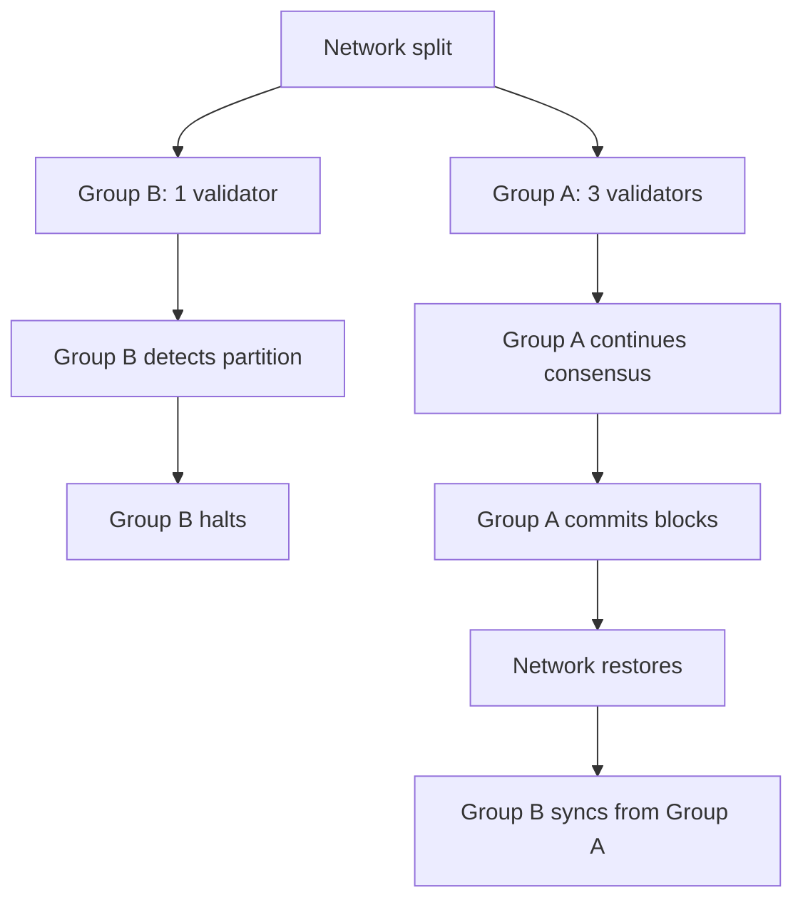

**Impact:** Temporary fork, recovery via state sync

### **Scenario 3: Multiple Validators Slow**
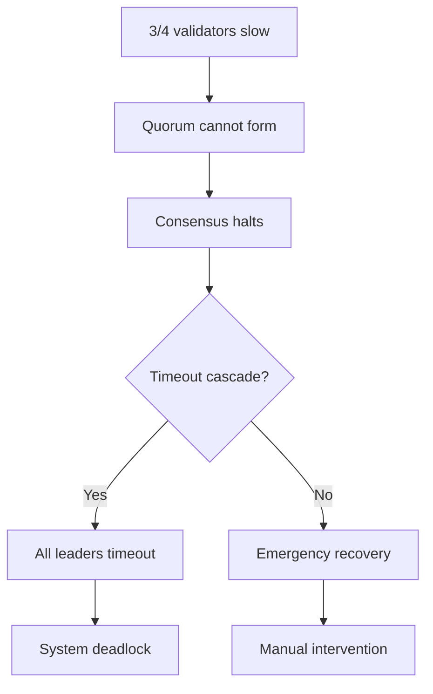

**Impact:** System halt, requires external recovery

---

## 🛠️ **Configuration Tuning cho Validator Sync**

### **Network Settings:**
```toml
# Consensus timeouts
round_timeout_ms = 5000
vote_timeout_ms = 1000
leader_timeout_ms = 10000

# Network
max_message_size = 1048576  # 1MB
connection_pool_size = 10
heartbeat_interval_ms = 1000
```

### **Performance Tuning:**
```toml
# Cryptographic settings
signature_cache_size = 1000
verification_threads = 4

# Storage
state_cache_size = 1000000  # 1M entries
sync_batch_size = 100
```

### **Monitoring Points:**
- Round completion rate
- Vote response times
- Message queue depths
- Network error rates
- Validator participation %

---

## 🔧 **Recovery Mechanisms**

### **1. Automatic Recovery:**
- **Leader rotation** on timeouts
- **State sync** for crashed validators
- **Dynamic timeouts** based on network conditions

### **2. Manual Recovery:**
- **Restart slow validators**
- **Network reconfiguration**
- **Committee updates** to replace failing validators

### **3. Preventive Measures:**
- **Load balancing** across validators
- **Redundant networking**
- **Performance monitoring**
- **Chaos testing**

---

## 📈 **Best Practices**

### **For Development:**
1. **Test with network simulation** (latencies, partitions)
2. **Implement comprehensive logging** for sync events
3. **Monitor all validator communications**
4. **Test failure scenarios** thoroughly

### **For Production:**
1. **Deploy validators across regions** for redundancy
2. **Implement alerting** for sync issues
3. **Monitor round completion times**
4. **Have backup validators** ready
5. **Regular performance testing**

---

## 🎯 **Tóm tắt Validator-to-Validator Sync**

### **Strengths:**
- ✅ **Decentralized**: No single point of failure
- ✅ **Resilient**: Handles validator failures gracefully
- ✅ **Scalable**: Can add more validators
- ✅ **Secure**: Cryptographic verification

### **Challenges:**
- ❌ **Network dependent**: Performance varies with network
- ❌ **Complex coordination**: Many moving parts
- ❌ **Hard to debug**: Distributed system complexity
- ❌ **Performance overhead**: Consensus coordination cost

**Validator sync là core của hệ thống - khi nó hoạt động tốt, cả hệ thống hoạt động tốt!** ⚡

## 🔍 **Câu trả lời các câu hỏi quan trọng:**

### **1. Đồng bộ validator chậm có phải từ Rust với Rust?**
**CÓ** - Consensus layer hoàn toàn giữa các Rust nodes (P2P communication)

### **2. Quá trình đồng bộ có lấy full thông tin block và đầy đủ giao dịch?**
**❌ KHÔNG** - Hiện tại chỉ fast-forward sync, KHÔNG download actual block data

#### **Chi tiết về Full Node Sync hiện tại:**
- ✅ Query Go Master để biết `last_block_number`
- ✅ Update local index để "catch up"
- ❌ **KHÔNG** download actual block data
- ❌ **KHÔNG** download transactions
- ❌ **KHÔNG** verify block contents

**Full nodes hiện tại chỉ biết "đã sync tới block X", không có actual data!**

## **Consensus Layer (Rust ↔ Rust):**

### 1. **Consensus Layer (Rust ↔ Rust)**
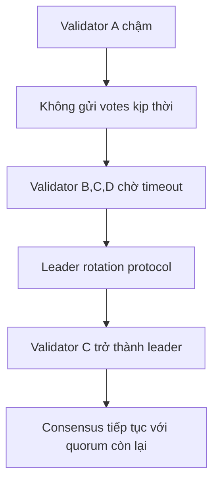

### 2. **Recovery Layer (Rust → Go Master)**
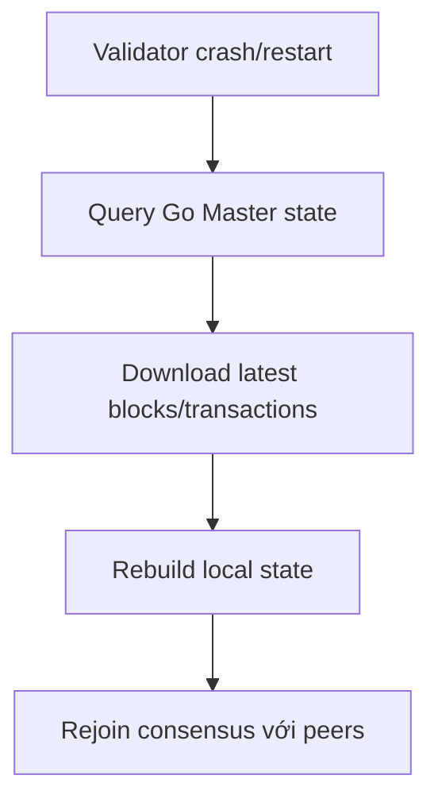

### 3. **Full Node Sync (Rust → Go Master)**
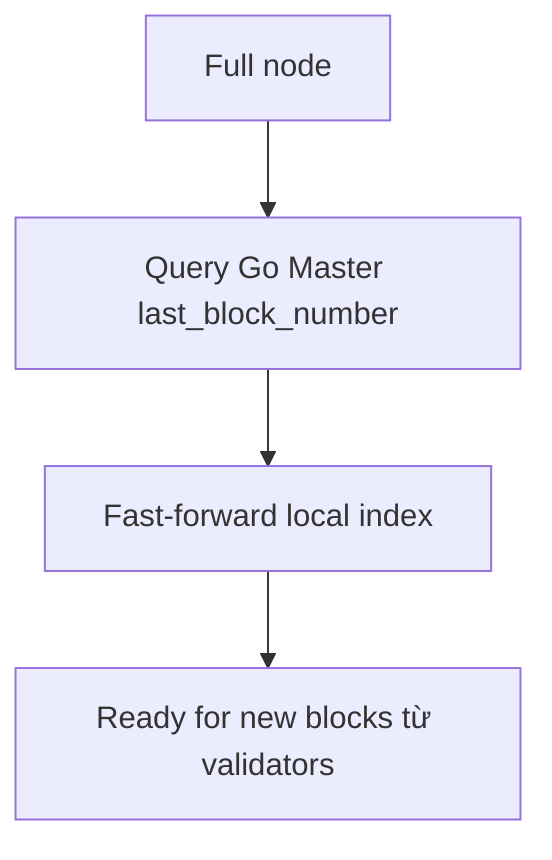

## Luồng đồng bộ bình thường

### 1. **Consensus Communication (Rust ↔ Rust)**
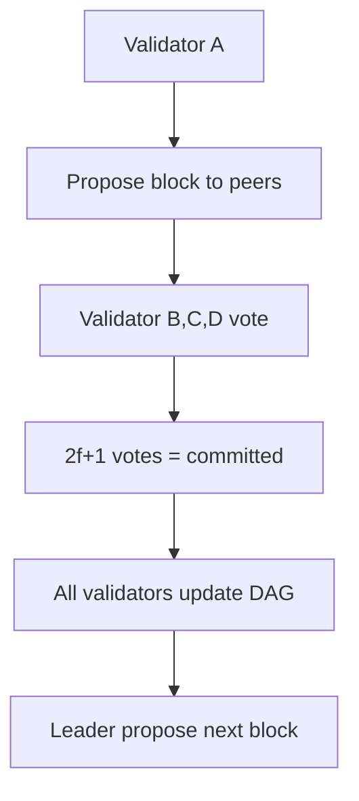

**Network Protocol**: TCP connections giữa validators, sử dụng consensus protocol để:
- Broadcast proposals
- Collect votes
- Detect commits
- Handle timeouts

### 2. **Block Execution & Storage (Rust → Go)**
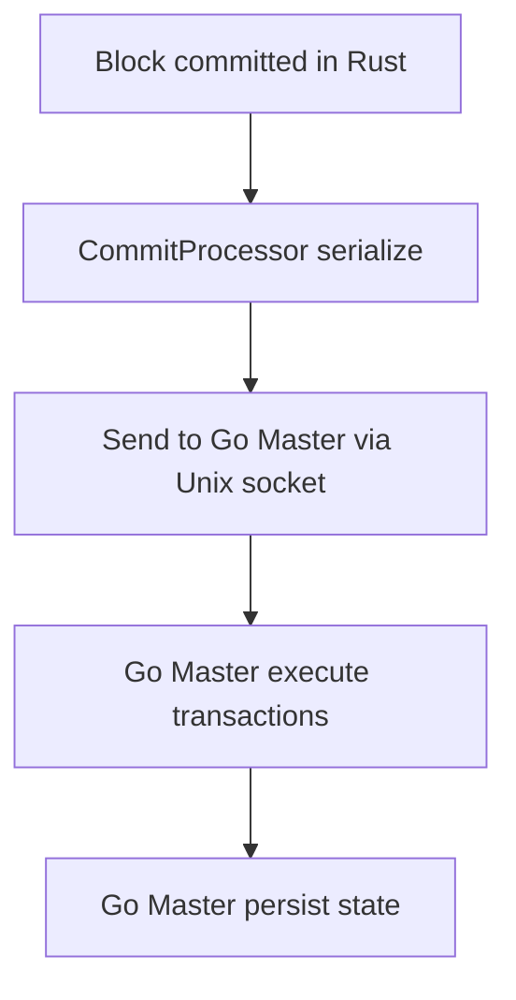

### 3. **Full Node Synchronization (Rust → Go)**

#### **❌ Hiện tại: Chỉ fast-forward sync (KHÔNG có full block data)**
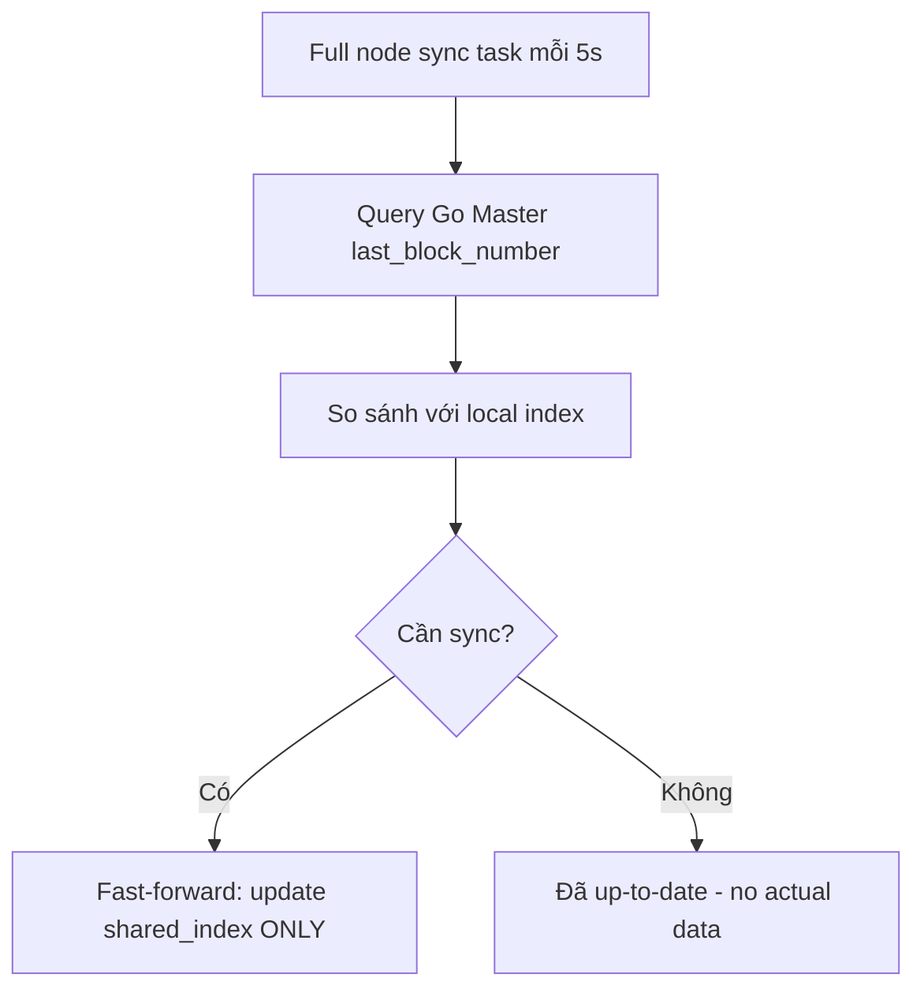

#### **✅ Tiềm năng: Full block sync (NetworkSyncManager - chưa implement)**
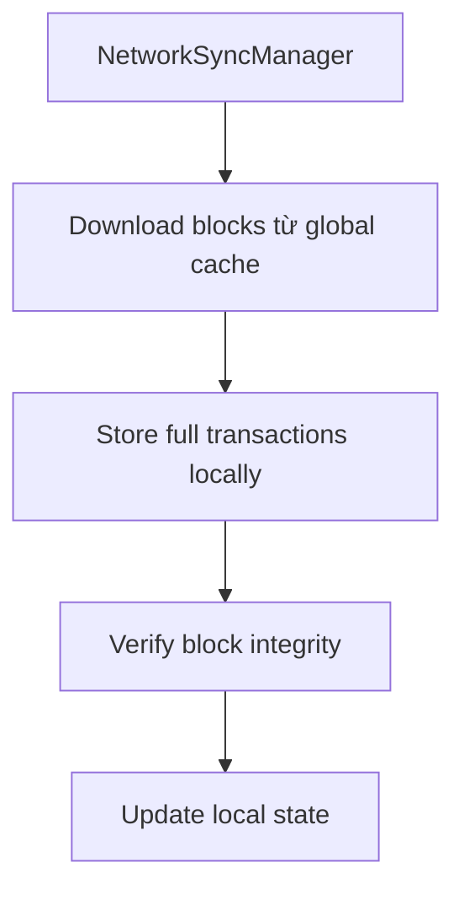

## Phân tích trường hợp validator chậm

### Trường hợp 1: **Validator chậm trong Consensus (Rust ↔ Rust)**

#### **Đây là vấn đề P2P giữa các Rust nodes:**

#### Nguyên nhân:
- **Network latency**: Packet delay giữa validators
- **CPU/Memory overload**: Consensus computation chậm
- **Disk I/O**: State persistence bottleneck
- **Consensus timeout**: Round timeout quá ngắn

#### Communication Flow khi validator chậm:
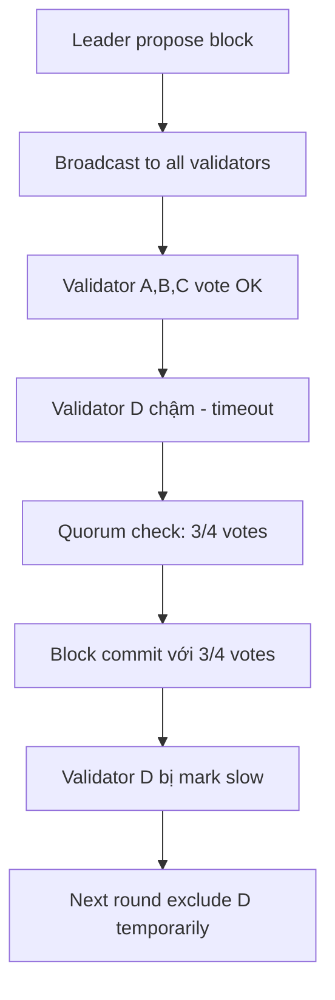

#### Tác động:
- **Consensus slowdown**: Rounds take longer
- **Reduced quorum**: Temporary degraded safety
- **Leader rotation**: Slow validators lose leadership
- **Network congestion**: Retry messages increase load

#### Recovery trong Consensus Layer:
- **Automatic leader rotation**: Slow leaders replaced
- **Dynamic timeout adjustment**: Based on network conditions
- **Validator scoring**: Track participation rate
- **Temporary exclusion**: Slow validators skipped in rounds

### Trường hợp 2: Validator crash/restart

#### Crash Scenario:
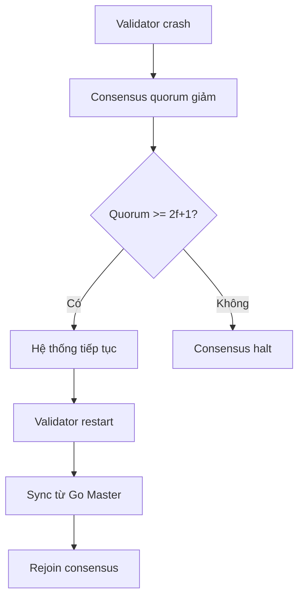

#### Restart Process:
1. **Cold start**: Load genesis state từ Go Master
2. **State sync**: Query Go Master cho latest state
3. **Committee check**: Verify node still in committee
4. **Consensus rejoin**: Start participating in rounds

#### Tác động:
- **Temporary halt**: Nếu quorum bị break
- **Sync overhead**: Node phải catch up
- **State consistency**: Đảm bảo không fork

### Trường hợp 3: Network partition

#### Partition Types:
- **Partial**: Một số validators bị isolate
- **Complete**: Network split thành 2+ groups

#### Handling:
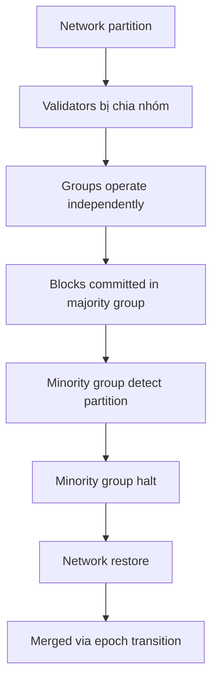

#### Safety guarantees:
- **No double commits**: Quorum requirements
- **Fork prevention**: Go Master sequential execution
- **State consistency**: Epoch transitions handle merges

## Performance Analysis

### Metrics quan trọng:
- **Block production rate**: Blocks/second
- **Commit latency**: Time from proposal to commit
- **Sync latency**: Time for full nodes to catch up
- **Network round trips**: RPC calls between nodes

### Bottlenecks:
1. **Consensus latency**: Voting rounds
2. **Go Master throughput**: Transaction execution
3. **Network bandwidth**: Block propagation
4. **Storage I/O**: State persistence

## Configuration Tuning

### Validator chậm - Optimization:

```toml
# Epoch transition settings
epoch_transition_optimization = "fast"  # or "safe", "balanced"
epoch_duration_seconds = 180

# Consensus timeouts
consensus_timeout_ms = 5000

# Network settings
network_timeout_ms = 3000
max_retries = 3
```

### Monitoring Points:
- Consensus round completion time
- Block commit rate
- Validator participation %
- Network latency between nodes
- Go Master execution queue depth

## Recovery Strategies

### 1. Automatic Recovery:
- Leader rotation on timeouts
- Epoch transitions on committee changes
- State sync on node restart

### 2. Manual Intervention:
- Restart slow validators
- Adjust network configuration
- Scale up resources (CPU, memory, disk)

### 3. Preventive Measures:
- Load balancing across validators
- Redundant network paths
- Regular health checks
- Performance monitoring

## Recommendations

### For Production:
1. **Monitor consensus health** continuously
2. **Set appropriate timeouts** based on network conditions
3. **Implement alerting** for slow validators
4. **Have backup validators** ready
5. **Test failure scenarios** regularly

### For Development:
1. **Use realistic network simulation** (latency, packet loss)
2. **Test with uneven node performance**
3. **Implement chaos engineering** practices
4. **Monitor all sync paths** (Rust ↔ Go, Node ↔ Node)

## Conclusion

### **Tóm tắt câu trả lời:**

#### **1. Validator chậm sync: RUST ↔ RUST ✅**
- Consensus communication hoàn toàn giữa Rust nodes
- Leader rotation, timeout handling, quorum management

#### **2. Full node sync data: KHÔNG CÓ FULL BLOCK DATA ❌**
- **Hiện tại**: Chỉ fast-forward index (không có actual blocks/transactions)
- **Thiếu**: Full node không download, verify, hoặc store actual block data
- **Tiềm năng**: NetworkSyncManager có logic nhưng chưa được sử dụng

### **Implications:**

#### **Ưu điểm của thiết kế hiện tại:**
- ✅ **Fast sync**: Chỉ cập nhật index, không download data lớn
- ✅ **Low storage**: Full nodes không cần store historical blocks
- ✅ **Simple recovery**: Dựa vào Go Master làm source of truth

#### **Nhược điểm:**
- ❌ **No block verification**: Full nodes không thể verify block contents
- ❌ **No transaction history**: Không có local transaction data
- ❌ **Dependency on Go Master**: Nếu Go Master chậm, tất cả full nodes bị ảnh hưởng

#### **Đề xuất cải tiến:**
1. **Implement NetworkSyncManager** cho full block sync khi cần
2. **Add block verification** cho full nodes
3. **Hybrid approach**: Fast-forward + selective block download

**Hệ thống hiện tại ưu tiên speed và simplicity over completeness!** ⚡