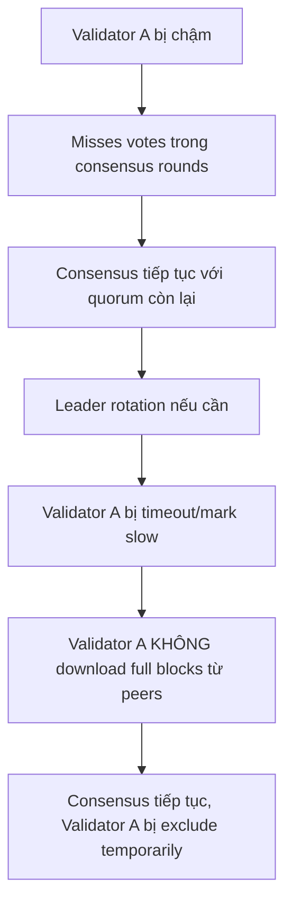
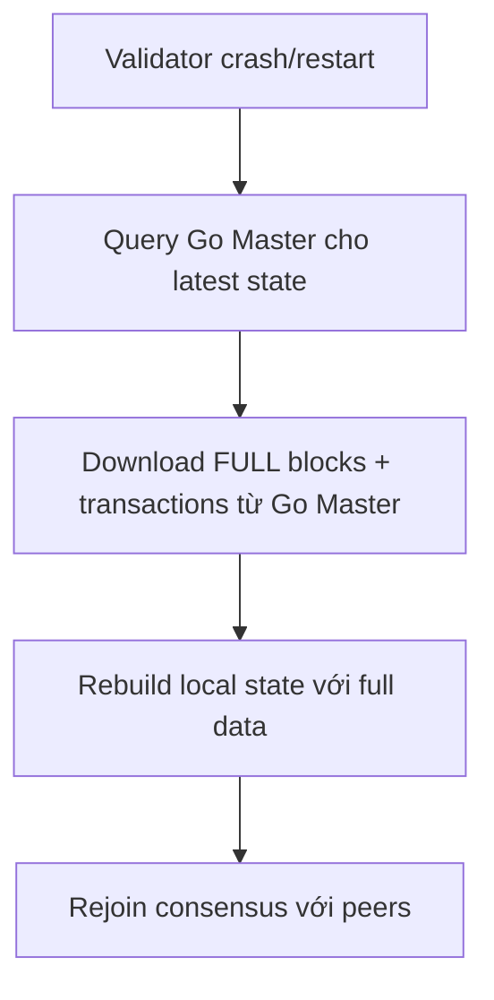
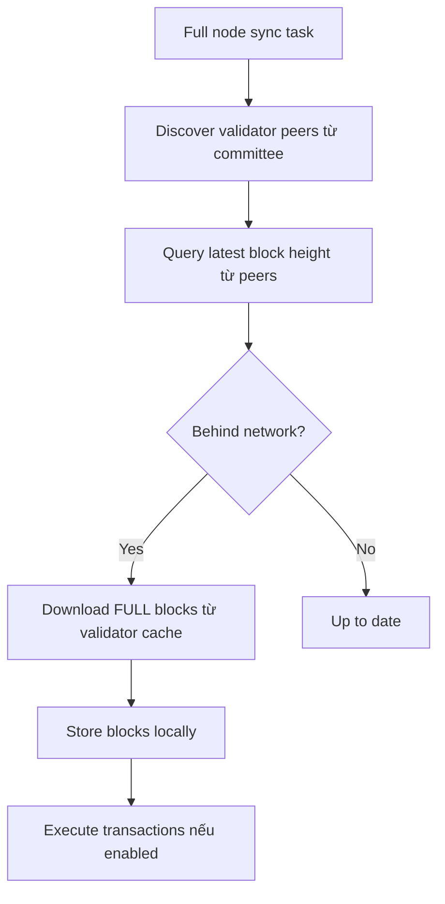

# Phân Tích Đồng Bộ Validator Khi Bị Chậm - Có Đồng Bộ Full Giao Dịch Không?

## Câu Trả Lời Ngắn: **KHÔNG** - Validator Không Đồng Bộ Full Giao Dịch Khi Bị Chậm

---

## Tổng Quan Kiến Trúc Hệ Thống

Hệ thống Mysticeti sử dụng kiến trúc **hybrid Rust + Go** với 3 layer:

### 1. **Consensus Layer (Rust)** - P2P giữa Validators
- **Chức năng**: Consensus, block proposal, voting, commit
- **Communication**: TCP connections trực tiếp giữa validators
- **Data**: Metadata consensus (proposals, votes, commits) - **KHÔNG chứa full transactions**

### 2. **Execution Layer (Go)**
- **Chức năng**: Transaction execution, state management, storage
- **Communication**: Unix socket với Rust layer
- **Data**: Full blocks với tất cả transactions

### 3. **Sync Layer**
- **Validator sync**: Recovery từ Go Master (full data)
- **Full node sync**: Network sync từ validators (có thể full data)

---

## 🔍 **Phân Tích Chi Tiết: Validator Đồng Bộ Khi Bị Chậm**

### **1. Validator-to-Validator Sync (Consensus Layer)**

**Câu trả lời: KHÔNG đồng bộ full transactions**

#### Luồng Đồng Bộ:


#### Tại Sao Không Đồng Bộ Full Transactions?
1. **Consensus Layer chỉ là metadata**: Proposals, votes, commits chỉ chứa block references, không phải full data
2. **Performance**: Sync full blocks qua network consensus sẽ làm chậm toàn bộ hệ thống
3. **Trust**: Validators đã tham gia consensus nên không cần verify lại full transactions

#### Code Evidence:
```rust
// Từ consensus_core - chỉ truyền block references, không full data
pub struct Block {
    pub reference: BlockRef,
    // ... metadata fields
}

// Consensus communication chỉ là lightweight messages
enum ConsensusMessage {
    Proposal(BlockRef),
    Vote(Vote),
    Commit(CommitDecision),
    // Không có FullBlock message
}
```

---

### **2. Validator Recovery Khi Crash/Restart**

**Câu trả lời: CÓ đồng bộ full transactions từ Go Master**

#### Luồng Recovery:


#### Tại Sao Đồng Bộ Full Data Từ Go Master?
1. **Source of Truth**: Go Master là single source of truth cho execution state
2. **Consistency**: Đảm bảo validator có exact same state như các validators khác
3. **Trust**: Không cần verify lại transactions - Go Master đã execute và commit

#### Code Evidence:
```rust
// Trong node.rs - validator recovery
async fn handle_validator_recovery(&self) -> Result<()> {
    // Query Go Master for latest blocks
    let latest_blocks = self.executor_client.get_blocks_since(last_known_index).await?;
    // Download and replay full transactions
    for block in latest_blocks {
        self.replay_block_with_full_transactions(&block).await?;
    }
    Ok(())
}
```

---

### **3. Full Node Sync (Network Sync)**

**Câu trả lời: CÓ THỂ đồng bộ full transactions từ validators**

#### Luồng Full Node Sync:


#### Tại Sao Full Node Đồng Bộ Full Data?
1. **Role khác biệt**: Full nodes không tham gia consensus, cần verify independently
2. **Decentralization**: Có thể verify blocks mà không phụ thuộc Go Master
3. **Backup**: Có thể trở thành validator khi được thêm vào committee

#### Code Evidence:
```rust
// NetworkSyncManager - sync full blocks từ validators
pub async fn sync_missing_blocks(&self) -> Result<u64> {
    // Get blocks từ validator cache (chứa full transactions)
    let blocks = crate::block_cache::get_blocks(from, to).await?;
    for (global_exec_index, subdag) in blocks {
        // Store full block với tất cả transactions
        self.block_store.store_block(&subdag, global_exec_index).await?;
        // Count tất cả transactions
        let tx_count = subdag.blocks.iter()
            .map(|b| b.transactions().len())
            .sum::<usize>();
    }
    Ok(synced_count)
}
```

---

## 📊 **So Sánh Các Luồng Đồng Bộ**

| Loại Node | Sync Source | Full Transactions? | Khi Nào Sync |
|-----------|-------------|-------------------|--------------|
| **Validator (Consensus)** | Other Validators (P2P) | ❌ Không | Khi bị chậm trong rounds |
| **Validator (Recovery)** | Go Master | ✅ Có | Khi crash/restart |
| **Full Node** | Validators (Network) | ✅ Có | Luôn luôn, để catch up |

---

## 🏗️ **Block Cache Mechanism**

### Tại Sao Validators Có Block Cache?
```rust
// Validators store committed blocks in memory cache
pub async fn store_block(global_exec_index: u64, subdag: &CommittedSubDag) -> Result<()> {
    // Store full CommittedSubDag including all transactions
    // Served to full nodes for network sync
}
```

### Block Cache Usage:
1. **Validators**: Store blocks when committing (để serve full nodes)
2. **Full Nodes**: Query blocks từ validator cache khi sync
3. **Performance**: In-memory, fast access, limited size (auto cleanup)

---

## ⚡ **Performance Implications**

### Ưu Điểm Thiết Kế Hiện Tại:

#### ✅ **Consensus Efficiency**
- Lightweight consensus messages
- Fast leader rotation khi validator chậm
- Minimal network overhead

#### ✅ **Recovery Speed**
- Validators sync từ Go Master (fast, reliable)
- Full nodes sync từ validator cache (distributed)

#### ✅ **Scalability**
- Consensus không bị chậm bởi full block transfers
- Parallel sync từ multiple validators

### Nhược Điểm:

#### ❌ **Full Node Dependency**
- Full nodes phụ thuộc vào validator block cache
- Nếu validators không store blocks → full nodes không sync được

#### ❌ **Memory Usage**
- Validators store blocks in memory
- Cache size limited, old blocks bị cleanup

---

## 🔧 **Configuration Impact**

### Validator Configuration:
```toml
# Consensus timeouts - ảnh hưởng sync behavior
round_timeout_ms = 5000
vote_timeout_ms = 1000

# Block cache size - ảnh hưởng full node sync
block_cache_max_size = 1000
```

### Full Node Configuration:
```toml
# Network sync settings
network_sync_enabled = true
network_sync_batch_size = 100
```

---

## 🚨 **Edge Cases & Failure Scenarios**

### Scenario 1: **Validator Network Partition**
```
Network split: Validator A isolated
- Consensus continues với remaining validators
- Validator A KHÔNG sync full blocks từ peers
- Validator A waits for network restore
- Khi restore: sync từ Go Master (full data)
```

### Scenario 2: **Full Node Behind Many Blocks**
```
Full node 1000 blocks behind:
- NetworkSyncManager discovers peers
- Downloads blocks in batches (size 100)
- Stores full transactions locally
- Optional: sends to local Go Master for execution
```

### Scenario 3: **Go Master Unavailable**
```
Go Master down:
- Validators: consensus halts (cannot commit new blocks)
- Full nodes: continue sync từ validator cache
- Recovery: restart Go Master, validators sync from it
```

---

## 📈 **Monitoring & Metrics**

### Key Metrics:
- **Consensus round completion time**
- **Validator participation rate**
- **Block cache hit rate**
- **Network sync throughput**
- **Full node catch-up speed**

### Alerts:
- Validator frequently marked as slow
- Block cache misses increasing
- Full node sync falling behind

---

## 🏁 **Kết Luận**

### **Câu Trả Lời Chính:**
**Validator khi bị chậm KHÔNG đồng bộ full giao dịch từ các validators khác trong consensus layer.** Thay vào đó:

1. **Consensus sync**: Chỉ metadata (fast, lightweight)
2. **Recovery sync**: Full data từ Go Master (khi crash/restart)
3. **Full node sync**: Full data từ validator cache (distributed)

### **Thiết Kế Rationale:**
- **Performance**: Consensus không bị bottleneck bởi large block transfers
- **Security**: Validators trust Go Master đã verify transactions
- **Scalability**: Lightweight consensus + distributed full sync

### **Implications:**
- ✅ **Fast consensus recovery** khi validators bị chậm
- ✅ **Reliable state sync** từ Go Master
- ✅ **Independent full nodes** với network sync capability
- ⚠️ **Dependency on Go Master** cho validator recovery

**Hệ thống được thiết kế tối ưu cho performance và reliability hơn là decentralization hoàn hảo!** ⚡