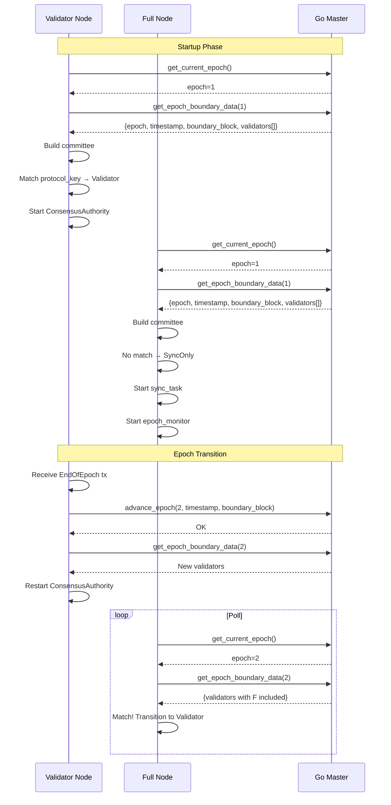

# Cơ Chế Load Committee cho Validator và Full Node

## Tổng Quan

Tài liệu này mô tả cách các node (Validator và Full Node/SyncOnly) load committee để tham gia consensus hoặc đồng bộ dữ liệu.

```mermaid
graph TD
    subgraph "Validator Node"
        V1["Khởi động"] --> V2["Query Go Master"]
        V2 --> V3["get_epoch_boundary_data(epoch)"]
        V3 --> V4["Build Committee"]
        V4 --> V5["Check protocol_key"]
        V5 --> V6["Start ConsensusAuthority"]
    end
    
    subgraph "Full Node (SyncOnly)"
        F1["Khởi động"] --> F2["Query Go Master"]
        F2 --> F3["get_epoch_boundary_data(epoch)"]
        F3 --> F4["Build Committee"]
        F4 --> F5["Not in committee"]
        F5 --> F6["Start Sync Task"]
        F6 --> F7["Epoch Monitor Poll"]
        F7 --> F8{"In committee?"}
        F8 -->|No| F7
        F8 -->|Yes| F9["Transition to Validator"]
    end
```



---

## 1. Nguồn Dữ Liệu Committee

### 1.1 Go Master là Source of Truth

```
┌─────────────────┐         ┌─────────────────┐
│   Rust Node     │ ─────▶  │   Go Master     │
│  (Metanode)     │   UDS   │  (simple_chain) │
└────────┬────────┘         └────────┬────────┘
         │                           │
         │  get_epoch_boundary_data  │
         │◀──────────────────────────│
         │                           │
         │  - epoch                  │
         │  - epoch_timestamp_ms     │
         │  - boundary_block         │
         │  - validators[]           │
         │                           │
```

### 1.2 API Quan Trọng

| API | Mô tả | Sử dụng khi |
|-----|-------|-------------|
| `get_epoch_boundary_data(epoch)` | Lấy validators tại **epoch boundary** | **Khuyên dùng** - Fork-safe |
| `get_validators_at_block(block)` | Lấy validators tại block cụ thể | Legacy fallback |
| `get_current_epoch()` | Epoch hiện tại của Go | Kiểm tra epoch |
| `get_epoch_start_timestamp()` | Timestamp bắt đầu epoch | Genesis hash |

---

## 2. Khởi Động Node (Startup)

### 2.1 Flow Chung

```rust
// File: metanode/src/node/mod.rs - new_with_registry_and_service()

// 1. Query epoch từ Go Master (hoặc peer nếu có)
let go_epoch = executor_client.get_current_epoch().await?;

// 2. Lấy epoch boundary data (CRITICAL)
let (boundary_block, epoch_timestamp_ms, _, validators) = 
    executor_client.get_epoch_boundary_data(go_epoch).await?;

// 3. Build committee từ validators
let committee = committee::build_committee_from_validator_list(
    validators, 
    go_epoch
)?;

// 4. Xác định identity bằng protocol_key matching
let own_index = committee.authorities()
    .find_map(|(idx, auth)| {
        if auth.protocol_key == own_protocol_pubkey {
            Some(idx)
        } else {
            None
        }
    });

// 5. Quyết định mode
if own_index.is_some() {
    // Validator mode - Start ConsensusAuthority
    authority = Some(ConsensusAuthority::start(...).await);
} else {
    // SyncOnly mode - Start sync task + epoch monitor
    start_sync_task();
    start_epoch_monitor();
}
```

### 2.2 Peer Epoch Discovery

Khi có nhiều Go Master (multi-node setup):

```rust
// File: metanode/src/node/mod.rs

// Query tất cả peers để tìm epoch cao nhất
let (go_epoch, peer_last_block, best_socket) = 
    catchup::query_peer_epochs(&peer_sockets, &local_socket).await?;

// Sử dụng Go Master có epoch cao nhất
let peer_executor_client = ExecutorClient::new(..., best_socket);
```

---

## 3. Validator Node

### 3.1 Điều Kiện Để Là Validator

```rust
// Node được coi là Validator khi:
// 1. protocol_key của node match với một authority trong committee
// 2. Node có đủ stake (registered on-chain)

let is_validator = committee.authorities()
    .any(|(_, auth)| auth.protocol_key == node.protocol_key);
```

### 3.2 Startup Flow

```
1. Load keys từ file (protocol_key, network_key, authority_key)
2. Query Go Master: get_epoch_boundary_data(epoch)
3. Build committee từ validators
4. Find own_index by protocol_key match
5. Start ConsensusAuthority với:
   - epoch_timestamp_ms (CRITICAL cho genesis hash)
   - own_index
   - committee
   - commit_consumer (nhận commits từ consensus)
```

### 3.3 Epoch Transition (Validator)

```rust
// File: metanode/src/node/transition.rs

// Khi nhận EndOfEpoch system transaction:
// 1. CommitProcessor phát hiện EndOfEpoch
// 2. Trigger epoch_transition_callback
// 3. transition_to_epoch_from_system_tx() được gọi

async fn transition_to_epoch_from_system_tx(
    node: &mut ConsensusNode,
    new_epoch: u64,
    new_epoch_timestamp_ms: u64,
    synced_global_exec_index: u64,  // boundary_block
    config: &NodeConfig,
) {
    // 1. Discover best committee source
    let committee_source = CommitteeSource::discover(config).await?;
    
    // 2. Fetch new committee (với retry vô hạn)
    let committee = committee_source.fetch_committee(
        &config.executor_send_socket_path,
        new_epoch
    ).await?;
    
    // 3. Stop old authority
    if let Some(auth) = node.authority.take() {
        auth.stop().await;
    }
    
    // 4. Start new authority với committee mới
    node.authority = Some(ConsensusAuthority::start(
        new_epoch_timestamp_ms,
        own_index,
        committee,
        ...
    ).await);
    
    // 5. Advance epoch trong Go
    executor_client.advance_epoch(
        new_epoch, 
        new_epoch_timestamp_ms,
        synced_global_exec_index  // boundary_block
    ).await;
}
```

---

## 4. Full Node (SyncOnly)

### 4.1 Startup Flow

```
1. Query Go Master: get_epoch_boundary_data(epoch)
2. Build committee từ validators
3. Check: protocol_key không match → SyncOnly mode
4. Start sync_task để đồng bộ blocks
5. Start epoch_monitor để poll committee changes
```

### 4.2 Epoch Monitor

```rust
// File: metanode/src/node/epoch_monitor.rs

// Poll định kỳ để phát hiện:
// 1. Epoch change
// 2. Được thêm vào committee (stake registered)

loop {
    // Check epoch từ Go
    let go_epoch = client.get_current_epoch().await?;
    
    // Lấy committee tại epoch boundary
    let (epoch, timestamp, boundary_block, validators) = 
        client.get_epoch_boundary_data(go_epoch).await?;
    
    // Build committee và check membership
    let committee = build_committee_from_validator_list(validators, epoch)?;
    
    let in_committee = committee.authorities()
        .any(|(_, auth)| auth.protocol_key == own_protocol_key);
    
    if in_committee {
        // Đã được thêm vào committee!
        transition_sender.send((epoch, timestamp, boundary_block))?;
        break; // Exit monitor, chuyển sang Validator mode
    }
    
    sleep(poll_interval).await;
}
```

### 4.3 SyncOnly → Validator Transition

```
1. Epoch Monitor phát hiện node trong committee
2. Gửi signal qua epoch_transition_sender
3. epoch_transition_handler nhận signal
4. Gọi transition_to_epoch_from_system_tx()
5. Stop sync task
6. Start ConsensusAuthority
7. Node trở thành Validator
```

---

## 5. CommitteeSource Module

### 5.1 Mục Đích

Đảm bảo tất cả nodes sử dụng **cùng một nguồn** cho committee data để tránh fork.

```rust
// File: metanode/src/node/committee_source.rs

pub struct CommitteeSource {
    pub socket_path: String,       // Go Master socket 
    pub epoch: u64,                // Epoch từ nguồn này
    pub epoch_timestamp_ms: u64,   // CRITICAL cho genesis hash
    pub last_block: u64,           // Last committed block
    pub is_peer: bool,             // Từ peer hay local
}
```

### 5.2 Discovery Logic

```rust
// Ưu tiên: Peer có epoch cao nhất > Local Go Master

async fn discover(config: &NodeConfig) -> Result<Self> {
    // 1. Query local Go Master
    let local_epoch = local_client.get_current_epoch().await?;
    
    // 2. Query các peers
    let mut best_epoch = local_epoch;
    for peer_socket in &config.peer_go_master_sockets {
        let peer_epoch = peer_client.get_current_epoch().await?;
        if peer_epoch > best_epoch {
            best_epoch = peer_epoch;
            best_socket = peer_socket;
        }
    }
    
    // 3. Sử dụng nguồn có epoch cao nhất
    Ok(Self { socket_path: best_socket, epoch: best_epoch, ... })
}
```

### 5.3 Fetch Committee (Fork-Safe)

```rust
// Retry vô hạn vì epoch transition PHẢI thành công

async fn fetch_committee(&self, target_epoch: u64) -> Result<Committee> {
    loop {
        match client.get_epoch_boundary_data(target_epoch).await {
            Ok((epoch, timestamp, boundary_block, validators)) => {
                if epoch != target_epoch {
                    // Go chưa advance epoch, chờ và retry
                    continue;
                }
                return build_committee_from_validator_list(validators, epoch);
            }
            Err(_) => {
                // Retry until success
                continue;
            }
        }
    }
}
```

---

## 6. Điểm Khác Biệt Chính

| Aspect | Validator | Full Node (SyncOnly) |
|--------|-----------|---------------------|
| **Protocol key** | Match trong committee | Không match |
| **Startup** | Start ConsensusAuthority | Start sync_task + epoch_monitor |
| **Epoch transition** | Nhận EndOfEpoch tx | Poll qua epoch_monitor |
| **Tham gia consensus** | Có | Không |
| **Load committee từ** | `get_epoch_boundary_data()` | `get_epoch_boundary_data()` |
| **Transition trigger** | System transaction | Epoch monitor detect |

---

## 7. Sequence Diagram



---

## 8. Các Điểm Lưu Ý

### 8.1 Fork Prevention

1. **Luôn dùng `get_epoch_boundary_data()`** thay vì `get_validators_at_block()`
2. **epoch_timestamp_ms phải nhất quán** - ảnh hưởng genesis hash
3. **Sử dụng CommitteeSource** để đảm bảo cùng nguồn dữ liệu

### 8.2 Identity Matching

```rust
// ĐÚNG: Match bằng protocol_key (cryptographic identity)
auth.protocol_key == node.protocol_key

// SAI: Match bằng hostname (có thể trùng/thay đổi)
auth.hostname == node.hostname
```

### 8.3 Retry Logic

- **Validator transition**: Retry vô hạn vì network không thể tiếp tục nếu epoch không advance
- **SyncOnly poll**: Interval cố định, không cần retry aggressively
