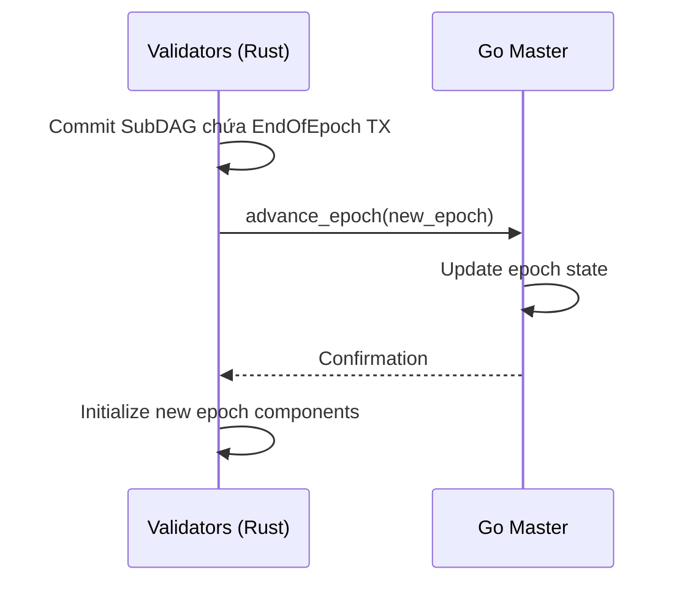
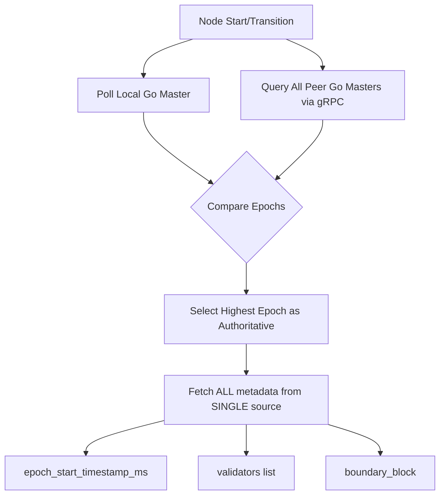
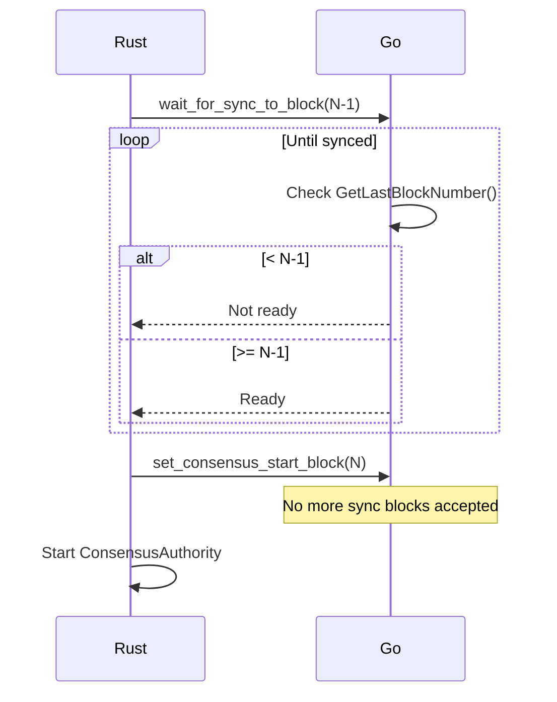
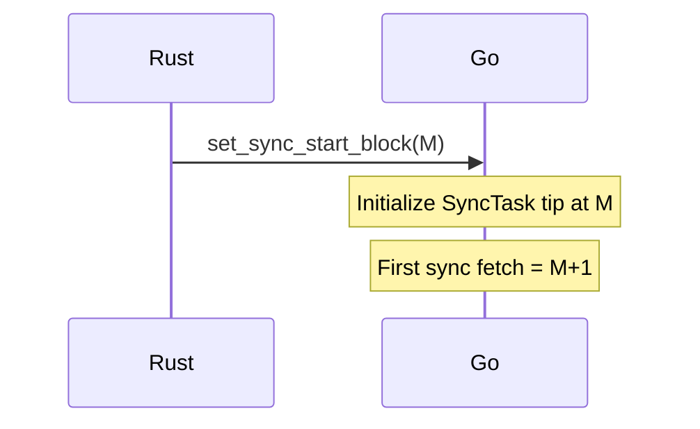

# Epoch Transition và Fork Prevention

Tài liệu mô tả chi tiết quá trình chuyển đổi epoch với các trường quan trọng như `time`, `global_exec_index`, và cơ chế trao đổi block để tránh fork.

## 1. Tổng Quan Epoch Transition

### 1.1. Các Thành Phần

| Component | Vai trò | Giao tiếp |
|:---|:---|:---|
| **Rust Metanode** | BFT consensus, linearization, DAG state | UDS (local), gRPC (WAN) |
| **Go Master** | Execution, state management, validator list | UDS (local), P2P (network) |

### 1.2. Trigger Epoch Transition



---

## 2. Các Trường Quan Trọng (Critical Fields)

### 2.1. Global Execution Index

> [!IMPORTANT]
> `global_exec_index` là trường quan trọng nhất để tránh fork!

**Công thức xác định**:
```
global_exec_index = epoch_base_index + commit_index
```

| Trường | Định nghĩa | Nguồn Authority |
|:---|:---|:---|
| `epoch_base_index` | Block cuối của epoch trước | `GetEpochBoundaryData.boundary_block` |
| `commit_index` | Sequence number của SubDAG | Mysticeti consensus |
| `global_exec_index` | Block number tuyệt đối trên chain | Tính toán deterministic |

**Ví dụ**:
```
Epoch 1 starts at block 4273 (epoch_base_index)
First commit of epoch 1: commit_index = 0
→ global_exec_index = 4273 + 0 = 4273

100th commit of epoch 1: commit_index = 99
→ global_exec_index = 4273 + 99 = 4372
```

### 2.2. epoch_start_timestamp_ms

| Yếu tố | Chi tiết |
|:---|:---|
| **Precision** | Milliseconds (1769668785000, không phải 1769668785) |
| **Nguồn** | `GetEpochBoundaryData` từ authoritative peer |
| **Dùng cho** | Genesis block hash của epoch mới |
| **Yêu cầu** | TẤT CẢ nodes PHẢI dùng timestamp GIỐNG NHAU |

> [!CAUTION]
> Timestamp khác nhau → Genesis hash khác → **FORK NGAY LẬP TỨC!**

### 2.3. Boundary Block Number

- **Định nghĩa**: Block cuối cùng của epoch trước
- **Nguồn**: `GetEpochBoundaryData.boundary_block`
- **Vai trò**: Điểm cắt giữa 2 epochs, dùng làm `epoch_base_index`

---

## 3. Cơ Chế Tránh Fork

### 3.1. CommitteeSource Discovery

Để đảm bảo tất cả nodes dùng cùng metadata:



> [!WARNING]
> **KHÔNG MIX** metadata từ nhiều sources! Ví dụ lấy epoch từ Peer A nhưng timestamp từ Local Go → FORK!

### 3.2. No Gap, No Overlap Policy

#### 3.2.1. SyncOnly → Validator (Promotion)

```
Block N-1: Sync cuối cùng
Block N:   Consensus bắt đầu
```

**Barrier Protocol**:


#### 3.2.2. Validator → SyncOnly (Demotion)

```
Block M:   Consensus cuối cùng
Block M+1: Sync bắt đầu
```

**Handoff Protocol**:


### 3.3. Timestamp Consistency

| Cơ chế | Mô tả |
|:---|:---|
| **Stake-weighted Median** | Timestamp từ 2f+1 DAG ancestors |
| **Deterministic** | Mọi node tính cùng timestamp cho cùng block |
| **Monotonic** | Timestamps không giảm so với block trước |
| **Certified** | Timestamp được include trong consensus vote |

### 3.4. Final Sync Verification Barrier

Ngay trước transition, thực hiện kiểm tra cuối:

```rust
// epoch_monitor.rs
let fresh_source = CommitteeSource::discover(&config).await?;
if local_go_block < fresh_source.last_block {
    warn!("⚠️ Go Master still behind peer! Aborting transition.");
    return false; // Retry next poll (3s)
}
// Proceed with transition
```

---

## 4. Các Lỗi Fork Đã Xảy Ra

### 4.1. Base Index Collision (Block #4842 Fork)

**Hiện tượng**:
```
Node 4:   Block #4842, commit_index=489, epoch_base_index=4353
Quorum:   Block #4842, commit_index=569, epoch_base_index=4273
                                          ^^^^^ KHÁC NHAU!
```

**Kết quả**:
- Hash: `0x50f...` vs `0xbc...`  ❌
- Parent: `0x6b...` vs `0xe5...` ❌
- Leader: `0xc98...` vs `0x906...` ❌

**Nguyên nhân**: Node 4 dùng local `shared_last_global_exec_index` thay vì fetch `boundary_block` từ network.

**Fix (V3 Hardening)**:
```rust
// Fetch ONCE from authoritative source
let epoch_base_index = source.boundary_block;

// Store IMMUTABLY in CommitProcessor
struct CommitProcessor {
    epoch_base_index: u64,  // Never changes during epoch
}

// Use formula
fn get_global_exec_index(&self, commit_index: u64) -> u64 {
    self.epoch_base_index + commit_index
}
```

### 4.2. Premature Validator Join (Block #4295 Fork)

**Hiện tượng**:
- Node 4 join mid-epoch tại Block 4295
- Node 4 commit: `hash=0x9c17..., tx_count=0`
- Quorum commit: `hash=0x067f..., tx_count=2`

**Nguyên nhân**: Node 4 reset `commit_index = 0` khi join, trong khi network đã ở `commit_index = 7`.

**Fix**: Epoch Boundary Join requirement - chỉ join khi `go_epoch > current_epoch`.

### 4.3. Timestamp Mismatch Fork

**Hiện tượng**: Nodes tạo genesis block với timestamps khác nhau.

**Nguyên nhân**: 
- Một số nodes dùng `GetCurrentEpochStartTimestampMs()` (có thể rounded)
- Một số nodes dùng local clock

**Fix**: 
- Tất cả dùng `GetEpochBoundaryData.epoch_start_timestamp_ms`
- **Fatal Consistency**: Panic thay vì fallback local clock

---

## 5. Protobuf Messages (Go ↔ Rust)

### 5.1. Transition APIs

| Field # | Message | Purpose |
|:---|:---|:---|
| 10 | `SetConsensusStartBlock(N)` | Promote sau barrier N-1 |
| 11 | `SetSyncStartBlock(M)` | Reset sync tip sau consensus M |
| 12 | `WaitForSyncToBlock(target)` | Block until Go reaches target |

### 5.2. GetEpochBoundaryData Response

```protobuf
message EpochBoundaryData {
    uint64 epoch = 1;                    // Target epoch
    uint64 epoch_start_timestamp_ms = 2; // Precise ms timestamp
    repeated Validator validators = 3;   // Committee list
    uint64 boundary_block = 4;           // epoch_base_index
}
```

---

## 6. Verification và Monitoring

### 6.1. Consistent Initialization Logs

Tất cả nodes trong cùng epoch PHẢI có log giống nhau:

```text
📊 [COMMIT PROCESSOR] Configured with epoch=1, epoch_base_index=4273 (from GetEpochBoundaryData)
🚀 [COMMIT PROCESSOR] Started processing commits for epoch 1 (epoch_base_index=4273, next_expected_index=1)
```

> [!CAUTION]
> Nếu thấy `epoch_base_index=0` cho epoch > 0 → Node running stale binary → **FORK RISK!**

### 6.2. Fork Detection Logs

```text
⚠️ [EPOCH VERIFY] Go-Rust epoch mismatch! Rust: 2, Go: 1
⚠️ [FORK-SAFETY] Block global_exec_index mismatch! Expected: 4300, Received: 4295
```

### 6.3. Successful Transition Logs

```text
✅ [SYNC BARRIER] Local Go Master synced to peer tip at block 4273
✅ [HANDOFF] Consensus start block set to 4274
✅ [EPOCH VERIFY] Go-Rust epoch consistent: 1
✅ [TRANSITION] Successfully promoted to Validator for epoch 1
```

---

## 7. Best Practices

### 7.1. Cho Operators

1. **Đợi epoch boundary** trước khi register validator mới
2. **Verify logs** đảm bảo tất cả nodes có cùng `epoch_base_index`
3. **Monitor timestamps** trong block headers
4. **Backup paths phải unique** per node (`SetBackupPath`)

### 7.2. Cho Developers

1. **KHÔNG dùng local state** cho `epoch_base_index`
2. **LUÔN fetch metadata từ SINGLE authoritative source**
3. **Include global_exec_index trong consensus vote**
4. **Panic thay vì fallback** cho critical fields (timestamp)

---

## 8. 10 Trụ Cột An Toàn (Safety Pillars)

| # | Pillar | Mechanism | Component |
|:---|:---|:---|:---|
| 1 | **Deterministic Indexing** | `Base + Offset` height calculation | `Linearizer.rs` |
| 2 | **Mandatory Mirroring** | Consensus timestamps → Go headers | `block_processor_utils.go` |
| 3 | **Fatal Consistency** | Panic on 0-timestamp | `block_processor_utils.go` |
| 4 | **Final Sync Barrier** | Peer verify before promote | `epoch_monitor.rs` |
| 5 | **Catch-up Barrier** | Wait until local = peer tip | `epoch_monitor.rs` |
| 6 | **Atomic Promotion** | N-1 handoff | `SetConsensusStartBlock` |
| 7 | **Atomic Demotion** | M+1 handoff | `SetSyncStartBlock` |
| 8 | **Monotonic Guards** | No duplicate transitions | `mod.rs` |
| 9 | **Persistence Isolation** | Unique backup paths per node | `SetBackupPath` |
| 10 | **Boundary Precision** | Historical ms-precise timestamps | `GetEpochBoundaryData` |

---

## 9. Tham Khảo

- [Node Modes and Transitions](../knowledge/node_modes_and_transitions.md)
- [Consensus Determinism and Indexing](../knowledge/consensus_determinism_and_indexing.md)
- [Transition Safety Mechanisms](../knowledge/transition_safety_mechanisms.md)
