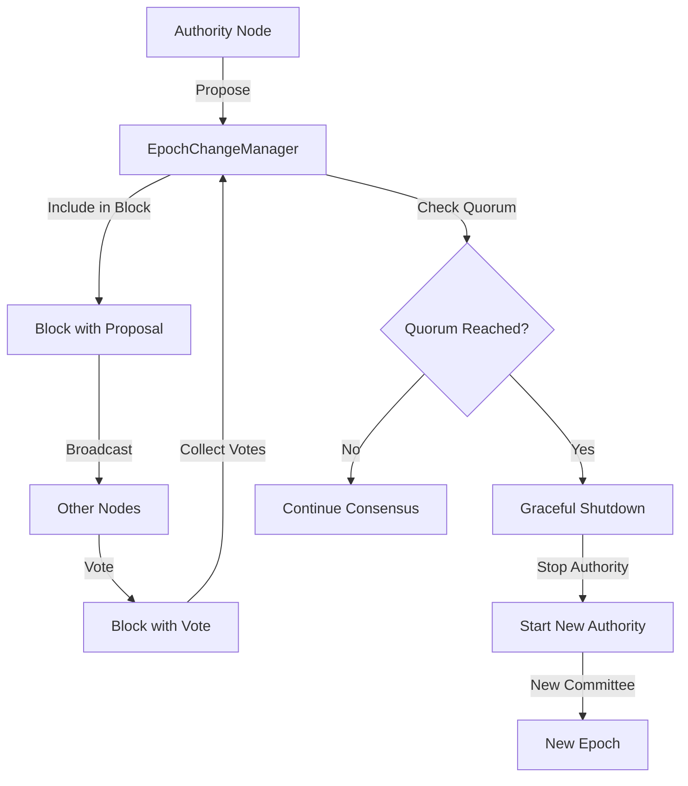

<!-- 59719b6a-6227-42dc-9dbc-7eb9365a779d b7292081-2196-411c-a2ea-9712322a36c0 -->
# Kế hoạch Triển khai Consensus-Based Epoch Change

## Tổng quan

Triển khai cơ chế cho phép nodes đề xuất và vote epoch change thông qua consensus protocol. Khi đạt quorum (2f+1), tất cả nodes sẽ tự động transition sang epoch mới.

## Architecture Overview



## Phase 1: Data Structures (Week 1)

### 1.1 Tạo Epoch Change Types

**File:** `src/epoch_change.rs` (new file)

Tạo các structures:

- `EpochChangeProposal`: Proposal cho epoch mới
- `EpochChangeVote`: Vote của authority
- `EpochChangeManager`: Manager xử lý proposals và votes

**Key structures:**

```rust
#[derive(Clone, Debug, Serialize, Deserialize)]
pub struct EpochChangeProposal {
    pub new_epoch: u64,
    pub new_committee: Committee,
    pub new_epoch_timestamp_ms: u64,
    pub proposal_commit_index: u32,
    pub proposer: AuthorityIndex,
    pub signature: ProtocolKeySignature,
}

#[derive(Clone, Debug, Serialize, Deserialize)]
pub struct EpochChangeVote {
    pub proposal_hash: Vec<u8>,
    pub voter: AuthorityIndex,
    pub approve: bool,
    pub signature: ProtocolKeySignature,
}
```

### 1.2 Extend Block Structure

**File:** `sui-consensus/core/src/block.rs`

Thêm fields vào `BlockV1` và `BlockV2`:

- `epoch_change_proposal: Option<EpochChangeProposal>`
- `epoch_change_votes: Vec<EpochChangeVote>`

**Changes:**

- Update `BlockV1::new()` to accept optional proposal/votes
- Update `BlockAPI` trait nếu cần
- Update block serialization/deserialization

## Phase 2: Epoch Change Manager (Week 1-2)

### 2.1 Core Manager Implementation

**File:** `src/epoch_change.rs`

Implement `EpochChangeManager` với:

- `propose_epoch_change()`: Tạo proposal
- `vote_on_proposal()`: Vote trên proposal
- `check_proposal_quorum()`: Check quorum (2f+1)
- `validate_proposal()`: Validate proposal
- `validate_vote()`: Validate vote signature
- **NEW:** `should_propose_time_based()`: Check nếu nên propose dựa trên time
- **NEW:** `check_clock_sync()`: Validate clock synchronization

**Key methods:**

```rust
impl EpochChangeManager {
    pub fn propose_epoch_change(
        &mut self,
        new_committee: Committee,
        new_epoch_timestamp_ms: u64,
        proposer_keypair: &ProtocolKeyPair,
    ) -> Result<EpochChangeProposal>
    
    pub fn vote_on_proposal(
        &mut self,
        proposal: &EpochChangeProposal,
        voter_keypair: &ProtocolKeyPair,
    ) -> Result<EpochChangeVote>
    
    pub fn check_proposal_quorum(
        &self,
        proposal: &EpochChangeProposal,
    ) -> Option<bool>  // Some(true) = approved, Some(false) = rejected, None = pending
    
    // NEW: Time-based proposal trigger
    pub fn should_propose_time_based(&self) -> bool {
        if !self.time_based_enabled {
            return false;
        }
        
        let now_ms = SystemTime::now()
            .duration_since(UNIX_EPOCH)
            .unwrap()
            .as_millis() as u64;
        
        let elapsed_seconds = (now_ms - self.epoch_start_timestamp_ms) / 1000;
        
        // Propose khi đã đủ thời gian (có thể chênh lệch vài giây do clock drift)
        elapsed_seconds >= self.epoch_duration_seconds
    }
    
    // NEW: Validate clock synchronization
    pub fn check_clock_sync(&self) -> Result<()> {
        // Check nếu clock drift quá lớn
        // Có thể so sánh với timestamp từ blocks hoặc network time
        Ok(())
    }
}
```

### 2.2 Time-based Configuration

**File:** `src/config.rs`

Thêm config cho time-based epoch change:

```rust
pub struct NodeConfig {
    // ... existing fields ...
    
    // Time-based epoch change
    pub epoch_duration_seconds: Option<u64>,  // None = disabled, Some(86400) = 24h
    pub time_based_epoch_change: bool,  // Enable/disable time-based
    pub max_clock_drift_seconds: u64,  // Max allowed clock drift (default: 5)
}
```

**File:** `config/node_*.toml`

Thêm config:

```toml
# Time-based epoch change
time_based_epoch_change = true
epoch_duration_seconds = 86400  # 24 hours
max_clock_drift_seconds = 5     # Max 5 seconds drift allowed
```

### 2.2 Integration với ConsensusNode

**File:** `src/node.rs`

- Add `epoch_change_manager: Arc<RwLock<EpochChangeManager>>` vào `ConsensusNode`
- Initialize manager trong `ConsensusNode::new()`
- Expose methods để propose/vote

## Phase 3: Block Creation Integration (Week 2)

### 3.1 Include Proposal trong Block

**File:** `sui-consensus/core/src/core.rs` hoặc block creation logic

Khi authority tạo block:

- Check nếu có pending proposal từ `EpochChangeManager`
- Nếu có, include proposal trong block
- Check nếu có proposal từ other nodes cần vote
- Include vote trong block

**Logic:**

```rust
// Trong block creation
let epoch_change_proposal = epoch_change_manager
    .read()
    .get_pending_proposal_to_broadcast();

let epoch_change_votes = epoch_change_manager
    .read()
    .get_pending_votes_to_broadcast();

// Include trong block
block.set_epoch_change_proposal(epoch_change_proposal);
block.set_epoch_change_votes(epoch_change_votes);
```

### 3.2 Process Proposals/Votes từ Blocks

**File:** `sui-consensus/core/src/block_manager.rs` hoặc block processing

Khi nhận block:

- Extract `epoch_change_proposal` nếu có
- Extract `epoch_change_votes` nếu có
- Process vào `EpochChangeManager`
- Check quorum sau khi process votes

**Logic:**

```rust
// Khi nhận block
if let Some(proposal) = block.epoch_change_proposal() {
    epoch_change_manager.write().process_proposal(proposal)?;
}

for vote in block.epoch_change_votes() {
    epoch_change_manager.write().process_vote(vote)?;
}

// Check quorum
if let Some(approved) = epoch_change_manager.read().check_proposal_quorum(&proposal) {
    if approved {
        // Trigger transition
    }
}
```

## Phase 4: Graceful Shutdown (Week 2-3)

### 4.1 Shutdown Methods

**File:** `src/node.rs`

Extend `ConsensusNode` với graceful shutdown:

- `stop_accepting_transactions()`: Stop accept new transactions
- `wait_for_pending_transactions()`: Wait for pending to complete
- `wait_for_current_round_complete()`: Wait for round completion
- `flush_pending_commits()`: Flush all commits

**Implementation:**

```rust
impl ConsensusNode {
    pub async fn graceful_shutdown(&mut self) -> Result<()> {
        // 1. Stop accepting new transactions
        self.stop_accepting_transactions().await?;
        
        // 2. Wait for pending
        self.wait_for_pending_transactions().await?;
        
        // 3. Wait for round completion
        self.wait_for_current_round_complete().await?;
        
        // 4. Flush commits
        self.flush_pending_commits().await?;
        
        // 5. Stop authority
        self.shutdown().await?;
        
        Ok(())
    }
}
```

### 4.2 Transaction Client Control

**File:** `sui-consensus/core/src/transaction.rs`

Add flag để control transaction acceptance:

- `accepting_transactions: Arc<AtomicBool>`
- Check flag trong `TransactionClient::submit()`

## Phase 5: Epoch Transition (Week 3)

### 5.1 Transition Logic

**File:** `src/node.rs`

Implement `transition_to_epoch()`:

- Load last commit index
- Graceful shutdown current authority
- Create new context với new committee
- Start new authority với new epoch

**Implementation:**

```rust
impl ConsensusNode {
    pub async fn transition_to_epoch(
        &mut self,
        proposal: &EpochChangeProposal,
    ) -> Result<()> {
        // 1. Load last commit index
        let last_commit_index = self.load_last_commit_index()?;
        
        // 2. Graceful shutdown
        self.graceful_shutdown().await?;
        
        // 3. Update config với new committee
        self.update_committee_config(&proposal.new_committee)?;
        self.update_epoch_timestamp(proposal.new_epoch_timestamp_ms)?;
        
        // 4. Get own index in new committee
        let own_index = self.get_own_index_in_new_committee(&proposal.new_committee)?;
        
        // 5. Start new authority
        let new_authority = ConsensusAuthority::start(
            NetworkType::Tonic,
            proposal.new_epoch_timestamp_ms,
            own_index,
            proposal.new_committee.clone(),
            // ... other params ...
            last_commit_index,  // Replay từ commit cuối
        ).await?;
        
        self.authority = new_authority;
        
        Ok(())
    }
}
```

### 5.2 State Preservation

**File:** `src/node.rs`

- Load last commit index từ storage
- Preserve DAG state (nếu cần)
- Pass `replay_after_commit_index` vào `CommitConsumerArgs::new()`

## Phase 6: Integration và Coordination (Week 3-4)

### 6.1 Monitor và Trigger

**File:** `src/node.rs`

Add monitoring task:

- Monitor `EpochChangeManager` cho approved proposals
- Trigger transition khi quorum reached
- Log transition events

**Implementation:**

```rust
// Trong ConsensusNode::new()
let epoch_change_manager_clone = epoch_change_manager.clone();
let authority_clone = Arc::new(RwLock::new(self.authority.clone()));

tokio::spawn(async move {
    loop {
        tokio::time::sleep(Duration::from_secs(1)).await;
        
        // Check for approved proposals
        let manager = epoch_change_manager_clone.read();
        if let Some(proposal) = manager.get_approved_proposal() {
            drop(manager);
            
            // Trigger transition
            let mut node = authority_clone.write();
            if let Err(e) = node.transition_to_epoch(&proposal).await {
                error!("Epoch transition failed: {}", e);
            }
            break;
        }
    }
});
```

### 6.2 Proposal Trigger

**File:** `src/rpc.rs` hoặc CLI

Add RPC endpoint hoặc CLI command để trigger proposal:

- `POST /admin/propose_epoch_change` với new committee
- Hoặc CLI command: `metanode propose-epoch-change --committee-path <path>`

## Phase 7: Testing (Week 4)

### 7.1 Unit Tests

**File:** `src/epoch_change.rs` (tests module)

- Test proposal creation
- Test vote validation
- Test quorum calculation
- Test proposal validation

### 7.2 Integration Tests

**File:** `tests/epoch_transition_test.rs` (new file)

- Test full epoch transition flow
- Test với multiple nodes
- Test quorum scenarios
- Test graceful shutdown
- Test state preservation

### 7.3 Manual Testing

- Test trên local network với 4 nodes
- Test proposal và voting
- Test transition
- Verify no data loss
- Verify no fork

## Phase 8: NTP/Clock Synchronization (Week 4)

### 8.1 Clock Sync Module

**File:** `src/clock_sync.rs` (new file)

Tạo module để quản lý clock synchronization:

```rust
pub struct ClockSyncManager {
    ntp_servers: Vec<String>,
    max_clock_drift_ms: u64,
    sync_interval_seconds: u64,
    last_sync_time: Option<SystemTime>,
    clock_offset_ms: i64,  // Positive = local clock ahead, negative = behind
}

impl ClockSyncManager {
    /// Sync với NTP servers
    pub async fn sync_with_ntp(&mut self) -> Result<()> {
        // Query NTP servers
        // Calculate average offset
        // Update clock_offset_ms
    }
    
    /// Get synchronized time (local time + offset)
    pub fn get_synced_time(&self) -> SystemTime {
        // Return adjusted time based on clock_offset
    }
    
    /// Check nếu clock drift quá lớn
    pub fn check_clock_drift(&self) -> Result<()> {
        let drift_ms = self.clock_offset_ms.abs() as u64;
        if drift_ms > self.max_clock_drift_ms {
            anyhow::bail!("Clock drift too large: {}ms > {}ms", 
                drift_ms, self.max_clock_drift_ms);
        }
        Ok(())
    }
    
    /// Start periodic sync task
    pub fn start_sync_task(&self) -> JoinHandle<()> {
        // Sync every sync_interval_seconds
    }
}
```

### 8.2 NTP Client Integration

**Option A: Sử dụng `ntp` crate**

**File:** `Cargo.toml`

```toml
[dependencies]
ntp = "0.4"
```

**Implementation:**

```rust
use ntp::NtpTimestamp;

impl ClockSyncManager {
    pub async fn sync_with_ntp(&mut self) -> Result<()> {
        let mut offsets = Vec::new();
        
        for server in &self.ntp_servers {
            match self.query_ntp_server(server).await {
                Ok(offset) => offsets.push(offset),
                Err(e) => warn!("Failed to query NTP server {}: {}", server, e),
            }
        }
        
        if offsets.is_empty() {
            anyhow::bail!("All NTP servers failed");
        }
        
        // Calculate median offset (more robust than average)
        offsets.sort();
        let median_offset = offsets[offsets.len() / 2];
        
        self.clock_offset_ms = median_offset;
        self.last_sync_time = Some(SystemTime::now());
        
        info!("Clock sync completed: offset={}ms", median_offset);
        
        Ok(())
    }
    
    async fn query_ntp_server(&self, server: &str) -> Result<i64> {
        // Use ntp crate to query server
        // Return offset in milliseconds
    }
}
```

**Option B: Sử dụng system NTP (ntpd/chronyd)**

**File:** `src/clock_sync.rs`

```rust
impl ClockSyncManager {
    /// Check system NTP status
    pub fn check_system_ntp(&self) -> Result<()> {
        // Check if ntpd/chronyd is running
        // Parse output from `ntpq -p` or `chronyc sources`
        // Validate sync status
    }
    
    /// Get clock offset từ system NTP
    pub fn get_system_ntp_offset(&self) -> Result<i64> {
        // Parse from `ntpq -c "rv 0 offset"` or `chronyc tracking`
    }
}
```

### 8.3 Clock Drift Monitoring

**File:** `src/clock_sync.rs`

Add monitoring và metrics:

```rust
impl ClockSyncManager {
    /// Monitor clock drift continuously
    pub fn start_drift_monitor(&self) -> JoinHandle<()> {
        tokio::spawn(async move {
            loop {
                tokio::time::sleep(Duration::from_secs(60)).await;
                
                // Check clock drift
                if let Err(e) = self.check_clock_drift() {
                    error!("Clock drift check failed: {}", e);
                    // Emit alert
                }
                
                // Log metrics
                metrics::gauge!("clock_offset_ms", self.clock_offset_ms as f64);
                metrics::gauge!("clock_drift_ms", self.clock_offset_ms.abs() as f64);
            }
        })
    }
}
```

**File:** `src/epoch_change.rs`

Integrate clock sync vào epoch change:

```rust
impl EpochChangeManager {
    /// Check nếu nên propose (với clock sync validation)
    pub fn should_propose_time_based(&self, clock_sync: &ClockSyncManager) -> Result<bool> {
        // 1. Check clock drift
        clock_sync.check_clock_drift()?;
        
        // 2. Get synced time (not local time)
        let synced_time = clock_sync.get_synced_time();
        let now_ms = synced_time
            .duration_since(UNIX_EPOCH)?
            .as_millis() as u64;
        
        // 3. Check epoch duration
        let elapsed_seconds = (now_ms - self.epoch_start_timestamp_ms) / 1000;
        
        Ok(elapsed_seconds >= self.epoch_duration_seconds)
    }
}
```

### 8.4 Configuration

**File:** `src/config.rs`

```rust
pub struct NodeConfig {
    // ... existing fields ...
    
    // Clock synchronization
    pub enable_ntp_sync: bool,
    pub ntp_servers: Vec<String>,  // Default: ["pool.ntp.org", "time.google.com"]
    pub max_clock_drift_ms: u64,   // Default: 5000 (5 seconds)
    pub ntp_sync_interval_seconds: u64,  // Default: 300 (5 minutes)
}
```

**File:** `config/node_*.toml`

```toml
# Clock synchronization
enable_ntp_sync = true
ntp_servers = ["pool.ntp.org", "time.google.com", "time.cloudflare.com"]
max_clock_drift_ms = 5000  # Max 5 seconds drift
ntp_sync_interval_seconds = 300  # Sync every 5 minutes
```

### 8.5 Production Deployment Checklist

**Pre-deployment:**

- [ ] Verify NTP service running trên tất cả nodes
- [ ] Test NTP sync với multiple servers
- [ ] Verify clock drift < max_clock_drift_ms
- [ ] Configure firewall để allow NTP traffic (UDP 123)
- [ ] Set up monitoring cho clock drift

**Deployment:**

- [ ] Install NTP client trên tất cả nodes
- [ ] Configure NTP servers trong config
- [ ] Start clock sync service
- [ ] Verify sync status

**Post-deployment:**

- [ ] Monitor clock drift metrics
- [ ] Set up alerts nếu drift > threshold
- [ ] Document NTP configuration

## Phase 9: Documentation và Monitoring (Week 4-5)

### 9.1 Update Documentation

**Files:**

- `docs/EPOCH_PRODUCTION.md`: Update với implementation details
- `docs/EPOCH.md`: Update với usage examples
- `docs/DEPLOYMENT.md`: Add NTP/clock sync section
- Code comments: Document all public APIs

**New section in DEPLOYMENT.md:**

````markdown
## Clock Synchronization

### NTP Setup

1. Install NTP client:
   ```bash
   # Ubuntu/Debian
   sudo apt-get install ntp
   
   # CentOS/RHEL
   sudo yum install ntp
   ```

2. Configure NTP servers:
   ```bash
   # Edit /etc/ntp.conf
   server pool.ntp.org
   server time.google.com
   ```

3. Start NTP service:
   ```bash
   sudo systemctl start ntpd
   sudo systemctl enable ntpd
   ```

4. Verify sync:
   ```bash
   ntpq -p
   # Should show synchronized servers
   ```

### Clock Drift Monitoring

- Monitor `clock_drift_ms` metric
- Alert nếu drift > max_clock_drift_ms
- Check NTP sync status regularly
````

### 9.2 Metrics và Logging

**File:** `src/epoch_change.rs`

Add metrics:

- `epoch_change_proposals_total`
- `epoch_change_votes_total`
- `epoch_change_quorum_reached_total`
- `epoch_transition_duration_seconds`
- **NEW:** `clock_drift_ms` - Current clock drift
- **NEW:** `clock_sync_failures_total` - NTP sync failures
- **NEW:** `clock_sync_duration_seconds` - Time to sync with NTP

Add logging:

- Log proposal creation
- Log votes received
- Log quorum reached
- Log transition start/complete
- **NEW:** Log clock sync events
- **NEW:** Log clock drift warnings
- **NEW:** Log NTP sync failures

## Implementation Details

### Key Files to Modify

1. **New files:**

                        - `src/epoch_change.rs`: Core epoch change logic
                        - `tests/epoch_transition_test.rs`: Integration tests

2. **Modified files:**

                        - `src/node.rs`: Add epoch change manager, graceful shutdown, transition
                        - `src/main.rs`: Add CLI command để propose epoch change
                        - `src/rpc.rs`: Add RPC endpoint (optional)
                        - `sui-consensus/core/src/block.rs`: Add proposal/votes fields
                        - `sui-consensus/core/src/block_manager.rs`: Process proposals/votes
                        - `sui-consensus/core/src/core.rs`: Include proposals/votes trong blocks

### Dependencies

- Sử dụng existing: `Committee`, `AuthorityIndex`, `ProtocolKeyPair`, `ProtocolKeySignature`
- Sử dụng existing: Block structure, consensus protocol
- Không cần external dependencies mới

### Risks và Mitigation

1. **Risk:** Transition có thể gây fork nếu không đồng bộ

                        - **Mitigation:** Chỉ transition khi quorum reached, tất cả nodes transition cùng lúc

2. **Risk:** Graceful shutdown có thể timeout

                        - **Mitigation:** Set reasonable timeouts, log warnings nếu timeout

3. **Risk:** State migration phức tạp

                        - **Mitigation:** Start với state preservation đơn giản (replay từ last commit), optimize sau

## Success Criteria

- [ ] Nodes có thể propose epoch change
- [ ] Nodes có thể vote trên proposals
- [ ] Quorum check hoạt động correctly
- [ ] Transition tự động khi quorum reached
- [ ] Graceful shutdown hoạt động
- [ ] State được preserve (no data loss)
- [ ] No fork sau transition
- [ ] Tests pass
- [ ] Documentation complete

## Phase 9: Error Handling và Recovery (Week 5)

### 9.1 Comprehensive Error Types

**File:** `src/epoch_change.rs`

```rust
#[derive(Debug, Error)]
pub enum EpochChangeError {
    #[error("Proposal validation failed: {0}")]
    InvalidProposal(String),
    #[error("Vote validation failed: {0}")]
    InvalidVote(String),
    #[error("Clock drift too large: {0}ms")]
    ClockDriftTooLarge(u64),
    #[error("Transition failed: {0}")]
    TransitionFailed(String),
    #[error("Quorum not reached")]
    QuorumNotReached,
    #[error("Proposal timeout after {0}s")]
    ProposalTimeout(u64),
    #[error("Duplicate proposal detected")]
    DuplicateProposal,
    #[error("Invalid committee: {0}")]
    InvalidCommittee(String),
}
```

### 9.2 Proposal Timeout Handling

**File:** `src/epoch_change.rs`

```rust
impl EpochChangeManager {
    const PROPOSAL_TIMEOUT_SECONDS: u64 = 300;  // 5 minutes
    
    pub fn check_proposal_timeout(&self, proposal: &EpochChangeProposal) -> bool {
        let now = SystemTime::now();
        let proposal_age = now
            .duration_since(UNIX_EPOCH)
            .unwrap()
            .as_secs()
            .saturating_sub(proposal.created_at_seconds);
        proposal_age > Self::PROPOSAL_TIMEOUT_SECONDS
    }
    
    pub fn cleanup_expired_proposals(&mut self) {
        let expired: Vec<_> = self.pending_proposals
            .iter()
            .filter(|(_, p)| self.check_proposal_timeout(p))
            .map(|(hash, _)| hash.clone())
            .collect();
        
        for hash in expired {
            self.pending_proposals.remove(&hash);
            info!("Removed expired proposal: {}", hex::encode(&hash[..8]));
        }
    }
}
```

### 9.3 Transition Failure Recovery

**File:** `src/node.rs`

```rust
impl ConsensusNode {
    pub async fn transition_to_epoch_with_retry(
        &mut self,
        proposal: &EpochChangeProposal,
        max_retries: u32,
    ) -> Result<()> {
        for attempt in 1..=max_retries {
            match self.transition_to_epoch(proposal).await {
                Ok(()) => return Ok(()),
                Err(e) => {
                    warn!("Epoch transition attempt {}/{} failed: {}", 
                        attempt, max_retries, e);
                    if attempt < max_retries {
                        tokio::time::sleep(Duration::from_secs(5)).await;
                    } else {
                        return Err(e);
                    }
                }
            }
        }
        unreachable!()
    }
    
    pub async fn rollback_epoch_transition(&mut self) -> Result<()> {
        // Restore previous committee
        // Restore previous epoch timestamp
        // Restart with previous configuration
        // Log rollback event
        Ok(())
    }
}
```

## Phase 10: Security Enhancements (Week 5)

### 10.1 Duplicate Proposal Handling

**File:** `src/epoch_change.rs`

```rust
impl EpochChangeManager {
    pub fn handle_duplicate_proposals(
        &mut self,
        proposals: Vec<EpochChangeProposal>
    ) -> Result<Option<EpochChangeProposal>> {
        // Group by new_epoch
        let mut by_epoch: HashMap<u64, Vec<EpochChangeProposal>> = HashMap::new();
        for proposal in proposals {
            by_epoch.entry(proposal.new_epoch)
                .or_insert_with(Vec::new)
                .push(proposal);
        }
        
        // For each epoch, choose best proposal
        for (epoch, proposals) in by_epoch {
            if proposals.len() > 1 {
                warn!("Multiple proposals for epoch {}: {}", epoch, proposals.len());
                // Choose first valid proposal
                for proposal in proposals {
                    if self.validate_proposal(&proposal).is_ok() {
                        return Ok(Some(proposal));
                    }
                }
            } else if let Some(proposal) = proposals.into_iter().next() {
                if self.validate_proposal(&proposal).is_ok() {
                    return Ok(Some(proposal));
                }
            }
        }
        
        Ok(None)
    }
}
```

### 10.2 Rate Limiting

**File:** `src/epoch_change.rs`

```rust
impl EpochChangeManager {
    const MAX_PROPOSALS_PER_HOUR: u32 = 10;
    const MAX_PROPOSALS_PER_EPOCH: u32 = 3;
    
    pub fn check_rate_limit(&self, proposer: AuthorityIndex) -> Result<()> {
        let now = SystemTime::now();
        let hour_ago = now - Duration::from_secs(3600);
        
        let recent_proposals = self.proposal_history
            .iter()
            .filter(|p| p.proposer == proposer && p.created_at > hour_ago)
            .count();
        
        if recent_proposals >= Self::MAX_PROPOSALS_PER_HOUR as usize {
            anyhow::bail!("Rate limit exceeded: {} proposals in last hour", recent_proposals);
        }
        
        let epoch_proposals = self.proposal_history
            .iter()
            .filter(|p| p.proposer == proposer && p.new_epoch == self.current_epoch + 1)
            .count();
        
        if epoch_proposals >= Self::MAX_PROPOSALS_PER_EPOCH as usize {
            anyhow::bail!("Rate limit exceeded: {} proposals for next epoch", epoch_proposals);
        }
        
        Ok(())
    }
}
```

### 10.3 Enhanced Validation

**File:** `src/epoch_change.rs`

```rust
impl EpochChangeManager {
    pub fn validate_proposal_strict(&self, proposal: &EpochChangeProposal) -> Result<()> {
        // 1. Validate epoch increment
        ensure!(
            proposal.new_epoch == self.current_epoch + 1,
            "Epoch must increment by 1"
        );
        
        // 2. Validate committee
        self.validate_new_committee(&proposal.new_committee)?;
        
        // 3. Validate timestamp (must be future)
        let now_ms = SystemTime::now()
            .duration_since(UNIX_EPOCH)?
            .as_millis() as u64;
        ensure!(
            proposal.new_epoch_timestamp_ms > now_ms,
            "Epoch timestamp must be in future"
        );
        
        // 4. Validate proposer
        ensure!(
            self.committee.is_valid_index(proposal.proposer),
            "Invalid proposer authority index"
        );
        
        // 5. Validate signature
        self.verify_proposal_signature(proposal)?;
        
        // 6. Check for replay (nonce/timestamp)
        self.check_replay_attack(proposal)?;
        
        Ok(())
    }
    
    fn check_replay_attack(&self, proposal: &EpochChangeProposal) -> Result<()> {
        // Check if we've seen this proposal before
        let proposal_hash = self.hash_proposal(proposal);
        if self.seen_proposals.contains(&proposal_hash) {
            anyhow::bail!("Replay attack detected: proposal already processed");
        }
        self.seen_proposals.insert(proposal_hash);
        Ok(())
    }
}
```

## Phase 11: Performance Optimization (Week 5)

### 11.1 Block Size Management

**File:** `sui-consensus/core/src/block.rs`

```rust
impl Block {
    const MAX_EPOCH_CHANGE_VOTES: usize = 10;  // Limit votes per block
    
    pub fn add_epoch_change_votes(&mut self, votes: Vec<EpochChangeVote>) -> Result<()> {
        // Limit number of votes per block
        let votes_to_add = votes.into_iter()
            .take(Self::MAX_EPOCH_CHANGE_VOTES)
            .collect();
        
        self.epoch_change_votes.extend(votes_to_add);
        
        // Check block size
        let block_size = self.serialized_size()?;
        if block_size > Self::MAX_BLOCK_SIZE {
            warn!("Block size exceeds limit: {} > {}", block_size, Self::MAX_BLOCK_SIZE);
        }
        
        Ok(())
    }
}
```

### 11.2 Proposal Deduplication

**File:** `src/epoch_change.rs`

```rust
impl EpochChangeManager {
    pub fn deduplicate_proposals(&mut self) {
        // Group proposals by hash
        let mut by_hash: HashMap<Vec<u8>, Vec<EpochChangeProposal>> = HashMap::new();
        
        for (hash, proposal) in self.pending_proposals.iter() {
            by_hash.entry(hash.clone())
                .or_insert_with(Vec::new)
                .push(proposal.clone());
        }
        
        // Keep only first proposal for each hash
        for (hash, proposals) in by_hash {
            if proposals.len() > 1 {
                warn!("Deduplicating {} proposals with same hash", proposals.len());
                // Keep first, remove others
                for proposal in proposals.into_iter().skip(1) {
                    self.pending_proposals.remove(&self.hash_proposal(&proposal));
                }
            }
        }
    }
}
```

### 11.3 Backward Compatibility

**File:** `sui-consensus/core/src/block.rs`

```rust
impl Block {
    pub fn epoch_change_proposal(&self) -> Option<&EpochChangeProposal> {
        // Return None if block version doesn't support epoch change
        match self {
            Block::V1(block) => block.epoch_change_proposal.as_ref(),
            Block::V2(block) => block.epoch_change_proposal.as_ref(),
        }
    }
    
    pub fn is_epoch_change_supported(&self) -> bool {
        // Check if block version supports epoch change
        matches!(self, Block::V2(_))
    }
}
```

## Phase 12: Comprehensive Testing (Week 5-6)

### 12.1 Unit Tests

**File:** `src/epoch_change.rs` (tests module)

```rust
#[cfg(test)]
mod tests {
    use super::*;
    
    #[test]
    fn test_proposal_creation() {
        // Test proposal creation với valid inputs
    }
    
    #[test]
    fn test_vote_validation() {
        // Test vote signature validation
    }
    
    #[test]
    fn test_quorum_calculation() {
        // Test quorum calculation với various scenarios
    }
    
    #[test]
    fn test_proposal_timeout() {
        // Test proposal expiration
    }
    
    #[test]
    fn test_duplicate_proposal_handling() {
        // Test duplicate detection
    }
    
    #[test]
    fn test_rate_limiting() {
        // Test rate limit enforcement
    }
    
    #[test]
    fn test_clock_drift_validation() {
        // Test clock drift checks
    }
}
```

### 12.2 Integration Tests

**File:** `tests/epoch_transition_test.rs`

```rust
#[tokio::test]
async fn test_full_epoch_transition() {
    // Test complete flow với 4 nodes
}

#[tokio::test]
async fn test_quorum_scenarios() {
    // Test với different quorum scenarios
}

#[tokio::test]
async fn test_clock_drift_scenarios() {
    // Test với clock drift
}

#[tokio::test]
async fn test_ntp_failure() {
    // Test behavior khi NTP fails
}

#[tokio::test]
async fn test_duplicate_proposals() {
    // Test multiple proposals
}

#[tokio::test]
async fn test_proposal_timeout() {
    // Test proposal expiration
}

#[tokio::test]
async fn test_transition_failure_recovery() {
    // Test recovery sau failed transition
}
```

### 12.3 Load Testing

**File:** `tests/epoch_load_test.rs`

```rust
#[tokio::test]
async fn test_multiple_concurrent_proposals() {
    // Test nhiều proposals cùng lúc
}

#[tokio::test]
async fn test_high_vote_volume() {
    // Test với nhiều votes
}
```

## Phase 13: Monitoring và Alerting (Week 6)

### 13.1 Comprehensive Metrics

**File:** `src/epoch_change.rs`

```rust
// Metrics
epoch_change_proposals_total{type="time_based|manual|block_based",epoch}
epoch_change_votes_total{proposal_hash,approve}
epoch_change_quorum_reached_total{epoch}
epoch_transition_duration_seconds{epoch}
epoch_transition_failures_total{reason}
clock_drift_ms
clock_sync_failures_total
clock_sync_duration_seconds
proposal_timeout_total
duplicate_proposals_total
rate_limit_hits_total
```

### 13.2 Alerting Rules

**File:** `docs/MONITORING.md`

```yaml
groups:
 - name: epoch_change
    rules:
   - alert: ClockDriftTooLarge
        expr: clock_drift_ms > max_clock_drift_ms
        for: 1m
        annotations:
          summary: "Clock drift exceeds threshold"
          
   - alert: EpochTransitionFailed
        expr: epoch_transition_failures_total > 0
        for: 1m
        annotations:
          summary: "Epoch transition failed"
          
   - alert: ProposalTimeout
        expr: proposal_timeout_total > 0
        for: 5m
        annotations:
          summary: "Epoch change proposal timed out"
          
   - alert: NTPSyncFailure
        expr: clock_sync_failures_total > 5
        for: 10m
        annotations:
          summary: "NTP sync failures detected"
          
   - alert: HighProposalRate
        expr: rate_limit_hits_total > 10
        for: 5m
        annotations:
          summary: "High proposal rate detected"
```

### 13.3 Health Checks

**File:** `src/node.rs`

```rust
impl ConsensusNode {
    pub fn health_check(&self) -> HealthStatus {
        HealthStatus {
            epoch_change_manager_healthy: self.epoch_change_manager.is_healthy(),
            clock_sync_healthy: self.clock_sync.is_healthy(),
            last_epoch_transition: self.last_epoch_transition_time,
        }
    }
}
```

## Phase 14: Documentation (Week 6)

### 14.1 Technical Documentation

**Files to update:**

- `docs/EPOCH_PRODUCTION.md`: Complete implementation guide
- `docs/EPOCH.md`: Usage examples và best practices
- `docs/DEPLOYMENT.md`: NTP setup, configuration
- `docs/TROUBLESHOOTING.md`: Common issues và solutions
- `docs/MONITORING.md`: Metrics và alerting guide

### 14.2 Runbooks

**File:** `docs/RUNBOOK_EPOCH_CHANGE.md` (new)

- Step-by-step procedure cho epoch transition
- Rollback procedure
- Emergency procedures
- Checklist cho production deployment

### 14.3 API Documentation

- Document all public APIs
- Code examples
- Error handling guide

## Timeline (Updated)

- **Week 1:** Data structures và EpochChangeManager core
- **Week 2:** Block integration và graceful shutdown
- **Week 3:** Transition logic và integration
- **Week 4:** NTP/Clock sync implementation
- **Week 5:** Error handling, security, performance optimization
- **Week 6:** Comprehensive testing, monitoring, documentation

**Total:** 6 weeks

## Production Readiness Checklist

### Pre-deployment

- [ ] All phases completed
- [ ] Unit tests pass (100% coverage cho critical paths)
- [ ] Integration tests pass
- [ ] Load tests pass
- [ ] Security review completed
- [ ] Documentation complete
- [ ] Monitoring và alerting configured
- [ ] NTP configured trên tất cả nodes
- [ ] Clock drift < threshold
- [ ] Rollback procedure tested

### Deployment

- [ ] Deploy to staging environment
- [ ] Run staging tests
- [ ] Monitor staging for 48 hours
- [ ] Production deployment plan approved
- [ ] Rollback plan ready
- [ ] On-call team notified

### Post-deployment

- [ ] Monitor metrics for 72 hours
- [ ] Verify no errors in logs
- [ ] Verify clock sync working
- [ ] Test epoch transition on staging
- [ ] Document any issues
- [ ] Update runbooks based on experience

## Success Criteria (Updated)

- [ ] Nodes có thể propose epoch change (time-based, manual, block-based)
- [ ] Nodes có thể vote trên proposals
- [ ] Quorum check hoạt động correctly
- [ ] Transition tự động khi quorum reached
- [ ] Graceful shutdown hoạt động
- [ ] State được preserve (no data loss)
- [ ] No fork sau transition
- [ ] Clock sync working với NTP
- [ ] Error handling và recovery tested
- [ ] Security measures implemented
- [ ] Performance acceptable
- [ ] All tests pass
- [ ] Documentation complete
- [ ] Monitoring và alerting working

## Next Steps

1. **Review plan với team** - Get approval
2. **Set up development environment** - NTP, testing tools
3. **Start Phase 1** - Data structures
4. **Implement incrementally** - Test sau mỗi phase
5. **Document as you go** - Don't leave documentation to the end
6. **Deploy to staging** - After Phase 6
7. **Production deployment** - After all tests pass và monitoring ready