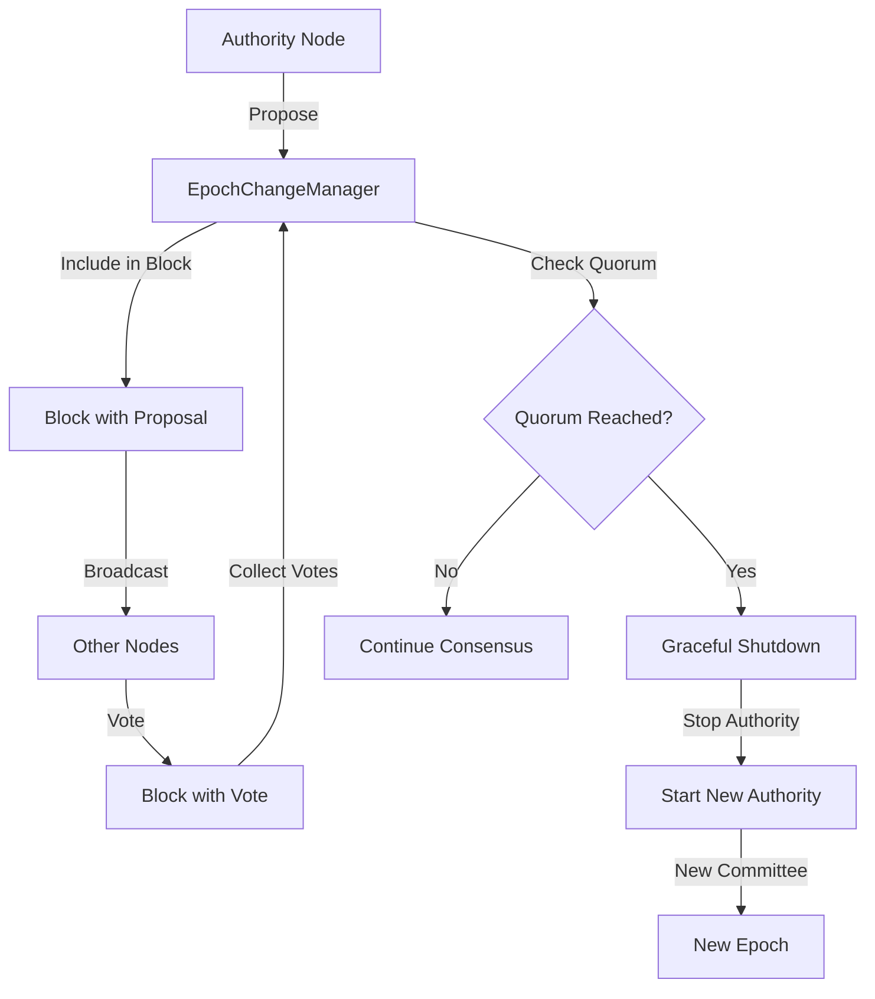

<!-- 59719b6a-6227-42dc-9dbc-7eb9365a779d 8e47ad06-a437-41b4-baf6-d7c4b003ec54 -->
# Kế hoạch Triển khai Consensus-Based Epoch Change

## Tổng quan

Triển khai cơ chế cho phép nodes đề xuất và vote epoch change thông qua consensus protocol. Khi đạt quorum (2f+1), tất cả nodes sẽ tự động transition sang epoch mới.

## Architecture Overview



## Phase 1: Data Structures (Week 1)

### 1.1 Tạo Epoch Change Types

**File:** `src/epoch_change.rs` (new file)

Tạo các structures:

- `EpochChangeProposal`: Proposal cho epoch mới
- `EpochChangeVote`: Vote của authority
- `EpochChangeManager`: Manager xử lý proposals và votes

**Key structures:**

```rust
#[derive(Clone, Debug, Serialize, Deserialize)]
pub struct EpochChangeProposal {
    pub new_epoch: u64,
    pub new_committee: Committee,
    pub new_epoch_timestamp_ms: u64,
    pub proposal_commit_index: u32,
    pub proposer: AuthorityIndex,
    pub signature: ProtocolKeySignature,
}

#[derive(Clone, Debug, Serialize, Deserialize)]
pub struct EpochChangeVote {
    pub proposal_hash: Vec<u8>,
    pub voter: AuthorityIndex,
    pub approve: bool,
    pub signature: ProtocolKeySignature,
}
```

### 1.2 Extend Block Structure

**File:** `sui-consensus/core/src/block.rs`

Thêm fields vào `BlockV1` và `BlockV2`:

- `epoch_change_proposal: Option<EpochChangeProposal>`
- `epoch_change_votes: Vec<EpochChangeVote>`

**Changes:**

- Update `BlockV1::new()` to accept optional proposal/votes
- Update `BlockAPI` trait nếu cần
- Update block serialization/deserialization

## Phase 2: Epoch Change Manager (Week 1-2)

### 2.1 Core Manager Implementation

**File:** `src/epoch_change.rs`

Implement `EpochChangeManager` với:

- `propose_epoch_change()`: Tạo proposal
- `vote_on_proposal()`: Vote trên proposal
- `check_proposal_quorum()`: Check quorum (2f+1)
- `validate_proposal()`: Validate proposal
- `validate_vote()`: Validate vote signature

**Key methods:**

```rust
impl EpochChangeManager {
    pub fn propose_epoch_change(
        &mut self,
        new_committee: Committee,
        new_epoch_timestamp_ms: u64,
        proposer_keypair: &ProtocolKeyPair,
    ) -> Result<EpochChangeProposal>
    
    pub fn vote_on_proposal(
        &mut self,
        proposal: &EpochChangeProposal,
        voter_keypair: &ProtocolKeyPair,
    ) -> Result<EpochChangeVote>
    
    pub fn check_proposal_quorum(
        &self,
        proposal: &EpochChangeProposal,
    ) -> Option<bool>  // Some(true) = approved, Some(false) = rejected, None = pending
}
```

### 2.2 Integration với ConsensusNode

**File:** `src/node.rs`

- Add `epoch_change_manager: Arc<RwLock<EpochChangeManager>>` vào `ConsensusNode`
- Initialize manager trong `ConsensusNode::new()`
- Expose methods để propose/vote

## Phase 3: Block Creation Integration (Week 2)

### 3.1 Include Proposal trong Block

**File:** `sui-consensus/core/src/core.rs` hoặc block creation logic

Khi authority tạo block:

- Check nếu có pending proposal từ `EpochChangeManager`
- Nếu có, include proposal trong block
- Check nếu có proposal từ other nodes cần vote
- Include vote trong block

**Logic:**

```rust
// Trong block creation
let epoch_change_proposal = epoch_change_manager
    .read()
    .get_pending_proposal_to_broadcast();

let epoch_change_votes = epoch_change_manager
    .read()
    .get_pending_votes_to_broadcast();

// Include trong block
block.set_epoch_change_proposal(epoch_change_proposal);
block.set_epoch_change_votes(epoch_change_votes);
```

### 3.2 Process Proposals/Votes từ Blocks

**File:** `sui-consensus/core/src/block_manager.rs` hoặc block processing

Khi nhận block:

- Extract `epoch_change_proposal` nếu có
- Extract `epoch_change_votes` nếu có
- Process vào `EpochChangeManager`
- Check quorum sau khi process votes

**Logic:**

```rust
// Khi nhận block
if let Some(proposal) = block.epoch_change_proposal() {
    epoch_change_manager.write().process_proposal(proposal)?;
}

for vote in block.epoch_change_votes() {
    epoch_change_manager.write().process_vote(vote)?;
}

// Check quorum
if let Some(approved) = epoch_change_manager.read().check_proposal_quorum(&proposal) {
    if approved {
        // Trigger transition
    }
}
```

## Phase 4: Graceful Shutdown (Week 2-3)

### 4.1 Shutdown Methods

**File:** `src/node.rs`

Extend `ConsensusNode` với graceful shutdown:

- `stop_accepting_transactions()`: Stop accept new transactions
- `wait_for_pending_transactions()`: Wait for pending to complete
- `wait_for_current_round_complete()`: Wait for round completion
- `flush_pending_commits()`: Flush all commits

**Implementation:**

```rust
impl ConsensusNode {
    pub async fn graceful_shutdown(&mut self) -> Result<()> {
        // 1. Stop accepting new transactions
        self.stop_accepting_transactions().await?;
        
        // 2. Wait for pending
        self.wait_for_pending_transactions().await?;
        
        // 3. Wait for round completion
        self.wait_for_current_round_complete().await?;
        
        // 4. Flush commits
        self.flush_pending_commits().await?;
        
        // 5. Stop authority
        self.shutdown().await?;
        
        Ok(())
    }
}
```

### 4.2 Transaction Client Control

**File:** `sui-consensus/core/src/transaction.rs`

Add flag để control transaction acceptance:

- `accepting_transactions: Arc<AtomicBool>`
- Check flag trong `TransactionClient::submit()`

## Phase 5: Epoch Transition (Week 3)

### 5.1 Transition Logic

**File:** `src/node.rs`

Implement `transition_to_epoch()`:

- Load last commit index
- Graceful shutdown current authority
- Create new context với new committee
- Start new authority với new epoch

**Implementation:**

```rust
impl ConsensusNode {
    pub async fn transition_to_epoch(
        &mut self,
        proposal: &EpochChangeProposal,
    ) -> Result<()> {
        // 1. Load last commit index
        let last_commit_index = self.load_last_commit_index()?;
        
        // 2. Graceful shutdown
        self.graceful_shutdown().await?;
        
        // 3. Update config với new committee
        self.update_committee_config(&proposal.new_committee)?;
        self.update_epoch_timestamp(proposal.new_epoch_timestamp_ms)?;
        
        // 4. Get own index in new committee
        let own_index = self.get_own_index_in_new_committee(&proposal.new_committee)?;
        
        // 5. Start new authority
        let new_authority = ConsensusAuthority::start(
            NetworkType::Tonic,
            proposal.new_epoch_timestamp_ms,
            own_index,
            proposal.new_committee.clone(),
            // ... other params ...
            last_commit_index,  // Replay từ commit cuối
        ).await?;
        
        self.authority = new_authority;
        
        Ok(())
    }
}
```

### 5.2 State Preservation

**File:** `src/node.rs`

- Load last commit index từ storage
- Preserve DAG state (nếu cần)
- Pass `replay_after_commit_index` vào `CommitConsumerArgs::new()`

## Phase 6: Integration và Coordination (Week 3-4)

### 6.1 Monitor và Trigger

**File:** `src/node.rs`

Add monitoring task:

- Monitor `EpochChangeManager` cho approved proposals
- Trigger transition khi quorum reached
- Log transition events

**Implementation:**

```rust
// Trong ConsensusNode::new()
let epoch_change_manager_clone = epoch_change_manager.clone();
let authority_clone = Arc::new(RwLock::new(self.authority.clone()));

tokio::spawn(async move {
    loop {
        tokio::time::sleep(Duration::from_secs(1)).await;
        
        // Check for approved proposals
        let manager = epoch_change_manager_clone.read();
        if let Some(proposal) = manager.get_approved_proposal() {
            drop(manager);
            
            // Trigger transition
            let mut node = authority_clone.write();
            if let Err(e) = node.transition_to_epoch(&proposal).await {
                error!("Epoch transition failed: {}", e);
            }
            break;
        }
    }
});
```

### 6.2 Proposal Trigger

**File:** `src/rpc.rs` hoặc CLI

Add RPC endpoint hoặc CLI command để trigger proposal:

- `POST /admin/propose_epoch_change` với new committee
- Hoặc CLI command: `metanode propose-epoch-change --committee-path <path>`

## Phase 7: Testing (Week 4)

### 7.1 Unit Tests

**File:** `src/epoch_change.rs` (tests module)

- Test proposal creation
- Test vote validation
- Test quorum calculation
- Test proposal validation

### 7.2 Integration Tests

**File:** `tests/epoch_transition_test.rs` (new file)

- Test full epoch transition flow
- Test với multiple nodes
- Test quorum scenarios
- Test graceful shutdown
- Test state preservation

### 7.3 Manual Testing

- Test trên local network với 4 nodes
- Test proposal và voting
- Test transition
- Verify no data loss
- Verify no fork

## Phase 8: Documentation và Monitoring (Week 4)

### 8.1 Update Documentation

**Files:**

- `docs/EPOCH_PRODUCTION.md`: Update với implementation details
- `docs/EPOCH.md`: Update với usage examples
- Code comments: Document all public APIs

### 8.2 Metrics và Logging

**File:** `src/epoch_change.rs`

Add metrics:

- `epoch_change_proposals_total`
- `epoch_change_votes_total`
- `epoch_change_quorum_reached_total`
- `epoch_transition_duration_seconds`

Add logging:

- Log proposal creation
- Log votes received
- Log quorum reached
- Log transition start/complete

## Implementation Details

### Key Files to Modify

1. **New files:**

   - `src/epoch_change.rs`: Core epoch change logic
   - `tests/epoch_transition_test.rs`: Integration tests

2. **Modified files:**

   - `src/node.rs`: Add epoch change manager, graceful shutdown, transition
   - `src/main.rs`: Add CLI command để propose epoch change
   - `src/rpc.rs`: Add RPC endpoint (optional)
   - `sui-consensus/core/src/block.rs`: Add proposal/votes fields
   - `sui-consensus/core/src/block_manager.rs`: Process proposals/votes
   - `sui-consensus/core/src/core.rs`: Include proposals/votes trong blocks

### Dependencies

- Sử dụng existing: `Committee`, `AuthorityIndex`, `ProtocolKeyPair`, `ProtocolKeySignature`
- Sử dụng existing: Block structure, consensus protocol
- Không cần external dependencies mới

### Risks và Mitigation

1. **Risk:** Transition có thể gây fork nếu không đồng bộ

   - **Mitigation:** Chỉ transition khi quorum reached, tất cả nodes transition cùng lúc

2. **Risk:** Graceful shutdown có thể timeout

   - **Mitigation:** Set reasonable timeouts, log warnings nếu timeout

3. **Risk:** State migration phức tạp

   - **Mitigation:** Start với state preservation đơn giản (replay từ last commit), optimize sau

## Success Criteria

- [ ] Nodes có thể propose epoch change
- [ ] Nodes có thể vote trên proposals
- [ ] Quorum check hoạt động correctly
- [ ] Transition tự động khi quorum reached
- [ ] Graceful shutdown hoạt động
- [ ] State được preserve (no data loss)
- [ ] No fork sau transition
- [ ] Tests pass
- [ ] Documentation complete

## Timeline

- **Week 1:** Data structures và EpochChangeManager core
- **Week 2:** Block integration và graceful shutdown
- **Week 3:** Transition logic và integration
- **Week 4:** Testing, documentation, monitoring

**Total:** 4 weeks

## Next Steps

1. Review plan với team
2. Start với Phase 1: Data structures
3. Implement incrementally, test sau mỗi phase
4. Document as you go
5. Deploy to staging sau Phase 6
6. Production deployment sau testing complete

### To-dos

- [ ] Phase 1: Tạo data structures (EpochChangeProposal, EpochChangeVote, EpochChangeManager) trong src/epoch_change.rs
- [ ] Phase 1: Extend Block structure (BlockV1, BlockV2) với epoch_change_proposal và epoch_change_votes fields
- [ ] Phase 2: Implement EpochChangeManager core methods (propose, vote, check_quorum, validate)
- [ ] Phase 2: Integrate EpochChangeManager vào ConsensusNode
- [ ] Phase 3: Include proposals/votes trong block creation logic
- [ ] Phase 3: Process proposals/votes từ received blocks và update EpochChangeManager
- [ ] Phase 4: Implement graceful shutdown methods (stop_accepting_transactions, wait_for_pending, flush_commits)
- [ ] Phase 5: Implement transition_to_epoch() với state preservation và new authority startup
- [ ] Phase 6: Add monitoring task để detect approved proposals và trigger transition
- [ ] Phase 6: Add RPC endpoint hoặc CLI command để trigger epoch change proposal
- [ ] Phase 7: Write unit tests cho EpochChangeManager (proposal, vote, quorum)
- [ ] Phase 7: Write integration tests cho full epoch transition flow với multiple nodes
- [ ] Phase 8: Update documentation (EPOCH_PRODUCTION.md, EPOCH.md) với implementation details
- [ ] Phase 8: Add metrics và logging cho epoch change events