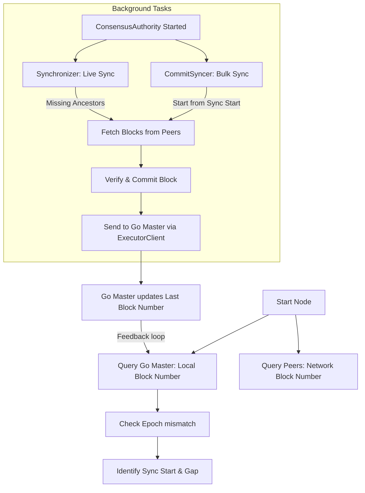

# Phân Tích Quá Trình Đồng Bộ Dữ Liệu Khi Khởi Động Lại Node (Mysticeti)

Tài liệu này mô tả chi tiết quy trình một node Mysticeti (có thể là Validator) thực hiện khi khởi động lại để đồng bộ dữ liệu với mạng lưới.

## 1. Tổng Quan Quy Trình Khởi Động

Khi một node khởi động lại, nó trải qua các giai đoạn chính sau:

1.  **Khởi tạo (Initialization):** Tải cấu hình, kết nối với Go Master để lấy thông tin Epoch hiện tại.
2.  **Phát hiện trạng thái (State Detection):** So sánh Epoch/Commit Index cục bộ với mạng lưới.
3.  **Chế độ Catchup (SyncingUp Mode):** Nếu bị lệch pha, node sẽ chuyển sang chế độ `SyncingUp` và tạm dừng tham gia đồng thuận.
4.  **Đồng bộ dữ liệu (Data Synchronization):** Chạy các tác vụ nền (`CommitSyncer`, `Synchronizer`) để tải các Block và Commit còn thiếu từ các peer.
5.  **Tham gia đồng thuận (Join Consensus):** Khi khoảng cách (gap) đủ nhỏ, node chuyển sang chế độ `Validator`.

---

## 2. Chi Tiết Các Hàm và Modules Tham Gia

### A. Giai đoạn Khởi Tạo (`metanode/src/node/startup.rs` & `mod.rs`)

Quá trình bắt đầu từ `main.rs` gọi đến `InitializedNode::initialize`.

1.  **Epoch Discovery (Tìm kiếm Epoch):**
    *   Hàm: `ConsensusNode::new_with_registry_and_service` (trong `metanode/src/node/mod.rs`)
    *   Hành động: Node query danh sách các Go Master của peers (`catchup::query_peer_epochs`) để tìm Epoch lớn nhất. Đây là bước quan trọng để tránh node khởi động với dữ liệu cũ.
    *   Nếu Local Epoch < Network Epoch: Xóa dữ liệu cũ (Stale Data) trong `storage`.

2.  **Load Committee (Tải Danh sách Validator):**
    *   Hàm: `ConsensusNode::new_with_registry_and_service`
    *   Hành động:
        *   Gọi `get_validators_at_block` từ Go Master (Local hoặc Peer tùy thuộc vào ai giữ Epoch đúng).
        *   Lấy `epoch_timestamp_ms` để đảm bảo Genesis Block Hash khớp với mạng lưới.
        *   Dùng `committee::build_committee_from_validator_list` để dựng đối tượng `Committee` cho Mysticeti.
        *   **Quan trọng:** Nếu Epoch được sync từ Peer, danh sách Validator cũng phải được lấy từ Peer đó để đảm bảo tính nhất quán.

3.  **Startup Catchup Loop:**
    *   Hàm: `run_main_loop` (trong `startup.rs`)
    *   Hành động:
        *   Tạo `CatchupManager` với danh sách peer sockets.
        *   Liên tục gọi `cm.check_sync_status(local_epoch, local_commit)` mỗi 2 giây.
        *   **Cập nhật mới:** `CatchupManager` sẽ query trực tiếp các Peer trong mạng lưới để lấy `Network Block Height`.
        *   **Block Consensus:** Trong lúc này, node set mode = `SyncingUp`. Nó sẽ **không** propose block mới cho đến khi synced.

### B. Cơ Chế Đồng Bộ Dữ Liệu (Consensus Core)

Trong khi `startup.rs` đang chờ (blocking loop), `ConsensusNode` đã khởi tạo `ConsensusAuthority` (trong `consensus-core`). Component này chịu trách nhiệm tải dữ liệu thực sự.

Có 2 component chính chịu trách nhiệm đồng bộ:

#### 1. CommitSyncer (`commit_syncer.rs`) - Đồng bộ Khối lượng lớn (Bulk Sync)
Đây là "công nhân" chính khi node bị tụt hậu xa.

*   **Logic chính:**
    *   So sánh `quorum_commit_index` (từ network votes) với `local_commit_index`.
    *   Nếu gap > 50 commits: Kích hoạt **Sync Mode** (tăng tần suất request, tăng batch size).
*   **Quy trình gọi hàm:**
    *   `schedule_loop`: Định kỳ kiểm tra lag.
    *   `try_schedule_once`: Xác định các range commit còn thiếu (ví dụ: fetch từ 1000 đến 2000).
    *   `fetch_loop` -> `fetch_once`:
        1.  Gửi RPC `FetchCommits` tới peer.
        2.  `verify_commits`: Xác thục chữ ký của Commit.
        3.  Gửi RPC `FetchBlocks`: Tải nội dung các Block được tham chiếu trong Commit.
        4.  `verify_blocks`: Xác thực Block.
        5.  `core_thread_dispatcher.add_certified_commits`: Đẩy Block đã verify vào Core để xử lý và lưu xuống DB.

#### 2. Synchronizer (`synchronizer.rs`) - Đồng bộ Live (Gap nhỏ)
Component này xử lý các thiếu hụt nhỏ, tức thời (ví dụ: nhận được Block B nhưng thiếu cha A).

*   **Logic chính:**
    *   Chạy định kỳ (200ms) hoặc khi Core báo thiếu Block cha.
*   **Quy trình gọi hàm:**
    *   `fetch_blocks_from_authority`: Gửi request xin các Block cụ thể (`BlockRef`).
    *   `process_fetched_blocks`:
        1.  `verify_blocks`: Verify signature.
        2.  `core_dispatcher.add_blocks`: Đẩy vào Core.

### C. Hoàn Tất Đồng Bộ (`metanode/src/node/catchup.rs`)

1.  **Catchup Manager (Cơ chế mới):**
    *   Hàm `check_sync_status` không còn so sánh Commit Index (vốn không đồng nhất với Block Height).
    *   **Logic Mới:**
        *   Lấy `Local Block Height` từ Go Master nội bộ.
        *   Lấy `Network Block Height` bằng cách query các Peer Go Master (`query_peer_epochs`).
        *   Tính `Block Gap` = `Network Block Height` - `Local Block Height`.
    *   Nếu `Block Gap <= 5` (ngưỡng an toàn) VÀ `Epoch Match`:
        *   Trả về `status.ready = true`.

2.  **Chuyển Mode:**
    *   `startup.rs` nhận thấy `ready`, log: `✅ [STARTUP] Node is synced`.
    *   Chuyển mode từ `SyncingUp` -> `Validator`.
    *   Bắt đầu tham gia consensus (propose block, vote).

---

### C. Đồng bộ Chỉ số Thực thi (Execution Index Sync)

Đây là phần **quan trọng nhất** để đảm bảo tính liên tục của dữ liệu giữa Rust và Go.

1.  **Lấy mốc từ Go Master:**
    *   Trong `ConsensusNode::new_with_registry_and_service`, node gọi `executor_client.get_last_block_number()` để lấy `last_global_exec_index`.
    *   Mốc này chính là điểm dừng cuối cùng của Go. Rust sẽ bắt đầu đồng bộ các block tiếp theo từ chỉ số `last_global_exec_index + 1`.

2.  **Kiểm tra Phục hồi (Recovery Check):**
    *   Hàm: `recovery::perform_block_recovery_check`
    *   Hành động: Nếu `last_global_exec_index > 0`, node sẽ kiểm tra trong RocksDB cục bộ xem có các block đã commit nhưng chưa được gửi sang Go hay không để thực hiện resend.

3.  **Chiến lược ưu tiên Network Tip:**
    *   Nếu phát hiện mốc Local Go Block cao hơn đáng kể so với mốc của Peers (Stale Chain), node sẽ buộc phải resync từ mốc của Peer để tránh bị fork.

## 3. Tóm Tắt Luồng Dữ Liệu

## 4. Các File Code Quan Trọng

*   `metanode/src/node/startup.rs`: Chứa vòng lặp chờ đồng bộ (wait loop).
*   `metanode/src/node/catchup.rs`: Logic kiểm tra Gap và trạng thái sync.
*   `consensus/core/src/commit_syncer.rs`: Logic tải dữ liệu quá khứ (Catchup).
*   `consensus/core/src/synchronizer.rs`: Logic tải dữ liệu tức thời (Live sync).
