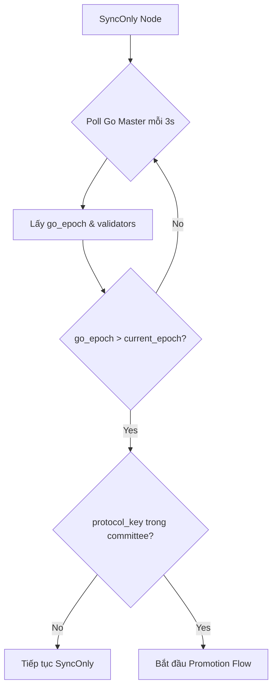
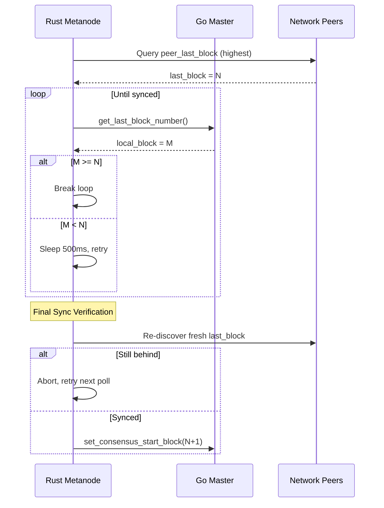

# Chuyển Đổi SyncOnly → Validator

Tài liệu mô tả chi tiết quá trình chuyển đổi một Full Node (SyncOnly) thành Validator trong hệ thống Mysticeti Metanode.

## 1. Tổng Quan Hai Chế Độ

### 1.1. SyncOnly Mode (Full Node)
- **Vai trò**: Đồng bộ dữ liệu từ Execution Layer (Go) mà không tham gia consensus
- **Hành vi**: 
  - Query Go Master định kỳ (5 giây/lần) để lấy `last_block_number`
  - Cập nhật `shared_last_global_exec_index` local
  - **KHÔNG** bind P2P ports (9000-9004) → Connection refused khi kiểm tra
- **Task chính**: `SyncTask` chạy nền

### 1.2. Validator Mode
- **Vai trò**: Tham gia consensus, propose và certify blocks
- **Hành vi**: 
  - Bind P2P consensus ports (9000-9004)
  - Propose blocks theo lịch trình BFT
  - Certify blocks của validators khác
- **Task chính**: `ConsensusAuthority` + các component liên quan

---

## 2. Điều Kiện Chuyển Đổi

### 2.1. Điều Kiện Bắt Buộc

| Điều kiện | Mô tả |
|:---|:---|
| **Committee Membership** | `protocol_key` của node phải có trong committee list của epoch mới |
| **Epoch Advancement** | `go_epoch > current_rust_epoch` (epoch mới đã bắt đầu trên network) |
| **Sync Completion** | Local Go Master đã đồng bộ đến `boundary_block` của epoch trước |

### 2.2. Epoch Boundary Join Requirement

> [!IMPORTANT]
> Node KHÔNG được join validator giữa epoch! Phải đợi epoch mới bắt đầu.

**Lý do**: Nếu join mid-epoch:
- Node mới dùng committee list mới (có bao gồm mình)
- Validators cũ vẫn dùng Genesis Committee (không có node mới)
- → Blocks bị reject: `Unexpected block authority [X] from peer [Y]`

---

## 3. Quy Trình Chuyển Đổi Chi Tiết

### 3.1. Phase 1: Detection (Epoch Monitor)



**Code liên quan**: `src/node/epoch_monitor.rs`

### 3.2. Phase 2: Synchronization Barrier

Trước khi transition, node phải đảm bảo đồng bộ hoàn toàn:



### 3.3. Phase 3: Handoff Signal

| API | Mục đích | Go Behavior |
|:---|:---|:---|
| `set_consensus_start_block(N)` | Thông báo consensus sẽ bắt đầu từ block N | Set `nextExpectedGlobalExecIndex = N`, stop sync |
| `wait_for_sync_to_block(N-1)` | Đợi Go đồng bộ đến N-1 | Poll `GetLastBlockNumber()` until reached |

### 3.4. Phase 4: Mode Switch

```rust
// Thứ tự thực hiện QUAN TRỌNG
1. self.node_mode = NodeMode::Validator;     // Cập nhật state TRƯỚC
2. self.sync_task.stop();                    // Dừng SyncTask
3. self.epoch_monitor_handle.take();         // Take (KHÔNG abort!)
4. ConsensusAuthority::start();              // Khởi động consensus
```

> [!WARNING]
> **State Update Before Effect**: Phải cập nhật `node_mode` TRƯỚC khi stop tasks, nếu không các background tasks sẽ check mode cũ và exit sớm.

---

## 4. Các Trường Quan Trọng Cần Đồng Bộ

### 4.1. epoch_base_index

```
global_exec_index = epoch_base_index + commit_index
```

| Trường | Nguồn | Ý nghĩa |
|:---|:---|:---|
| `epoch_base_index` | `GetEpochBoundaryData.boundary_block` | Block cuối cùng của epoch trước |
| `commit_index` | Mysticeti consensus sequence | Index của SubDAG trong epoch hiện tại |

> [!CAUTION]
> **KHÔNG** dùng local `shared_last_global_exec_index` cho `epoch_base_index`! Phải fetch từ `GetEpochBoundaryData` để đảm bảo consistency.

### 4.2. epoch_start_timestamp_ms

- **Nguồn**: `GetEpochBoundaryData` từ authoritative source
- **Dùng để**: Genesis block hash của epoch mới
- **Yêu cầu**: Tất cả nodes PHẢI dùng timestamp giống nhau

### 4.3. Validators List

- **Nguồn**: `GetEpochBoundaryData` tại block boundary
- **KHÔNG dùng**: `get_validators_at_block(latest)` → non-deterministic

---

## 5. Xử Lý Lỗi Thường Gặp

### 5.1. "Unexpected block authority"

**Nguyên nhân**: Node join mid-epoch, committee không khớp

**Fix**: Đảm bảo `go_epoch > current_epoch` trước khi transition

### 5.2. "Commit receiver closed"

**Nguyên nhân**: `CommitConsumer` bị drop khi ở SyncOnly mode

**Fix**: Persist `CommitConsumer` trong `ConsensusNode`:
```rust
pub struct ConsensusNode {
    pub(crate) commit_consumer: Option<CommitConsumer>, // Keeper
}
```

### 5.3. "RocksDB lock hold by current process"

**Nguyên nhân**: Duplicate epoch transition calls

**Fix**: Monotonic Epoch Guard:
```rust
if node.current_epoch >= new_epoch {
    return Ok(()); // No-op
}
```

---

## 6. Checklist Vận Hành

### 6.1. Trước Khi Đăng Ký Validator

- [ ] Node đã chạy ở SyncOnly mode và synced
- [ ] `protocol_key`, `authority_key`, `network_key` đã được generate đúng format
- [ ] Keys được lưu trong `committee.json` và `genesis.json`

### 6.2. Sau Khi Đăng Ký

- [ ] Đợi epoch transition (monitor logs)
- [ ] Verify: `go_epoch > current_epoch`
- [ ] Check logs: `[NODE MODE] Switching from SyncOnly to Validator`
- [ ] Confirm: P2P ports (9000-900x) đã bind

### 6.3. Verification Logs

```text
✅ Expected logs during successful transition:

📊 [COMMIT PROCESSOR] Configured with epoch=1, epoch_base_index=4273
🔄 [EPOCH MONITOR] Go epoch (1) advanced beyond startup epoch (0)
✅ [SYNC BARRIER] Local Go Master synced to peer tip at block 4273
🚀 [NODE MODE] Switching from SyncOnly to Validator
🟢 [CONSENSUS AUTHORITY] Started for epoch 1
```

---

## 7. Tham Khảo

- [Epoch Transition Architecture](../knowledge/epoch_transitions.md)
- [Fork Prevention](../knowledge/fork_prevention_and_recovery.md)
- [Transition Safety Mechanisms](../knowledge/transition_safety_mechanisms.md)
