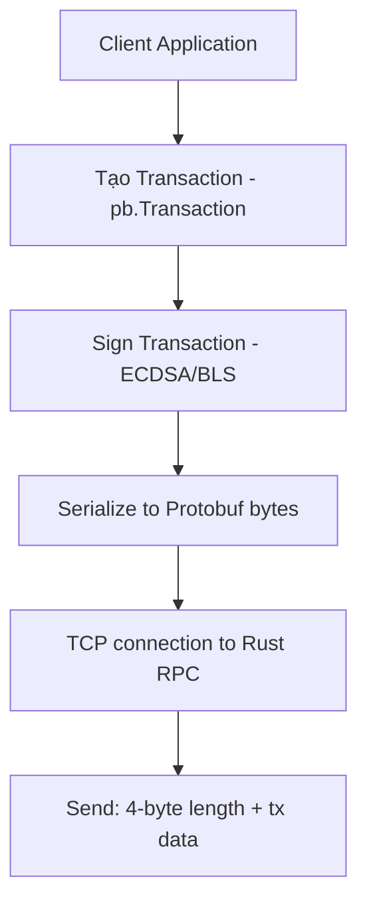
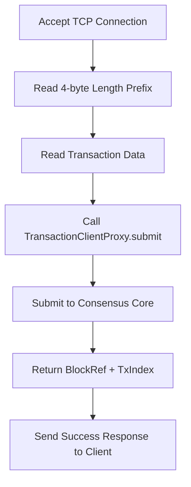
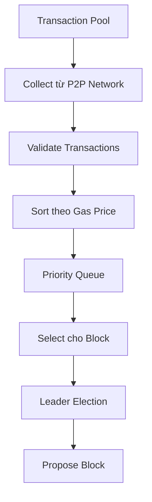
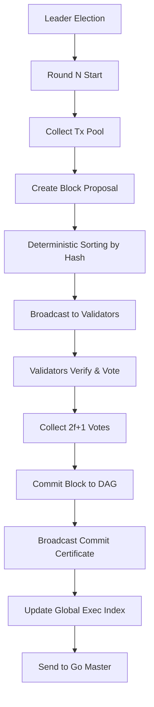
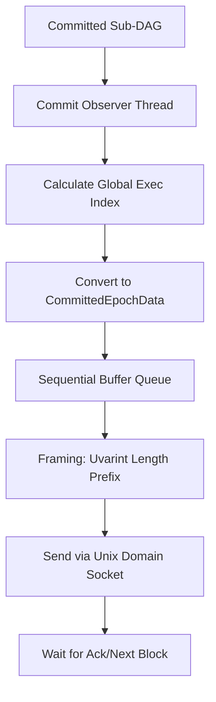
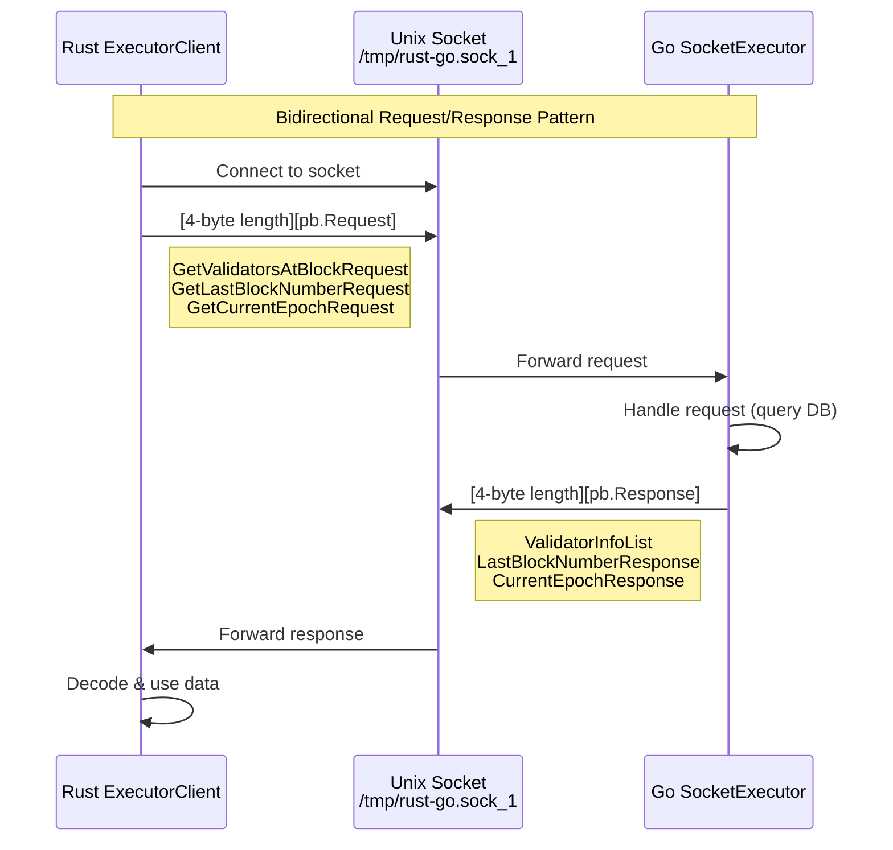
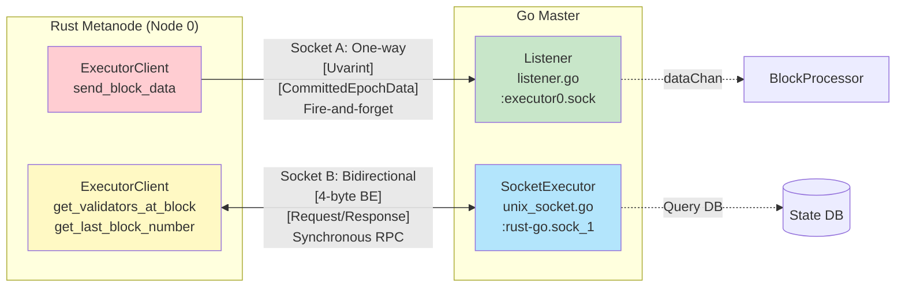
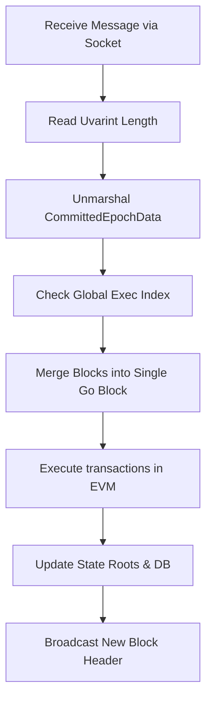
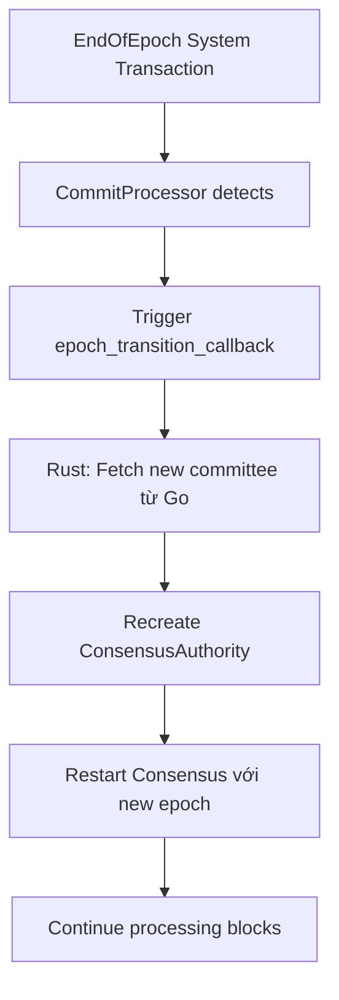
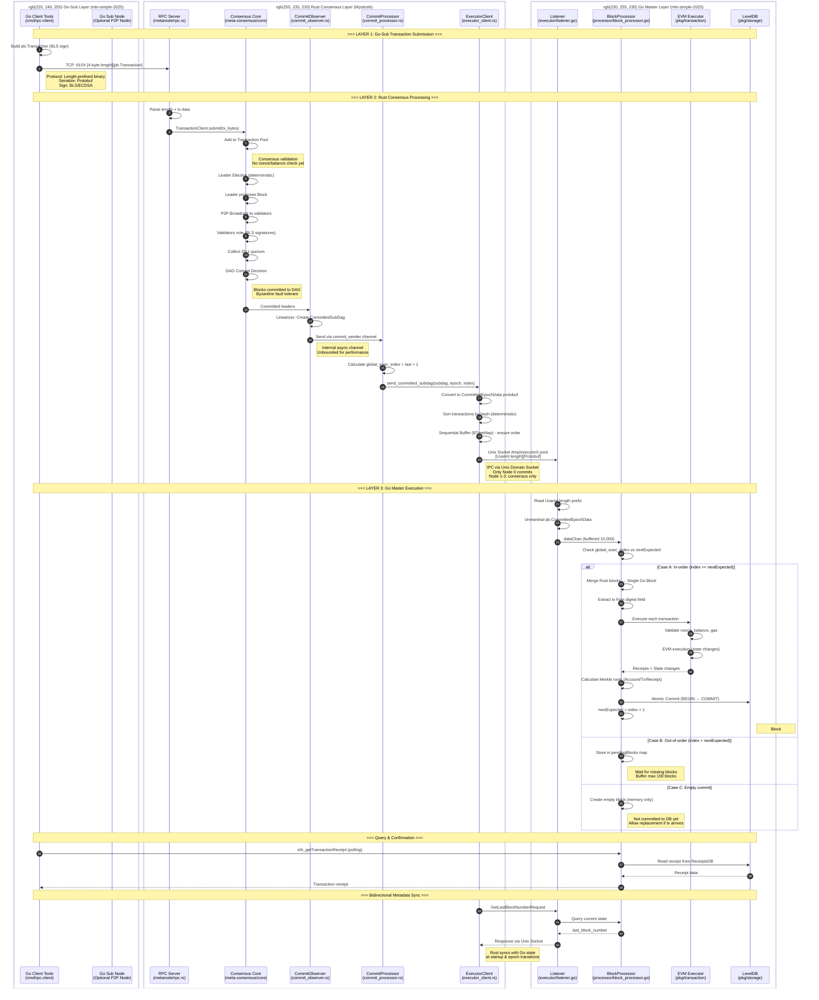

# Luồng Xử Lý Giao Dịch Hoàn Chỉnh: Go-sub → Rust Consensus → Go Master

*Tài liệu này nằm trong dự án Mysticeti - Rust Consensus Layer*

## Tổng Quan Hệ Thống

Hệ thống Mysticeti Blockchain là một nền tảng blockchain lai sử dụng kiến trúc hybrid Go/Rust với các thành phần chính:

- **Go Master** (`mtn-simple-2025`): Quản lý state và thực thi giao dịch
- **Rust Metanodes** (`Mysticeti`): Chạy consensus algorithm và tạo blocks
- **Go Sub** (`mtn-simple-2025`): Client applications submit giao dịch

Hệ thống hỗ trợ dynamic node roles: nodes có thể chuyển đổi giữa **Sync-only** (chỉ đồng bộ) và **Validator** (tham gia consensus) dựa trên committee membership.

## Kiến Trúc Tổng Thể

### Bản đồ triển khai trong repo

*Lưu ý: Hệ thống bao gồm hai repositories chính: `mtn-simple-2025` cho các thành phần Go và `Mysticeti` cho lớp consensus Rust.*

| Thành phần | Đường dẫn chính | Ghi chú |
|------------|-----------------|---------|
| **Rust RPC Server** | `Mysticeti/metanode/src/rpc.rs` | TCP server nhận transactions từ clients, submit vào consensus core qua `TransactionClientProxy.submit()`. |
| **Consensus Core** | `Mysticeti/metanode/meta-consensus/core/src/` (`commit_observer.rs`, `commit_finalizer.rs`, `linearizer.rs`) | DAG-based BFT: voting, commit decisions, finalize transactions, send `CommittedSubDag` qua channel. |
| **Metanode Wrapper** | `Mysticeti/metanode/src/` (`commit_processor.rs`, `executor_client.rs`) | Nhận commits từ channel, calculate `global_exec_index`, convert protobuf, sequential buffering, Unix socket transport. |
| **Go Master Executor** | `mtn-simple-2025/executor/listener.go`, `mtn-simple-2025/cmd/simple_chain/processor/block_processor.go` | Listener đọc Uvarint + protobuf, BlockProcessor merge Rust blocks → single Go block, execute EVM, commit DB. |
| **Config/Genesis** | `mtn-simple-2025/cmd/exec_node/genesis.json`, `Mysticeti/metanode/config/node_*.toml` | Genesis định nghĩa validators; node config điều khiển socket paths và executor toggles. |

```mermaid
graph TD
    subgraph GoSub["🔵 LAYER 1: Go-Sub (mtn-simple-2025)"]
        A[Go Client Tools<br/>cmd/rpc-client]
        B[Transaction Builder<br/>types.Transaction]
        C[BLS Signer<br/>pkg/bls]
    end

    subgraph Rust["🔴 LAYER 2: Rust Consensus (Mysticeti)"]
        D[RPC Server<br/>:9100-9104]
        E[Consensus Core<br/>meta-consensus/core]
        F[CommitObserver<br/>commit_observer.rs]
        G[CommitProcessor<br/>commit_processor.rs]
        H[ExecutorClient<br/>executor_client.rs]
    end

    subgraph GoMaster["🟢 LAYER 3: Go Master (mtn-simple-2025)"]
        I[Unix Socket Listener<br/>executor/listener.go]
        J[BlockProcessor<br/>processor/block_processor.go]
        K[EVM Executor<br/>pkg/transaction]
        L[State Manager<br/>pkg/state + pkg/storage]
        M[LevelDB<br/>Account/Block/Receipt DBs]
    end

    A -->|1. Build & Sign| B
    B -->|2. Protobuf Marshal| C
    C -->|3. TCP [length][data]| D
    D -->|4. submit| E
    E -->|5. Internal channels| F
    F -->|6. CommittedSubDag| G
    G -->|7. global_exec_index| H
    H -->|8. Unix Socket<br/>Uvarint + Protobuf| I
    I -->|9. dataChan| J
    J -->|10. Execute| K
    K -->|11. State updates| L
    L -->|12. Atomic commit| M
    
    H -.->|Metadata Query| I
    I -.->|Validators, Block#| H

    style GoSub fill:#e3f2fd
    style Rust fill:#ffebee
    style GoMaster fill:#e8f5e9
```

## Luồng Xử Lý Giao Dịch Chi Tiết

### Phase 1: Submit Transaction (Client → Rust RPC Server)

#### 1.1 Client Tạo và Gửi Transaction

**Điểm bắt đầu**: Client applications (wallets, dApps, testing tools)



**Hỗ trợ Chữ ký**:
- **ECDSA**: Tương thích hoàn toàn với Ethereum (MetaMask, Viem, v.v.)
- **BLS**: Sử dụng cho các giao dịch nội bộ hoặc tối ưu hóa (Custom meta-node protocol)

**Block Structure (Protobuf)**:
Block được đóng gói dưới dạng Protobuf `pb.Block` (định nghĩa trong `pkg/proto/block.proto`) với BlockHeader chứa thông tin epoch:

```protobuf
message BlockHeader {
  bytes LastBlockHash = 1;
  uint64 BlockNumber = 2;
  bytes AccountStatesRoot = 3;
  bytes ReceiptRoot = 4;
  bytes LeaderAddress = 5;
  bytes AggregateSignature = 6;
  uint64 TimeStamp = 7;
  bytes TransactionsRoot = 8;
  bytes StakeStatesRoot = 9;
  uint64 Epoch = 10;  // Thêm field epoch cho việc track epoch transitions
}
```

**Transaction Structure (Protobuf)**:
Giao dịch được đóng gói dưới dạng Protobuf `pb.Transaction` (định nghĩa trong `pkg/proto/transaction.proto`) trước khi gửi.

**Các phương thức submit**:
- **TCP to Rust RPC Server**: Cổng 9100-9104, protocol `[4-byte BE length][protobuf data]`
- **Go Client Tools**: `cmd/rpc-client/` có sẵn helper để build và gửi transactions
- **Testing Tools**: `client/spam_submit.sh` để stress test transaction throughput

#### 1.2 Rust RPC Server Processing

**RPC Server Flow** (`metanode/src/rpc.rs`):


**Processing Steps**:
1. **Connection Handling**: Async TCP server với semaphore để limit concurrent connections (max 500).
2. **Protocol Detection**: Đọc 4-byte đầu để detect length-prefixed binary hoặc HTTP protocol.
3. **Transaction Submission**: Gọi `TransactionClientProxy.submit()` để đưa vào consensus.
4. **Response**: Gửi binary response `[success byte][message]` cho client.

**Validation trong Consensus Core**:
- Signature verification (ECDSA/BLS) được thực hiện trong Core.
- Nonce, balance, gas validation được thực hiện tại thời điểm execution trong Go Master (không phải ở submission stage).

### Phase 2: Consensus & Block Creation (Rust Layer)

#### 2.1 Transaction Pool Management



**Pool Features**:
- **Dynamic sizing**: Tự động điều chỉnh theo load (min: 1000, max: 10000)
- **Priority ordering**: Gas price cao ưu tiên, sau đó theo thời gian nhận
- **Duplicate prevention**: Hash-based deduplication sử dụng Bloom filter
- **Expiration**: Remove stale transactions sau 30 phút
- **Capacity management**: LRU eviction khi đầy

**Transaction Pool Structure**:
```rust
// Định nghĩa trong mysticeti-core/src/transaction.rs
pub struct TransactionPool {
    pub transactions: HashMap<Hash, Transaction>,
    pub priority_queue: BinaryHeap<PrioritizedTransaction>,
    pub capacity: usize,
    pub bloom_filter: BloomFilter,
}

pub struct PrioritizedTransaction {
    pub hash: Hash,
    pub gas_price: u64,
    pub received_time: u64,
}
```

#### 2.2 DAG-based BFT Consensus



**Consensus Phases**:

1. **Leader Election**
   - Deterministic rotation theo round number: `leader = authorities[round % authorities.len()]`
   - Stake-weighted selection dựa trên voting power.

2. **Block Proposal Creation & Sorting**
   - Leader lấy các giao dịch từ pool.
   - **CRITICAL**: Các giao dịch trong một block được sắp xếp theo thứ tự deterministic (theo hash) để đảm bảo tất cả các node thực thi theo cùng một thứ tự, tránh fork.
   - `TransactionExe` message được tạo ra, trong đó field `digest` chứa **toàn bộ raw bytes** của giao dịch.

3. **Voting Phase**
   - Validators kiểm tra tính toàn vẹn của proposal và tính hợp lệ của các giao dịch.
   - Gửi chữ ký BLS aggregated để tối ưu hóa mạng.

4. **Finalization & Sequential Ordering**
   - Khi có đủ 2f+1 phiếu bầu, một **Commit Certificate** được tạo ra.
   - **Global Execution Index**: Được tính toán tuần tự để định danh block trên toàn hệ thống.
     ```rust
     fn calculate_global_exec_index(last_global_exec_index: u64) -> u64 {
         last_global_exec_index + 1
     }
     ```
   - Chỉ số này được chia sẻ giữa Rust và Go để đảm bảo tính nhất quán của số block.

#### 2.3 Block Structure và Protobuf Schema

```rust
// Định nghĩa trong mysticeti-core/src/commit_observer.rs (đối ứng với executor.proto)
pub struct CommittedSubDag {
    pub blocks: Vec<CommittedBlock>,
    pub leader: CommittedBlock,
    pub timestamp_ms: u64,
    pub epoch: u64,  // Epoch number cho block này
}

pub struct CommittedBlock {
    pub author: AuthorityIndex,
    pub round: Round,
    pub transactions: Vec<Transaction>,
}

pub struct Transaction {
    pub bytes: Vec<u8>, // CHỨA RAW TRANSACTION DATA (Protobuf bytes)
}
```

**Go BlockHeader với Epoch Field**:
```protobuf
// Định nghĩa trong pkg/proto/block.proto
message BlockHeader {
  bytes LastBlockHash = 1;
  uint64 BlockNumber = 2;
  bytes AccountStatesRoot = 3;
  bytes ReceiptRoot = 4;
  bytes LeaderAddress = 5;
  bytes AggregateSignature = 6;
  uint64 TimeStamp = 7;
  bytes TransactionsRoot = 8;
  bytes StakeStatesRoot = 9;
  uint64 Epoch = 10;  // Thêm để track epoch transitions trong state
}
```

#### 2.4 Rust Consensus Implementation Notes

**Consensus Core** (`metanode/meta-consensus/core/src/`):
- `commit_observer.rs`: Nhận committed leaders từ Core consensus, gọi Linearizer để tạo `CommittedSubDag`, forward đến `CommitFinalizer` qua channel.
- `commit_finalizer.rs`: Finalize transactions (handle reject votes), persist commits to storage, rồi gửi finalized `CommittedSubDag` qua `commit_sender` channel.
- `linearizer.rs`: Tạo deterministic ordering của blocks trong một commit dựa trên DAG topology.

**Metanode Wrapper** (`metanode/src/`):
- `node.rs`: Khởi tạo `ConsensusAuthority`, setup `CommitConsumerArgs` với channel để nhận commits từ Core, quản lý executor client và epoch transitions.
- `commit_processor.rs`: Nhận `CommittedSubDag` từ `commit_receiver`, tính `global_exec_index = last + 1`, gọi `ExecutorClient::send_committed_subdag()`.
- `executor_client.rs`: Convert `CommittedSubDag` → protobuf `CommittedEpochData`, sort transactions by hash, buffer trong `BTreeMap` để ensure sequential sending, gửi qua Unix Socket với Uvarint framing.
- `rpc.rs`: TCP server nhận transactions từ clients, submit vào consensus qua `TransactionClientProxy`.
- `tx_submitter.rs`: Wrapper cho `TransactionClient` của consensus core, cho phép swap client khi epoch transition.

### Phase 3: Block Execution (Rust → Go Master)

#### 3.1 Commit Observer (Rust Side)



**Critical Components**:

- **Global Execution Index**: Đóng vai trò là số block (Block Number) trong Go Master.
- **Sequential Buffer**: FIFO queue đảm bảo blocks được gửi theo đúng thứ tự. Nếu có block bị mất, hệ thống sẽ dừng lại và đợi cho đến khi block đó xuất hiện.
- **Message Framing**: Sử dụng **Uvarint** để mã hóa độ dài của message trước khi gửi qua Unix Socket (tương thích với `binary.ReadUvarint` của Go).

#### 3.2 Unix Domain Socket Communication Protocol

Hệ thống sử dụng **2 loại Unix Socket** với mục đích khác nhau:

**A. One-way Socket (Rust → Go): Block Delivery**

**Socket Path**: `/tmp/executor0.sock`
- **Direction**: Rust gửi → Go nhận (one-way, fire-and-forget)
- **Purpose**: Gửi committed blocks từ Rust đến Go Master để execute
- **Protocol**: `[Uvarint length][pb.CommittedEpochData protobuf]`
- **Acknowledgment**: Không có explicit ACK, Go xử lý async qua `dataChan`

**Implementation**:
```rust
// Rust side (executor_client.rs)
let mut len_buf = Vec::new();
write_uvarint(&mut len_buf, epoch_data_bytes.len())?;
stream.write_all(&len_buf).await?;
stream.write_all(epoch_data_bytes).await?;
stream.flush().await?;
```

```go
// Go side (listener.go)
msgLen, err := binary.ReadUvarint(reader)
buf := make([]byte, msgLen)
io.ReadFull(reader, buf)
proto.Unmarshal(buf, &epochData)
dataChan <- &epochData  // Send to BlockProcessor
```

**B. Bidirectional Socket (Rust ↔ Go): Metadata Sync**

**Socket Path**: `/tmp/rust-go.sock_1`
- **Direction**: Request/Response (bidirectional)
- **Purpose**: Rust query metadata từ Go Master (validators, block numbers, epoch info)
- **Protocol**: `[4-byte BE length][pb.Request]` → `[4-byte BE length][pb.Response]`
- **Timeout**: 5 seconds cho mỗi request/response

**Request Flow**:


**Implementation**:
```rust
// Rust side - Send request (executor_client.rs)
let len = request_buf.len() as u32;
let len_bytes = len.to_be_bytes();  // Big-Endian 4 bytes
stream.write_all(&len_bytes).await?;
stream.write_all(&request_buf).await?;

// Rust side - Read response
let mut len_buf = [0u8; 4];
stream.read_exact(&mut len_buf).await?;
let response_len = u32::from_be_bytes(len_buf);
let mut response_buf = vec![0u8; response_len];
stream.read_exact(&mut response_buf).await?;
let response = Response::decode(&response_buf[..])?;
```

```go
// Go side - Handle requests (unix_socket.go)
func (se *SocketExecutor) handleConnection(conn net.Conn) {
    for {
        var wrappedRequest pb.Request
        ReadMessage(conn, &wrappedRequest)  // Read [4-byte][protobuf]
        
        // Process request
        var wrappedResponse *pb.Response
        switch req := wrappedRequest.GetPayload().(type) {
        case *pb.Request_GetValidatorsAtBlockRequest:
            res := se.requestHandler.HandleGetValidatorsAtBlockRequest(req)
            wrappedResponse = &pb.Response{
                Payload: &pb.Response_ValidatorInfoList{ValidatorInfoList: res},
            }
        // ... other cases
        }
        
        WriteMessage(conn, wrappedResponse)  // Write [4-byte][protobuf]
    }
}
```

**Use Cases**:
1. **Startup**: Rust query `GetValidatorsAtBlock(0)` để load genesis committee
2. **Initialization**: Rust query `GetLastBlockNumber()` để sync với Go's state
3. **Epoch Transition**: Rust query `GetActiveValidators()` để fetch new committee
4. **State Sync**: Rust query current epoch info để ensure consistency

**Tóm tắt 2 loại Unix Socket**:

| Aspect | Block Delivery Socket | Metadata Sync Socket |
|--------|----------------------|---------------------|
| **Path** | `/tmp/executor0.sock` | `/tmp/rust-go.sock_1` |
| **Pattern** | One-way (Rust → Go) | Bidirectional (Rust ↔ Go) |
| **Protocol** | Uvarint + Protobuf | 4-byte BE + Protobuf |
| **Data** | `CommittedEpochData` (blocks) | `Request`/`Response` (metadata) |
| **Frequency** | Every consensus commit (~1-2s) | On-demand (startup, epoch transition) |
| **Rust Sender** | `executor_client.rs::send_block_data()` | `executor_client.rs::get_validators_at_block()` |
| **Go Receiver** | `listener.go::handleConnection()` | `unix_socket.go::handleConnection()` |
| **Async** | Fire-and-forget, Go buffers | Synchronous request/response |
| **Acknowledgment** | ❌ KHÔNG CÓ (No ACK) | ✅ CÓ (Response message) |

### Chi tiết về "Không có ACK" trong Block Delivery

**Câu hỏi**: Rust gửi block mà không chờ xác nhận, vậy làm sao đảm bảo Go Master đã nhận?

**Trả lời**: Rust sử dụng **"Trust the OS + Sequential Buffer"** thay vì explicit ACK:

#### Cơ chế đảm bảo reliability:

**1. TCP-level Guarantee** (OS handle):
```rust
// Rust code
stream.write_all(&data).await?;  // Write to socket buffer
stream.flush().await?;            // Flush to OS kernel
// ✅ Nếu Ok(()) → Data đã vào OS kernel buffer
// ✅ OS đảm bảo deliver đến Go process (hoặc fail nếu connection break)
```

- Khi `flush()` return `Ok(())`, nghĩa là data **đã được OS kernel chấp nhận**.
- OS kernel đảm bảo deliver data đến Go process (nếu connection còn sống).
- Nếu Go process crash hoặc socket đóng, `write()` sẽ return **error** → Rust biết ngay.

**2. Sequential Buffer** (Application-level):
```rust
// Rust buffer blocks để ensure ordering
send_buffer: BTreeMap<u64, (Vec<u8>, u64, u32)>
next_expected_index: u64

// Chỉ gửi khi index match
if global_exec_index == next_expected {
    send_block_data();  // Fire-and-forget
    next_expected += 1;  // Increment sau khi gửi
}
```

- Rust track `next_expected_index` locally
- Chỉ gửi blocks theo thứ tự (1, 2, 3, ...)
- Nếu block 5 đến trước block 4 → buffer block 5, chờ block 4

**3. Go Master Buffering**:
```go
// Go side
dataChan := make(chan *pb.CommittedEpochData, 10000)  // Buffer 10,000 blocks
nextExpectedGlobalExecIndex := lastBlock + 1

// Process in order
for epochData := range dataChan {
    if epochData.GlobalExecIndex == nextExpected {
        processBlock()  // Execute immediately
        nextExpected++
    } else if epochData.GlobalExecIndex > nextExpected {
        pendingBlocks[index] = epochData  // Buffer for later
    }
}
```

- Go Master buffer out-of-order blocks
- Process theo đúng sequence
- Không miss blocks nhờ large buffer (10,000)

**4. Error Handling**:
```rust
// Nếu write fail (connection broken)
Err(e) => {
    warn!("Failed to send");
    *conn_guard = None;  // Clear connection
    // Reconnect
    self.connect().await?;
    // Retry send
    retry_stream.write_all(&data).await?;
}
```

**Tại sao KHÔNG cần explicit ACK?**

❌ **ACK sẽ làm chậm**: Mỗi block phải đợi ACK → latency tăng gấp đôi
❌ **Không cần thiết**: OS socket đã guarantee delivery trong local machine
✅ **Fire-and-forget nhanh hơn**: Rust có thể gửi nhiều blocks liên tiếp
✅ **Sequential buffer đủ**: Ensure ordering without ACK
✅ **Connection failure = implicit NACK**: Rust detect ngay khi Go crash

**So sánh với hệ thống có ACK**:

| | No ACK (Current) | With ACK |
|---|------------------|----------|
| **Latency** | ~0.1ms (write only) | ~1-2ms (write + wait + read) |
| **Throughput** | High (parallel sends) | Low (serialized by ACK) |
| **Complexity** | Simple | Complex (ACK matching, timeouts) |
| **Reliability** | OS + Buffer guarantee | Explicit confirmation |
| **Use Case** | ✅ Local IPC (same machine) | Network communication |

**Kết luận**: 
- Block Delivery Socket là **one-way, fire-and-forget**.
- **KHÔNG CÓ** explicit ACK message từ Go về Rust.
- Reliability được đảm bảo bởi OS kernel + sequential buffer + large Go buffer.
- Thiết kế này tối ưu cho **low-latency local IPC** trên cùng một máy.

**Visual: Hai kênh Unix Socket**



**Key Differences**:

**Socket A (Block Delivery)**:
- Rust **chỉ gửi**, không đợi response
- Go **nhận async** qua buffered channel
- High frequency (mỗi 1-2 giây khi có commit)
- Large data size (có thể chứa hàng trăm transactions)

**Socket B (Metadata Sync)**:
- Rust **gửi request và đợi response**
- Go **xử lý đồng bộ** và trả về data
- Low frequency (chỉ khi startup, epoch transition)
- Small data size (validator list, block number, epoch info)

**Lý do thiết kế 2 sockets riêng**:
- **Performance**: Block delivery không bị block bởi metadata queries
- **Simplicity**: Clear separation of concerns
- **Reliability**: Metadata queries có timeout và retry logic riêng
- **Scalability**: Async block delivery không ảnh hưởng đến sync queries

#### 3.3 Go Master Execution Engine



**Execution Pipeline**:

1. **Gộp Block (Single Block per Commit)**
   - Go Master nhận một sub-DAG chứa nhiều Rust blocks.
   - Toàn bộ giao dịch trong sub-DAG được gộp lại để thực thi trong **một block Go duy nhất**.
   - Số block Go này chính bằng `global_exec_index`.

2. **Xử lý Empty Commit (Lag handling)**
   - Nếu nhận được commit không có block/giao dịch, Go Master tạo một **empty block trong bộ nhớ**.
   - Block này không được commit vào DB ngay lập tức để cho phép các commit có giao dịch (cùng index) thay thế nếu chúng đến sau (phòng trường hợp network delay).

3. **Transaction Execution Engine**
   - Giải mã `pb.Transaction` từ field `digest` của `TransactionExe`.
   - Thực thi tuần tự trong EVM.
   - Cập nhật account states, nonces và gas accounting.

4. **State Management & Finalization**
   - Cập nhật Merkle Patricia Trie (Account, Storage, Transaction, Receipt).
   - Commit nguyên tử (Atomic commit) vào LevelDB.
   - Cập nhật `lastCommittedBlockNumber` để Rust đồng bộ lại khi khởi động.

#### 3.4 Go Master Unix Socket Listener & Control Plane
- `executor/listener.go` lắng nghe `/tmp/executor{N}.sock`, sử dụng buffer 10,000 để tránh block Rust thread.
- `executor/unix_socket.go` xử lý các yêu cầu metadata từ Rust: `GetValidatorsAtBlock`, `GetLastBlockNumber`, `AdvanceEpochRequest`.
- Đây là kênh liên lạc hai chiều đảm bảo Rust luôn có thông tin mới nhất về committee và state của Go.

## Node Roles & Responsibilities

### Rust Validator Nodes (Mysticeti Metanodes)

**Primary Node (Node 0 - Commit Enabled)**:
- ✅ Tham gia consensus voting đầy đủ
- ✅ Propose và vote cho blocks
- ✅ **Gửi committed blocks đến Go Master** (`executor_commit_enabled = true`)
- ✅ Chạy RPC server cho client submissions (port 9100)
- ✅ Query Go Master cho committee updates và state sync

**Secondary Validator Nodes (Node 1-3)**:
- ✅ Tham gia consensus voting đầy đủ
- ✅ Propose và vote cho blocks  
- ❌ **KHÔNG gửi blocks đến Go** (`executor_commit_enabled = false`)
- ✅ Chạy RPC server (port 9101-9104)
- ✅ Read-only access đến Go Master cho committee info

**Configuration**:
```toml
# Node 0 (Primary)
executor_commit_enabled = true
executor_send_socket_path = "/tmp/executor0.sock"

# Node 1-3 (Secondary Validators)
executor_commit_enabled = false
executor_read_enabled = true
```

### Go Master Node (Single Execution Engine)

**Responsibilities**:
- Nhận blocks từ Rust Primary Node qua Unix Socket
- Execute tất cả transactions trong EVM
- Quản lý global state (accounts, contracts, balances)
- Persist blocks và state vào LevelDB
- Serve RPC queries từ clients (eth_getBalance, eth_call, etc.)
- Provide committee information cho Rust validators

**Note**: Chỉ có **một Go Master node duy nhất** thực thi transactions. Các Rust validators chỉ làm consensus.

### Epoch Transitions



**Epoch Transition Flow**:
1. Special `EndOfEpoch` transaction được detect trong commit.
2. Rust node query Go Master cho new committee (`GetActiveValidatorsRequest`).
3. Recreate `ConsensusAuthority` với new committee và epoch number.
4. `CommitProcessor` và `ExecutorClient` reset với new epoch state.
5. Pending transactions trong queue được re-submitted vào new epoch.

## Storage Architecture

### Database Types
| Database | Chức năng | Storage Engine |
|----------|-----------|---------------|
| AccountState | Balances, nonces | LevelDB |
| TransactionState | Tx receipts | LevelDB |
| Blocks | Block headers + bodies | LevelDB |
| Stake | Validators, delegations | LevelDB |
| SmartContractCode | Contract bytecode | LevelDB |
| SmartContractStorage | Contract variables | LevelDB |
| Receipts | Event logs | LevelDB |
| Trie | Merkle tree nodes | LevelDB |
| Mapping | Address → Tx history | LevelDB |
| Backup | Database backups | Remote |

### Merkle Patricia Trie
- **Account State Trie**: Map address → account data
- **Storage Trie**: Map slot → value (per contract)
- **Transaction Trie**: Map index → transaction
- **Receipt Trie**: Map index → receipt

## Security & Consistency Guarantees

### Fork Prevention Mechanisms
1. **Global Execution Index**: Sequential numbering across epochs
2. **Sequential Processing**: Go Master buffers out-of-order blocks
3. **State Root Verification**: Cryptographic consistency checks
4. **BLS Signatures**: Validator authentication

### Transaction Integrity
1. **Hash Verification**: Tại mỗi layer transition
2. **Protobuf Validation**: Data format integrity
3. **Deterministic Ordering**: Transactions sorted by hash
4. **Duplicate Detection**: Prevent replay attacks

### Network Resilience
1. **Leader Rotation**: Handle validator failures
2. **Epoch Transitions**: Dynamic committee updates
3. **State Synchronization**: Recovery mechanisms
4. **Connection Pooling**: Network fault tolerance

## End-to-End Transaction Flow với Timing

### Complete Transaction Journey - 3 Layer Architecture



### Giải thích chi tiết các Layer và Data Flow

#### LAYER 1: Go-Sub (Transaction Submission Layer)

**Thành phần**: Go Client Tools trong `mtn-simple-2025/cmd/rpc-client/`

**Chức năng**:
- Build và sign transactions (BLS hoặc ECDSA)
- Serialize transactions thành Protobuf format
- Gửi đến Rust RPC Server qua TCP connection
- Protocol: `[4-byte BE length][pb.Transaction bytes]`

**Data Flow Direction**: `Go-Sub → Rust Consensus (one-way)`

**Code Path**:
```
Go Client (cmd/rpc-client/controllers/transaction_controller.go)
  → Build types.Transaction
  → Sign with BLS key
  → Marshal to protobuf
  → TCP connect to localhost:910X
  → Send [length][data]
```

---

#### LAYER 2: Rust Consensus (DAG-based BFT Layer)

**Thành phần**: Rust Metanodes trong `Mysticeti/metanode/`

**Luồng xử lý nội bộ**:

1. **RPC Server** (`metanode/src/rpc.rs`):
   - Nhận TCP connections từ Go-Sub clients
   - Parse length-prefixed binary protocol
   - Submit vào Consensus Core

2. **Consensus Core** (`meta-consensus/core/src/`):
   - Transaction Pool management
   - Leader election (deterministic rotation)
   - Block proposal & P2P broadcast
   - Vote collection (2f+1 Byzantine quorum)
   - DAG commit decisions

3. **CommitObserver** (`core/src/commit_observer.rs`):
   - Nhận committed leaders từ Core
   - Gọi Linearizer để tạo deterministic ordering
   - Tạo `CommittedSubDag` structures
   - Forward qua internal channel

4. **CommitProcessor** (`metanode/src/commit_processor.rs`):
   - Nhận `CommittedSubDag` từ channel
   - **Calculate global_exec_index = last_global_exec_index + 1**
   - Gọi ExecutorClient

5. **ExecutorClient** (`metanode/src/executor_client.rs`):
   - Convert `CommittedSubDag` → Protobuf `CommittedEpochData`
   - **Sort transactions by hash** (deterministic cho fork prevention)
   - Sequential buffering (BTreeMap) để ensure order
   - Send via Unix Socket `/tmp/executor0.sock`

**Data Flow Direction**: 
- `Go-Sub → Rust` (transaction submission)
- `Rust → Go Master` (committed blocks via Unix Socket)
- `Rust ← Go Master` (metadata queries via Unix Socket)

**Communication Protocols**:
- **Inbound**: TCP length-prefixed binary từ Go-Sub
- **Internal**: Tokio async channels giữa các components
- **Outbound**: Unix Socket với Uvarint framing đến Go Master
- **Metadata Query**: Unix Socket request/response với Go Master

---

#### LAYER 3: Go Master (Execution & State Layer)

**Thành phần**: Single Go Master Node trong `mtn-simple-2025/`

**Luồng xử lý**:

1. **Unix Socket Listener** (`executor/listener.go`):
   - Listen trên `/tmp/executor0.sock`
   - Read Uvarint length prefix + Protobuf data
   - Unmarshal `pb.CommittedEpochData`
   - Send qua buffered channel (10,000 capacity)

2. **BlockProcessor** (`cmd/simple_chain/processor/block_processor.go`):
   - Receive từ `dataChan`
   - **Kiểm tra sequential ordering**: `global_exec_index` vs `nextExpectedGlobalExecIndex`
   - **Merge strategy**: Gộp tất cả Rust blocks trong một commit → **Single Go Block**
   - **Block numbering**: `Go Block #N = global_exec_index N`

3. **EVM Executor** (`pkg/transaction/execute_sc_transactions.go`):
   - Extract transactions từ `digest` field
   - **Validate**: Nonce, balance, gas, signatures (tại execution time)
   - Execute sequentially trong EVM
   - Generate receipts và event logs

4. **State Manager** (`pkg/state/`, `pkg/blockchain/`):
   - Update Account State (balances, nonces)
   - Update Smart Contract Storage
   - Calculate Merkle Patricia Trie roots
   - Atomic commit vào LevelDB

**Data Flow Direction**:
- `Rust → Go Master` (blocks via Unix Socket)
- `Go Master → DB` (state persistence)
- `Go Master ← Clients` (RPC queries for receipts/state)
- `Go Master → Rust` (metadata responses: last block, validators, epoch info)

**Sequential Processing**:
```
nextExpectedGlobalExecIndex = last_block + 1

Receive block với global_exec_index N:
  ├─ If N == nextExpected: Process immediately
  ├─ If N > nextExpected: Store in pendingBlocks, wait
  └─ If N < nextExpected: Duplicate, skip
```

---

### Cross-Layer Communication Protocols

#### 1. Go-Sub → Rust Consensus (Transaction Submission)

**Protocol**: TCP với Length-Prefixed Binary
```
[4 bytes: length (Big-Endian)][N bytes: pb.Transaction]
```

**Implementation**:
- **Go Client**: `cmd/rpc-client/controllers/transaction_controller.go`
  - Build `types.Transaction` object
  - Sign với BLS private key: `transaction.SetSign(keyPair.PrivateKey())`
  - Marshal: `transaction.Marshal()` → protobuf bytes
  - Send qua TCP connection

- **Rust RPC Server**: `metanode/src/rpc.rs`
  - Accept TCP connection trên port 910X
  - Read: `stream.read_exact(&mut len_buf)` (4 bytes BE)
  - Read: `stream.read_exact(&mut tx_data)` (N bytes)
  - Submit: `transaction_client.submit(vec![tx_data])`

**Data Format**: Protobuf `pb.Transaction` (định nghĩa trong `pkg/proto/transaction.proto`)

---

#### 2. Rust Consensus → Go Master (Block Delivery)

**Protocol**: Unix Domain Socket với Uvarint Length-Prefix
```
[Uvarint: length][N bytes: pb.CommittedEpochData]
```

**Implementation**:
- **Rust ExecutorClient**: `metanode/src/executor_client.rs`
  ```rust
  // Write Uvarint length prefix (Go-compatible)
  write_uvarint(&mut len_buf, epoch_data_bytes.len())?;
  stream.write_all(&len_buf).await?;
  stream.write_all(epoch_data_bytes).await?;
  ```

- **Go Listener**: `executor/listener.go`
  ```go
  // Read Uvarint length
  msgLen, err := binary.ReadUvarint(reader)
  // Read protobuf data
  buf := make([]byte, msgLen)
  io.ReadFull(reader, buf)
  // Unmarshal
  proto.Unmarshal(buf, &epochData)
  ```

**Socket Path**: `/tmp/executor0.sock` (chỉ Node 0 gửi)

**Data Format**: Protobuf `pb.CommittedEpochData`
```protobuf
message CommittedEpochData {
  repeated CommittedBlock blocks = 1;
  uint64 global_exec_index = 2;  // Block number in Go
  uint32 commit_index = 3;       // Commit index in epoch
  uint64 epoch = 4;              // Epoch number cho commit này
}

message CommittedBlock {
  uint64 epoch = 1;
  uint64 height = 2;
  repeated TransactionExe transactions = 3;
}

message TransactionExe {
  bytes digest = 1;  // RAW pb.Transaction bytes
  uint32 worker_id = 2;
}
```

**Go BlockHeader Format với Epoch Field**:
```protobuf
// Định nghĩa trong pkg/proto/block.proto
message BlockHeader {
  bytes LastBlockHash = 1;
  uint64 BlockNumber = 2;        // global_exec_index từ CommittedEpochData
  bytes AccountStatesRoot = 3;
  bytes ReceiptRoot = 4;
  bytes LeaderAddress = 5;
  bytes AggregateSignature = 6;
  uint64 TimeStamp = 7;
  bytes TransactionsRoot = 8;
  bytes StakeStatesRoot = 9;
  uint64 Epoch = 10;             // Epoch từ CommittedEpochData.epoch
}
```

**Cách sử dụng Epoch Field**:
- **Trong Block Creation**: Khi Go Master tạo Block từ CommittedEpochData, field `BlockHeader.Epoch` được set bằng `CommittedEpochData.epoch`
- **Trong State Persistence**: Epoch được lưu trong block header để track epoch transitions trong blockchain state
- **Trong Query APIs**: Clients có thể query epoch của một block cụ thể qua `eth_getBlockByNumber`
- **Trong Consensus Sync**: Khi Rust node restart, có thể sync epoch info từ Go Master để biết epoch hiện tại

**Critical**: Field `digest` chứa toàn bộ raw transaction data (protobuf bytes), không phải hash.

---

#### 3. Go Master → Rust Consensus (Metadata Sync)

**Protocol**: Unix Domain Socket với 4-byte BE Length-Prefix
```
Request:  [4 bytes: length (BE)][pb.Request]
Response: [4 bytes: length (BE)][pb.Response]
```

**Implementation**:
- **Rust Query**: `metanode/src/executor_client.rs`
  ```rust
  // Send request
  let len = request_buf.len() as u32;
  stream.write_all(&len.to_be_bytes()).await?;
  stream.write_all(&request_buf).await?;
  
  // Read response
  let mut len_buf = [0u8; 4];
  stream.read_exact(&mut len_buf).await?;
  let response_len = u32::from_be_bytes(len_buf);
  ```

- **Go Handler**: `executor/unix_socket.go`
  ```go
  // Read request
  ReadMessage(conn, &wrappedRequest)
  // Handle và send response
  WriteMessage(conn, wrappedResponse)
  ```

**Socket Path**: `/tmp/rust-go.sock_1` (bidirectional)

**Request Types**:
- `GetValidatorsAtBlockRequest`: Fetch committee at specific block
- `GetLastBlockNumberRequest`: Sync block numbering
- `GetCurrentEpochRequest`: Query current epoch
- `AdvanceEpochRequest`: Notify epoch transition

**Response Types**:
- `ValidatorInfoList`: List of validators với keys và stakes
- `LastBlockNumberResponse`: Current last block number
- `GetCurrentEpochResponse`: Current epoch info

---

#### 4. Rust Internal Communication (Within Consensus Layer)

**Protocol**: Tokio async channels (in-memory)

**Channels**:
1. `commit_sender` → `commit_receiver`:
   - Type: `UnboundedSender<CommittedSubDag>`
   - Flow: `CommitFinalizer` → `CommitProcessor`
   - Async, non-blocking

2. `block_receiver`:
   - Type: `UnboundedReceiver<VerifiedBlock>`
   - Flow: Consensus Core → Block verification
   - For recovery và block certification

---

### Data Format Examples

#### Transaction Submission (Go-Sub → Rust)
```json
{
  "from_address": "0xf39fd6e51aad88f6f4ce6ab8827279cfffb92266",
  "to_address": "0x1234567890123456789012345678901234567890",
  "amount": "1000000000000000000",
  "max_gas": 21000,
  "max_gas_price": 1000000,
  "nonce": 5,
  "chain_id": 991,
  "sign": "0x..." // BLS signature
}
```
↓ Marshal to Protobuf ↓
```
[4 bytes: 0x000000A5][165 bytes: protobuf pb.Transaction]
```

#### Block Delivery (Rust → Go Master)
```
CommittedSubDag (Rust internal) →
Convert to pb.CommittedEpochData (bao gồm epoch field) →
Sort transactions by hash →
Buffer in BTreeMap →
Send: [Uvarint: length][Protobuf bytes]
```

**Epoch Field Mapping**:
- `CommittedSubDag.epoch` → `CommittedEpochData.epoch` → `BlockHeader.Epoch`
- Được sử dụng để track epoch transitions trong blockchain state

#### Metadata Query (Rust ← Go Master)
```
Request:  pb.GetLastBlockNumberRequest
Response: pb.LastBlockNumberResponse { last_block_number: 12345 }
```

Những thay đổi này sẽ giúp tài liệu của bạn được cập nhật và dễ hiểu hơn cho người đọc. Nếu bạn cần tôi hỗ trợ thêm, đừng ngần ngại cho tôi biết nhé.
#### `metanode/config/node_0.toml`
```toml
node_id = 0
network_address = "127.0.0.1:9000"
protocol_key_path = "config/node_0_protocol_key.json"
network_key_path = "config/node_0_network_key.json"
storage_path = "config/storage/node_0"
enable_metrics = true
metrics_port = 9100
speed_multiplier = 0.2
time_based_epoch_change = true
epoch_duration_seconds = 180
max_clock_drift_seconds = 5
enable_ntp_sync = false
ntp_servers = [
    "pool.ntp.org",
    "time.google.com",
]
executor_read_enabled = true
executor_commit_enabled = true
executor_send_socket_path = "/tmp/executor0.sock"
executor_receive_socket_path = "/tmp/rust-go.sock_1"
commit_sync_batch_size = 200
commit_sync_parallel_fetches = 16
commit_sync_batches_ahead = 64
adaptive_catchup_enabled = true
adaptive_delay_enabled = true
adaptive_delay_ms = 50
enable_lvm_snapshot = true
lvm_snapshot_bin_path = "/home/abc/chain-n/Mysticeti/metanode/bin/lvm-snap-rsync"
lvm_snapshot_delay_seconds = 120
epoch_transition_optimization = "balanced"
enable_gradual_shutdown = true
initial_node_mode = "SyncOnly"
gradual_shutdown_user_cert_drain_secs = 2
gradual_shutdown_consensus_cert_drain_secs = 1
gradual_shutdown_final_drain_secs = 1
```

### Monitoring & Observability

#### Key Metrics to Monitor

**Consensus Layer Metrics**:
- `consensus_round_duration`: Time to complete consensus rounds
- `consensus_block_proposal_rate`: Blocks proposed per second
- `consensus_vote_latency`: Time for vote collection
- `consensus_commit_certificate_size`: Size of commit certificates
- `transaction_pool_size`: Current transaction pool depth
- `transaction_pool_eviction_rate`: Rate of transaction evictions

**Execution Layer Metrics**:
- `execution_block_processing_time`: Time to execute blocks
- `execution_transaction_throughput`: TPS achieved
- `execution_evm_execution_time`: EVM execution duration
- `execution_state_update_time`: State trie update time
- `execution_database_commit_time`: Database commit latency

**Network Layer Metrics**:
- `network_p2p_message_rate`: P2P message throughput
- `network_unix_socket_queue_depth`: Unix socket queue size
- `network_connection_pool_utilization`: Connection pool usage
- `network_message_dropped_rate`: Rate of dropped messages

**System Metrics**:
- `system_memory_usage`: Memory consumption
- `system_cpu_usage`: CPU utilization
- `system_disk_iops`: Storage I/O operations
- `system_network_bandwidth`: Network bandwidth usage

#### Monitoring Dashboards

**Grafana Dashboard Panels**:
1. **Transaction Flow Latency**: End-to-end transaction latency percentiles
2. **Block Production Health**: Block production rate and success rate
3. **Consensus Health**: Round completion times and failure rates
4. **Execution Performance**: EVM execution times and throughput
5. **System Resources**: CPU, memory, disk, network utilization
6. **Network Health**: Connection status and message rates

#### Alert Conditions

**Critical Alerts**:
- Block production stops (>30 seconds no new blocks)
- Consensus rounds failing (>3 consecutive failures)
- Unix socket disconnect (>10 seconds)
- Database commit failures
- Memory usage >90%

**Warning Alerts**:
- Transaction pool overflow (>80% capacity)
- High EVM execution latency (>2 seconds)
- Network partition detection
- Validator node offline

## Troubleshooting Guide

### Diagnostic Tools

#### Health Check & Monitoring

```bash
# Check Rust metanode logs (consensus, commits, executor client)
tail -f Mysticeti/metanode/logs/node_*.log

# Monitor specific components
grep "EXECUTOR" Mysticeti/metanode/logs/node_0.log | tail -50
grep "COMMIT" Mysticeti/metanode/logs/node_0.log | tail -50
grep "TX FLOW" Mysticeti/metanode/logs/node_0.log | tail -50

# Check Go Master logs
tail -f mtn-simple-2025/logs/*.log

# Monitor Unix socket communication
grep "UNIX SOCKET" mtn-simple-2025/logs/*.log | tail -50
grep "FORK-SAFETY" mtn-simple-2025/logs/*.log | tail -50

# Check Rust metanode processes
ps aux | grep metanode

# Check Go Master processes  
ps aux | grep "simple_chain\|exec_node"

# Monitor active Unix sockets
ls -la /tmp/executor*.sock /tmp/rust-go.sock_*
```

### Common Issues & Solutions

#### 1. Connection Refused (Unix Domain Socket)
```
Error: "Connection refused" when sending blocks to Go Master
Root Cause: Go Master not started or socket path mismatch
```

**Symptoms**:
- Blocks accumulating in Rust consensus buffer
- `executor_commit_enabled = true` but no commits
- Unix socket errors in logs

**Solutions**:
```bash
# Check if Go Master is running
ps aux | grep go-master

# Verify socket paths match
ls -la /tmp/executor*.sock
ls -la /tmp/rust-go.sock_*

# Check socket permissions
stat /tmp/executor0.sock

# Restart Go Master with correct config
cd mtn-simple-2025 && ./run.sh
```

#### 2. Duplicate Global Execution Index
```
Error: "Duplicate global_exec_index detected"
Root Cause: Out-of-order block execution or state corruption
```

**Symptoms**:
- Blocks rejected by Go Master
- Consensus continues but execution stalls
- Global execution index gaps

**Solutions**:
```bash
# Check current execution index
curl http://localhost:8545/debug/execution-index

# Reset execution state (CAUTION: May cause reorg)
curl -X POST http://localhost:8545/admin/reset-execution

# Verify consensus state alignment
curl http://localhost:9100/debug/consensus-state

# Clean restart with state sync
rm -rf config/storage/node_0/consensus_db/*
./start_metanode.sh --sync-from-genesis
```

#### 3. Consensus Rounds Stalling
```
Symptom: No new blocks produced, consensus rounds timeout
Root Cause: Network partition, validator failures, or leader issues
```

**Symptoms**:
- Round timeouts in logs
- Leader election failures
- Vote collection incomplete

**Diagnostic Steps**:
```bash
# Check validator connectivity
curl http://localhost:9100/debug/validators

# Test network connectivity between nodes
for node in {1..3}; do
  nc -z 127.0.0.1 $((9000 + node))
done

# Check leader election status
curl http://localhost:9100/debug/leader-election

# Monitor vote collection
tail -f logs/node_0.log | grep -i "vote\|leader"
```

**Solutions**:
- Fix network connectivity issues
- Restart failed validator nodes
- Check committee configuration
- Verify stake distribution

#### 4. Transaction Pool Overflow
```
Symptom: Transactions rejected, pool at capacity
Root Cause: High load or slow consensus/block execution
```

**Symptoms**:
- `eth_sendRawTransaction` returns errors
- Transaction pool size > 90% capacity
- Client timeouts

**Solutions**:
```bash
# Monitor pool status
curl http://localhost:9100/debug/transaction-pool

# Increase pool capacity temporarily
curl -X POST http://localhost:9100/admin/increase-pool-capacity \
  -d '{"new_capacity": 20000}'

# Check consensus throughput
curl http://localhost:9100/metrics | grep consensus

# Optimize block gas limits
# Edit genesis.json to increase block_gas_limit
```

#### 5. EVM Execution Failures
```
Symptom: Transactions fail during execution
Root Cause: Invalid transactions, gas issues, or state corruption
```

**Symptoms**:
- Transaction receipts show status=0
- EVM errors in logs
- State root mismatches

**Debug Steps**:
```bash
# Get transaction receipt
curl http://localhost:8545 \
  -X POST \
  -H "Content-Type: application/json" \
  -d '{"jsonrpc":"2.0","method":"eth_getTransactionReceipt","params":["0x..."],"id":1}'

# Check gas usage
curl http://localhost:8545 \
  -X POST \
  -H "Content-Type: application/json" \
  -d '{"jsonrpc":"2.0","method":"eth_call","params":[{"to":"0x...","data":"0x..."},"latest"],"id":1}'

# Verify state consistency
curl http://localhost:8545/debug/state-consistency
```

#### 6. Database Performance Issues
```
Symptom: Slow block commits, high I/O wait
Root Cause: Database corruption, insufficient I/O, or configuration issues
```

**Symptoms**:
- Block commit times >5 seconds
- High disk I/O utilization
- Database errors in logs

**Solutions**:
```bash
# Check disk I/O performance
iostat -x 1

# Verify database integrity
./tools/db_integrity_check.sh

# Optimize LevelDB settings
# Increase cache size in node_*.toml
cache_size_mb = 1024

# Consider SSD migration for better I/O
```

### Emergency Recovery Procedures

#### Complete System Reset
```bash
# Stop all Rust metanodes
cd Mysticeti/metanode
./scripts/kill_all_processes.sh

# Stop Go Master
cd ../../mtn-simple-2025
./kill_nodes.sh

# Clean all state
rm -rf Mysticeti/metanode/config/storage/*
rm -rf mtn-simple-2025/data/*
rm -rf /tmp/executor*.sock
rm -rf /tmp/rust-go.sock_*

# Restart from genesis
cd Mysticeti/metanode
./scripts/run_all_individual.sh  # Or run_full_system.sh

cd ../../mtn-simple-2025
./run.sh
```

#### Individual Node Restart
```bash
# Restart specific Rust node
cd Mysticeti/metanode/scripts
./node/restart_node.sh 0  # Restart node 0

# Check node status
ps aux | grep "metanode.*node_0"

# Monitor logs
tail -f ../logs/node_0.log
```

#### State Sync Recovery (For lagging nodes)
```bash
# Node sẽ tự động sync với Go Master khi khởi động
# Kiểm tra sync progress trong logs
grep "SYNC" Mysticeti/metanode/logs/node_*.log

# Check last committed block
grep "global_exec_index" Mysticeti/metanode/logs/node_0.log | tail -20

# Verify Go Master's block number matches
grep "lastCommittedBlockNumber" mtn-simple-2025/logs/*.log | tail -10
```

## API Endpoints

### Transaction Submission

**Rust RPC Server** (Port 9100-9104):
- **Protocol**: Length-prefixed binary `[4-byte BE length][pb.Transaction bytes]`
- **Endpoint**: TCP connection đến `127.0.0.1:910X`
- **Usage**: Client tools sử dụng để submit transactions trực tiếp vào consensus
- **Example**: `client/spam_submit.sh`, Go client tools trong `cmd/rpc-client/`

### Query APIs (Go Master)

**JSON-RPC Methods** (Port 8545 - nếu enabled):
| Method | Description | Implementation |
|--------|-------------|----------------|
| `eth_getBalance` | Query account balance | Read from AccountStateDB |
| `eth_getTransactionReceipt` | Get tx receipt | Read from ReceiptsDB |
| `eth_getBlockByNumber` | Get block by number | Read from BlocksDB |
| `eth_call` | Read-only contract call | Execute trong EVM read-only |
| `eth_getLogs` | Get event logs | Filter Receipts |

**Custom Meta Methods**:
| Method | Description | Implementation |
|--------|-------------|----------------|
| `meta_getValidators` | Get active validator set | Read from StakeStateDB |
| `meta_getEpochInfo` | Current epoch information | Read from ChainState |
| `meta_getCommittee` | Committee configuration | Read from Validator state |

**Internal APIs (Unix Socket)**:
- `GetValidatorsAtBlockRequest`: Rust query validators at specific block
- `GetLastBlockNumberRequest`: Rust sync với Go's block number
- `GetCurrentEpochRequest`: Rust query current epoch
- `AdvanceEpochRequest`: Rust notify Go về epoch transition

---

## Tóm Tắt Kiến Trúc và Luồng Xử Lý

### Kiến Trúc Hybrid Design

Hệ thống Mysticeti được thiết kế với kiến trúc layered hybrid để tối ưu hóa performance và reliability:

| Layer | Technology | Components | Responsibility |
|-------|------------|------------|----------------|
| **Consensus Core** | Rust (meta-consensus) | CommitObserver, CommitFinalizer, Linearizer | Pure DAG-based BFT consensus logic, voting, finalization |
| **Metanode Wrapper** | Rust (metanode/src) | RPC Server, CommitProcessor, ExecutorClient | Integration: RPC endpoints, commit processing, protobuf conversion, Unix socket transport |
| **Execution Layer** | Go (mtn-simple-2025) | Listener, BlockProcessor, EVM Executor, State Manager | Transaction execution, state management, Merkle tries, database persistence |
| **Storage Layer** | LevelDB | Account/Trie/Block/Receipt DBs | Optimized I/O patterns, atomic commits, crash consistency |

### End-to-End Transaction Flow Summary

1. **Transaction Submission** (10-50ms)
   - Client → Rust RPC Server (TCP) → TransactionClientProxy → Consensus Core

2. **Consensus Processing** (500ms-2s)
   - Transaction Pool → Leader Election → Block Proposal → DAG Voting (2f+1) → Commit Decision
   - CommitObserver → Linearizer → CommitFinalizer → Send via channel

3. **Metanode Processing** (5-20ms)
   - CommitProcessor calculate global_exec_index → ExecutorClient convert to protobuf
   - Sequential buffering → Sort by hash → Send via Unix Socket

4. **Go Master Execution** (50-500ms)
   - Listener unmarshal → BlockProcessor check sequence → Merge to single block
   - EVM execution → State updates → Merkle tree calculation → Atomic DB commit

5. **Confirmation & Query** (immediate)
   - Client polling eth_getTransactionReceipt → Receipt returned from DB

### Critical Design Decisions

#### Why Layered Architecture?
- **Consensus Core (meta-consensus)**: Pure consensus logic, reusable, well-tested DAG-based BFT.
- **Metanode Wrapper**: Integration layer kết nối consensus core với Go execution engine.
- **Go Execution**: Mature EVM implementation, state management, storage.
- **Separation of Concerns**: Cho phép upgrade từng layer độc lập.

#### Why Hybrid Rust/Go?
- **Performance**: Rust async/tokio cho high-performance consensus và networking.
- **Maturity**: Go ecosystem cho EVM execution (go-ethereum codebase).
- **Compatibility**: Seamless EVM compatibility với MetaMask, Hardhat, existing tooling.
- **Type Safety**: Rust's ownership system cho consensus safety, Go's GC cho state management.

#### Why DAG-based BFT (Mysticeti)?
- **High Throughput**: DAG allows parallel block proposals thay vì sequential như traditional BFT.
- **Fast Finality**: Sub-second finality với 4+ validators.
- **Fault Tolerance**: 2f+1 Byzantine fault tolerance (tolerates f failures).
- **Scalability**: Linear communication complexity, better than quadratic traditional BFT.

#### Why Unix Domain Sockets?
- **Low Latency**: Kernel-level IPC (0.01-0.1ms), không qua network stack.
- **Security**: File permission-based access control, only local processes.
- **Reliability**: Persistent connections với auto-reconnect, không bị network issues.
- **Simplicity**: Simpler than gRPC/HTTP cho local communication, zero serialization overhead với shared memory potential.

### Consistency Guarantees

#### Transaction Ordering
- **Unified Block Numbering**: Rust và Go chia sẻ cùng một hệ thống đánh số block thông qua `global_exec_index`.
- **Deterministic Execution**: Các giao dịch trong Rust block được sắp xếp theo hash trước khi gửi sang Go, đảm bảo thứ tự thực thi đồng nhất trên mọi node.
- **Fork Prevention**: Cơ chế sequential buffer trong Rust và `nextExpectedGlobalExecIndex` trong Go đảm bảo không có block nào bị nhảy cóc hoặc thực thi sai thứ tự.

#### State Consistency
- **Merkle Proofs**: Xác minh cryptographic cho mọi state transition (Account, Storage, Stake).
- **Atomic Commits**: Toàn bộ thay đổi trong một block Go (tương ứng một sub-DAG commit) được lưu xuống DB một cách nguyên tử.
- **Lag Handling**: Cơ chế giữ các block rỗng trong bộ nhớ giúp hệ thống tự phục hồi khi có network delay mà không gây fork state.

#### Network Consistency
- **Quorum Certificates**: Chứng thực từ 2f+1 validators cho mỗi commit.
- **BLS Signatures**: Sử dụng chữ ký BLS cho cả consensus voting và transaction signing (tùy chọn).
- **Auto-reconnect**: Các kết nối Unix Socket và P2P có cơ chế tự phục hồi linh hoạt.

### Performance Optimizations

#### Consensus Optimizations
- **Batch Processing**: Gộp nhiều giao dịch vào một block proposal.
- **Parallel Voting**: Validators bỏ phiếu song song qua mạng DAG.
- **Message Compression**: Sử dụng Protobuf và các kỹ thuật nén dữ liệu để giảm băng thông mạng.

#### Execution Optimizations
- **EVM Caching**: Cache contract code và account state để tăng tốc thực thi.
- **Single Block Commit**: Việc gộp sub-DAG thành một block Go duy nhất giúp giảm số lần I/O commit vào database.
- **Uvarint Framing**: Tối ưu hóa việc đọc độ dài message trên Unix Socket.

#### Network Optimizations
- **Connection Pooling**: Duy trì các kết nối persistent giữa các thành phần.
- **Priority Queues**: Ưu tiên xử lý các bản tin consensus quan trọng hơn bản tin sync.
- **Gossip Protocol**: Lan truyền giao dịch hiệu quả qua mạng P2P libp2p.

### Reliability & Fault Tolerance

#### Failure Scenarios Handled
- **Go Master Restart**: Rust sẽ tự động query `GetLastBlockNumber` để bắt đầu gửi tiếp từ block đúng.
- **Rust Node Restart**: Fetch committee và `last_global_exec_index` từ Go state tại block 0 hoặc block gần nhất.
- **Network delay**: Go Master có buffer 100 block chờ (pendingBlocks) để xử lý các commit đến sai thứ tự.
- **Empty Commits**: Xử lý barrier commits trong epoch transition mà không làm mất tính liên tục của block numbering.

#### Recovery Mechanisms
- **State Synchronization**: Các node mới có thể đồng bộ state từ Genesis hoặc từ các snapshot gần nhất.
- **Checkpointing**: Cơ chế tạo snapshot state định kỳ để phục hồi nhanh.
- **Log Replay**: Khả năng thực thi lại các block từ consensus log để tái tạo state.

---

*Tài liệu này mô tả luồng xử lý giao dịch hoàn chỉnh trong hệ thống Mysticeti blockchain hybrid Go/Rust. Thông tin được cập nhật dựa trên thực tế codebase của dự án.*

## Liên kết đến Codebase

### Rust Consensus Layer

**Consensus Core** (`Mysticeti/metanode/meta-consensus/core/src/`):
- `authority_service.rs` & `core.rs`: DAG-based BFT consensus engine, leader election, voting.
- `commit_observer.rs`: Nhận committed leaders, gọi Linearizer để tạo CommittedSubDag.
- `commit_finalizer.rs`: Finalize transactions (handle reject votes), persist và send qua channel.
- `linearizer.rs`: Tạo deterministic ordering của blocks trong commit.
- `transaction.rs`: Transaction type definitions và handling trong core.

**Metanode Wrapper** (`Mysticeti/metanode/src/`):
- `node.rs`: Bootstrap ConsensusNode, setup commit channels, quản lý epoch transitions.
- `rpc.rs`: TCP RPC server nhận transactions từ clients, submit vào consensus.
- `tx_submitter.rs`: TransactionClientProxy wrapper cho phép swap client khi epoch change.
- `commit_processor.rs`: Nhận CommittedSubDag từ channel, calculate global_exec_index.
- `executor_client.rs`: Convert protobuf, sequential buffering, Unix socket transport.
- `checkpoint.rs`: Hàm `calculate_global_exec_index()` để đảm bảo block numbering nhất quán.

### Go Execution Layer

**Executor Module** (`mtn-simple-2025/executor/`):
- `listener.go`: Unix socket listener (`/tmp/executor{N}.sock`), đọc Uvarint + protobuf.
- `unix_socket.go`: SocketExecutor xử lý requests từ Rust (validators, last block number, epoch info).

**Block Processing** (`mtn-simple-2025/cmd/simple_chain/processor/`):
- `block_processor.go`: Main execution loop - nhận `CommittedEpochData`, merge blocks, execute EVM, commit DB.

**Core Packages** (`mtn-simple-2025/pkg/`):
- `transaction/`: Transaction types, EVM execution, signature verification.
- `state/`: Account state, smart contract state management.
- `storage/`: LevelDB wrapper, storage manager.
- `blockchain/`: ChainState, block database, Merkle trie management.
- `proto/`: Protocol buffer definitions (`executor.proto`, `transaction.proto`).

### Communication & Protocols
- **Protocol Buffers**:
- `mtn-simple-2025/pkg/proto/executor.proto` - Định nghĩa `CommittedEpochData`, `CommittedBlock`, `TransactionExe`
- `mtn-simple-2025/pkg/proto/block.proto` - Định nghĩa `BlockHeader` với `Epoch` field (thêm field epoch để track epoch transitions)
- **Unix Socket Protocol**: `COMMUNICATION_PROTOCOLS.md` - Chi tiết về socket paths và message framing.
- **Network Sync**: `SYNC_ANALYSIS.md` + `metanode/src/network_sync.rs` - State sync mechanisms.

### Configuration & Deployment
- **Genesis Config**: `mtn-simple-2025/cmd/exec_node/genesis.json` - Chain config (ChainID 991, validators, initial balances).
- **Executor Config**: `mtn-simple-2025/cmd/exec_node/config.json` - Database paths, socket paths, P2P config.
- **Rust Node Config**: `Mysticeti/metanode/config/node_*.toml` - Per-node settings (`executor_commit_enabled`, epoch timing).
- **Deployment Scripts**: `Mysticeti/metanode/scripts/` - Automation scripts (`run_all_individual.sh`, `start_mysticeti_in_tmux.sh`).